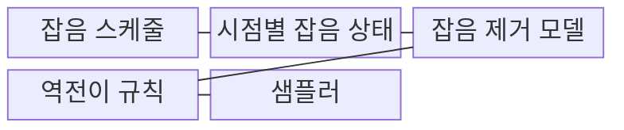
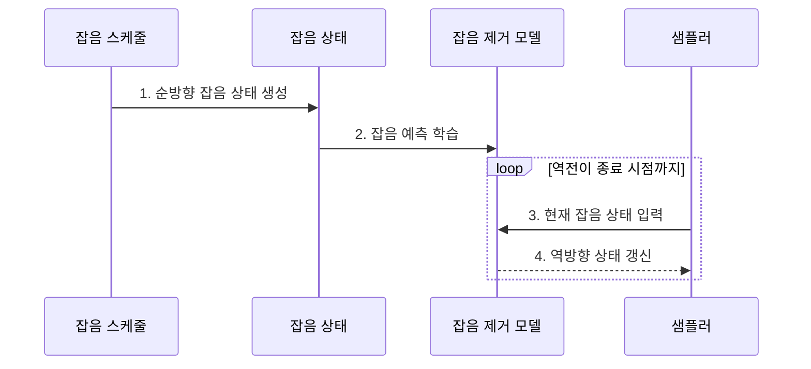

---
sidebar:
  order: 90
  label: "090. Diffusion Model (확산모델)"
  badge:
    text: "미출 · 70%"
    variant: note
title: "Diffusion Model (확산모델)"
date: "2026-07-31T08:49:43+09:00"
tags:
  - "notes-latest_tech"
weight: 90
extra:
  question_no: "090"
  source_status: "미출"
  source_history: ""
  priority: 70
  priority_note: "잡음 제거 생성 원리가 대표 출제 후보"
---

## 미리 알고가기

- **확산모델(Diffusion Model)**: 데이터에 잡음을 더하는 순방향 과정과 잡음을 제거하는 역방향 과정을 학습해 새 표본을 생성하는 모델
- **잡음 스케줄(Noise Schedule)**: 확산 시점마다 원본 신호와 잡음을 섞는 비율을 정하는 규칙
- **잡음 제거 모델(Denoising Model)**: 시점별 잡음 상태에서 제거할 잡음이나 이전 상태를 예측하는 신경망
- **샘플러(Sampler)**: 무작위 잡음에서 역방향 상태 갱신을 반복해 최종 표본을 만드는 알고리즘
- **DDPM·DDIM**: 확률적 역전이를 사용하는 방식과 결정론적 갱신으로 단계를 줄일 수 있는 확산 샘플링 방식

## Ⅰ. 개요

- 정의/개념: **확산모델**은 순방향 잡음 추가와 역방향 제거를 학습해 표본을 생성하는 모델
- 배경/필요성: GAN의 적대적 학습은 **학습 불안정·모드 붕괴** 위험

### 쉽게 이해하기 (학습용)
- 학습 때는 단계별 잡음을 예측하고 생성 때는 무작위 잡음에서 시작해 이를 반복해서 제거합니다.

## Ⅱ. 특징

- **순방향 잡음 확산**을 통한 시점별 학습 상태 생성
- **역방향 잡음 제거** 반복을 통한 새 표본 추출
- **샘플러·단계 수** 기반 생성 품질·다양성·지연 절충

### 쉽게 이해하기 (학습용)
- 흐려진 원본을 복원하는 것이 아니라 학습한 잡음 제거 규칙으로 새로운 표본을 만듭니다.

## Ⅲ. 구조 및 구성요소

| 구성요소 | 책임 |
|:---|:---|
| 잡음 스케줄 | 단계별 **신호·잡음 비율** 정의 |
| 시점별 잡음 상태 | 시점별 혼합된 **학습 입력** |
| 잡음 제거 모델 | **역방향 갱신값** 예측 신경망 |
| 역전이 규칙 | 모델 예측의 **평균·분산** 변환 |
| 샘플러 | 잡음에서 **표본 추출** 실행 |

### 쉽게 이해하기 (학습용)
- 잡음 스케줄, 시점별 상태, 잡음 제거 모델, 역전이 규칙과 샘플러가 함께 작동합니다.

## Ⅳ. 흐름도

**동작 원리**

1. **순방향 잡음 상태 생성**: 학습 표본과 잡음을 **스케줄 비율**로 혼합
2. **잡음 예측 학습**: 제거 모델이 시점 조건부 **추가 잡음** 예측
3. **현재 잡음 상태 입력**: 무작위 잡음에서 시작해 **시점 상태** 전달
4. **역방향 상태 갱신**: 예측값으로 이전 상태를 반복 산출해 **새 표본 추출**

### 쉽게 이해하기 (학습용)
- 잡음이 섞인 표본에서 제거 방향을 배우고 생성 때 새 잡음에 그 방향을 반복 적용합니다.

## Ⅴ. 종류 및 비교

| 확산 샘플러 | DDPM | DDIM |
|:---|:---|:---|
| 적용 기준 | **표본 다양성** 확보 시 | **생성 속도** 우선 시 |
| 핵심 특징 | **확률적 마르코프 역전이** | **결정론적 비마르코프 갱신** |
| 한계 | 많은 단계의 **생성 지연** | 단계 축소 시 **품질 저하** |

> 요약: 잡음 단계적 제거를 통해 표본을 생성함

### 쉽게 이해하기 (학습용)
- 확률적 경로와 결정론적 경로 중 다양성·속도·재현 요구에 맞는 샘플러를 선택합니다.

## Ⅵ. 실무 고려사항 및 대책

| 고려사항 | 대책 | 효과 |
|:---|:---|:---|
| 단계 축소로 **잡음 제거 오차** 누적 | 샘플러·단계별 품질 회귀 시험 | 생성 **품질·지연 절충** |
| 강한 조건 유도로 **다양성 감소** | 유도 강도별 품질·다양성 평가 | 조건 충실성 내 **표본 다양성** 유지 |

### 쉽게 이해하기 (학습용)
- 제거 단계를 줄이면 빨라지지만 품질이 달라질 수 있어 용도별 샘플러와 단계 수를 검증해야 합니다.

## Ⅶ. 결론

- **생성 품질·지연**을 기준으로 DDPM·DDIM과 역전이 단계 수 결정

### 쉽게 이해하기 (학습용)
- 학습한 잡음 제거기뿐 아니라 실제 생성의 샘플러와 단계 수도 결과와 속도를 좌우합니다.
