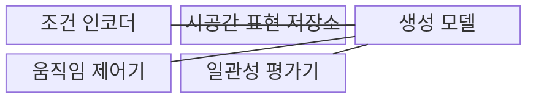
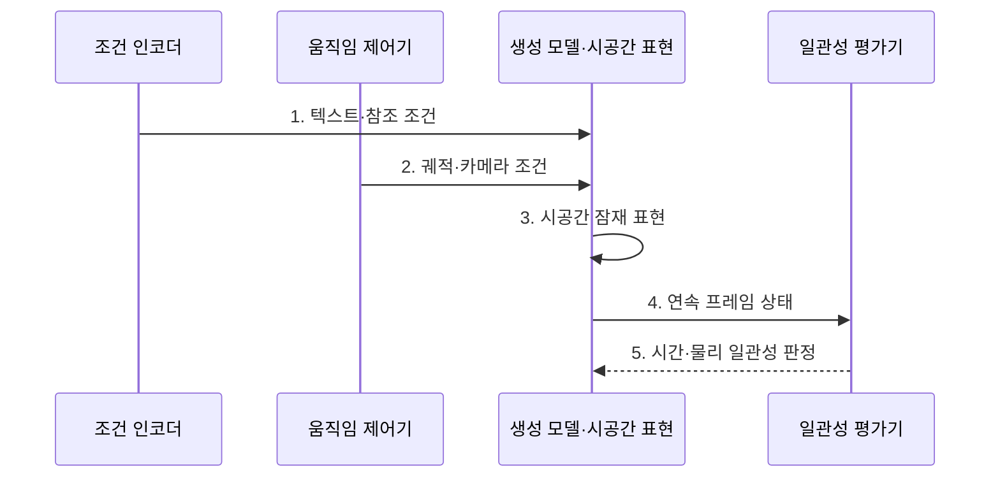

---
sidebar:
  order: 91
  label: "091. 영상 생성 (Video Generation)"
  badge:
    text: "미출 · 70%"
    variant: note
title: "영상 생성 (Video Generation)"
date: "2026-07-31T08:50:24+09:00"
tags:
  - "notes-latest_tech"
weight: 91
extra:
  question_no: "091"
  source_status: "미출"
  source_history: ""
  priority: 70
  priority_note: "영상 생성 구조·안전이 최신 쟁점"
---

## Ⅰ. 개요

핵심 용어

- **영상 생성**: 텍스트·이미지·영상 조건을 사용해 공간 구조와 시간 움직임이 이어지는 프레임을 합성하는 기술이다.
- **시간 연속성**: 인접 프레임 사이에서 객체의 외형·위치·동작이 자연스럽게 이어지는 성질이다.

- 정의/개념: **영상 생성(Video Generation)** 은 공간 구조와 시간 움직임을 함께 합성하는 생성 기술
- 배경/필요성: 독립 프레임 생성은 객체 외형과 움직임의 **시간 연속성 보장 불가**

#### 한줄 요약

- 인물과 배경의 형태와 움직임이 이어지는 연속 장면 생성 기술입니다.

## Ⅱ. 특징

핵심 용어

- **시공간 표현**: 한 표현 안에 프레임의 공간 구조와 시간축 변화를 함께 담은 상태이다.
- **움직임 조건**: 객체 궤적·카메라·포즈처럼 영상의 시간 변화를 제어하는 입력이다.

- 공간 구조와 움직임을 결합한 **시공간 표현**
- 궤적·카메라·포즈 기반 **움직임 조건 제어**
- 이전 객체 상태를 보존하는 **시간 일관성**

#### 한줄 요약

- 한 장면이 선명해도 다음 장면에서 얼굴이나 움직임이 갑자기 바뀌면 시간 일관성이 낮습니다.

## Ⅲ. 구조 및 구성요소

핵심 용어

- **조건 인코더**: 텍스트와 참조 자료를 생성 모델이 사용할 수 있는 조건 표현으로 변환한다.
- **잠재 텐서**: 영상의 공간·시간 위치별 특징을 압축해 저장한 다차원 표현이다.
- **일관성 평가기**: 생성 프레임의 객체 외형과 움직임, 물리 관계가 이어지는지 평가한다.

| 구성요소 | 책임 |
|:---|:---|
| 조건 인코더 | 텍스트·참조 정보를 **생성 조건**으로 변환 |
| 시공간 표현 저장소 | 공간·시간 위치를 담은 **잠재 텐서** 보관 |
| 생성 모델 | 프레임 구조와 **시간 변화** 예측 |
| 움직임 제어기 | 궤적·카메라 등 **제어 신호** 주입 |
| 일관성 평가기 | 물리 법칙과 **시간 연속성** 평가 |

#### 한줄 요약

- 조건 인코더·시공간 표현·생성기·움직임 제어기·평가기의 역할이 연결됩니다.

## Ⅳ. 흐름도

핵심 용어

- **객체 상태**: 특정 시점의 객체 외형·위치·자세와 움직임 정보를 묶은 표현이다.
- **물리 일관성**: 생성된 움직임과 객체 관계가 시간에 따라 물리적으로 가능한 상태를 유지하는 정도이다.

**동작 원리**

1. **텍스트·참조 조건**: 장면의 객체·배경·스타일 표현
2. **궤적·카메라 조건**: 시간축의 이동·시점 변화 제어
3. **시공간 잠재 표현**: 공간 구조와 인접 프레임 관계 결합
4. **연속 프레임 상태**: 이전 객체 상태를 다음 프레임에 전달
5. **시간·물리 일관성 판정**: 외형·동작·물리 관계의 연속성 검증

#### 한줄 요약

- 앞 장면의 객체 상태와 움직임을 다음 장면에 전달하고 전체 흐름의 일관성을 확인합니다.

## Ⅴ. 종류 및 비교

핵심 용어

- **프레임별 생성**: 각 프레임을 독립적으로 합성한 뒤 영상으로 연결하는 방식이다.
- **비디오 확산**: 시공간 잡음을 반복 제거하며 여러 프레임의 구조와 움직임을 함께 생성하는 방식이다.
- **자기회귀 생성**: 앞서 생성한 프레임이나 토큰을 조건으로 다음 시점의 내용을 순차 생성하는 방식이다.

| 생성 방식 | 프레임별 | 비디오 확산 | 자기회귀 |
|:---|:---|:---|:---|
| 적용 기준 | **프레임별 편집** | **움직임 최적화** | **긴 영상 생성** |
| 핵심 특징 | 프레임 **독립 생성** | **시공간 잡음 제거** | 프레임 **순차 생성** |
| 한계 | 객체 **외형 흔들림** | 높은 **시공간 연산량** | **장기 오차 누적** |

> 요약: **생성 지연·영상 길이**에 따른 영상 생성 방식 선택

#### 한줄 요약

- 프레임을 독립 생성할지 시공간으로 함께 처리할지 순차 생성할지에 따라 특성이 달라집니다.

## Ⅵ. 실무 고려사항 및 대책

핵심 용어

- **객체 변형**: 프레임이 바뀌면서 동일 객체의 얼굴·형태·속성이 의도하지 않게 달라지는 문제이다.
- **장기 오차 누적**: 앞 시점의 생성 오류가 다음 시점의 조건으로 전달되어 긴 영상에서 커지는 문제이다.
- **키프레임 조건**: 특정 시점의 기준 장면을 지정해 중간 프레임의 객체와 움직임을 제약하는 입력이다.

| 문제 | 대책 | 효과 |
|:---|:---|:---|
| 장면 간 **객체 변형** | 객체 특징·상태의 **시간 일관성** 평가 | **외형 흔들림** 감소 |
| 긴 영상의 **오차 누적** | 구간별 생성·**키프레임 조건** 적용 | 장기 **물리 일관성** 보완 |
| **움직임 제어 불일치** | 궤적·카메라·포즈 **조건 충족도** 검증 | 의도한 **동작 재현** |

#### 한줄 요약

- 광고 초안은 제작 속도를 중시하지만 학습 데이터는 객체가 물리 법칙대로 움직이는지 더 엄격히 확인해야 합니다.

## Ⅶ. 결론

핵심 용어

- **조건 충족도**: 생성 영상이 지정한 객체·궤적·카메라·포즈 조건을 반영한 정도이다.
- **시간 일관성**: 영상 전체에서 객체의 외형과 움직임이 끊기지 않고 유지되는 정도이다.

- 영상 길이·움직임 조건에 따라 **생성 방식**을 선택하고 **시간 일관성** 검증

#### 한줄 요약

- 좋은 영상은 개별 장면뿐 아니라 처음부터 끝까지 같은 객체와 물리 세계가 이어져야 합니다.
