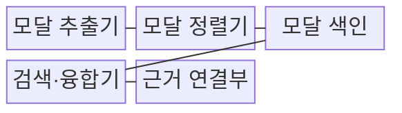
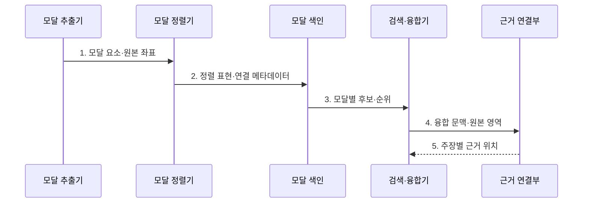

---
sidebar:
  order: 92
  label: "092. Multimodal RAG 멀티모달 RAG (Multimodal RAG)"
  badge:
    text: "미출 · 70%"
    variant: note
title: "Multimodal RAG 멀티모달 RAG (Multimodal RAG)"
date: "2026-07-25T22:44:00+09:00"
tags:
  - "notes-latest_tech"
weight: 92
extra:
  question_no: "092"
  source_status: "미출"
  source_history: ""
  priority: 70
  priority_note: "다중 모달 근거 검색이 RAG 확장축"
---

## 미리 알고가기

- **멀티모달 RAG**: 텍스트, 이미지, 표, 도면을 검색 근거로 활용하는 RAG
- **중요 요소**: 문서 파싱 품질과 모달별 검색 전략이 답변 품질을 결정
- **핵심 기술**: VLM(Vision Language Model)과 인용(Citation) 체계의 결합

## Ⅰ. 개요
- 정의/개념: 텍스트·이미지·표를 검색 근거로 쓰는 RAG
- 배경/필요성: 텍스트 변환 시 **시각 관계·원본 위치** 손실 보완 필요
### 쉽게 이해하기 (학습용)
- 글·그림·표의 원본 위치를 함께 찾아 답변 근거로 활용합니다.

## Ⅱ. 특징
- 텍스트·이미지·표의 **모달별 표현 색인**
- 공동 공간·순위 결합 기반 **교차 모달 검색**
- 답변 주장과 **원본 영역·좌표**의 근거 연결
### 쉽게 이해하기 (학습용)
- 글·그림 색인을 따로 만들고 질문에 맞는 후보를 모은 뒤 실제 원본과 대조합니다.

## Ⅲ. 구조 및 구성요소

| 구성요소 | 책임 |
|:---|:---|
| 모달 추출기 | 문서에서 텍스트·이미지·표와 원본 좌표를 분리함 |
| 모달 정렬기 | 캡션·표 구조·식별자로 서로 관련된 표현을 연결함 |
| 모달 색인 | 모달별 임베딩과 문서·페이지·영역 메타데이터를 저장함 |
| 검색·융합기 | 모달별 후보 순위를 융합하고 생성 문맥을 구성함 |
| 근거 연결부 | 답변 주장과 원본 문단·표 셀·이미지 영역을 연결함 |

### 쉽게 이해하기 (학습용)
- 추출기·정렬기·모달 색인·검색 융합기·근거 연결부가 역할을 나눕니다.

## Ⅳ. 흐름도

1. **모달 요소·원본 좌표**: 문단·이미지·표 셀과 페이지 영역 분리
2. **정렬 표현·연결 메타데이터**: 캡션·식별자로 관련 모달 연결
3. **모달별 후보·순위**: 질의에 맞는 텍스트·시각 후보 검색
4. **융합 문맥·원본 영역**: 요약 표현과 세부 시각 자료 결합
5. **주장별 근거 위치**: 답변을 원본 문단·표 셀·이미지 영역과 연결
### 쉽게 이해하기 (학습용)
- 질문이 시각 세부를 요구하면 요약에 그치지 않고 원본 영역을 다시 불러 답과 대조합니다.
## Ⅴ. 종류 및 비교
| 검색 방식 | 텍스트 변환 | 공동 임베딩 | 다중 표현 |
|:---|:---|:---|:---|
| 적용 기준 | 시각 정보 최소 시 | 의미 검색 중심 시 | 세부 인용 필요 시 |
| 핵심 특징 | 설명문 변환 색인 | 공동 벡터 공간 검색 | 모달별 표현·원본 연결 |
| 한계 | 시각 세부 손실 | 이미지 단위 근거 한계 | 색인·융합 복잡도 증가 |

> 요약: 모달별 근거 연결을 통한 정확도 향상
### 쉽게 이해하기 (학습용)
- 시각 자료를 글로 바꾸는 방식, 공동 공간에서 찾는 방식, 여러 표현과 원본을 함께 쓰는 방식의 차이입니다.

## Ⅵ. 실무 고려사항 및 대책
| 고려사항 | 대책 | 효과 |
|:---|:---|:---|
| 표·도면 구조 손실 | 모달별 파싱과 **원본 좌표** 보존 | 시각 관계 복원 |
| 교차 모달 정렬 오류 | 캡션·식별자 기반 **모달 정렬** | 관련 없는 근거 결합 감소 |
| 주장 근거 불일치 | 주장별 **문단·셀·영역 인용** | 답변 근거 재현성 확보 |
### 쉽게 이해하기 (학습용)
- 도면 부품이나 표의 수치를 답할 때 실제 페이지와 영역을 함께 제시할 수 있습니다.
## Ⅶ. 결론
- **시각 정보 비중·인용 단위**에 맞춰 표현 방식을 선택하고 **원본 영역 재현**이 가능한 근거만 사용
### 쉽게 이해하기 (학습용)
- 글만으로 부족한 질문은 그림과 표를 검색하되 답이 원본 어디에서 나왔는지 확인해야 합니다.
