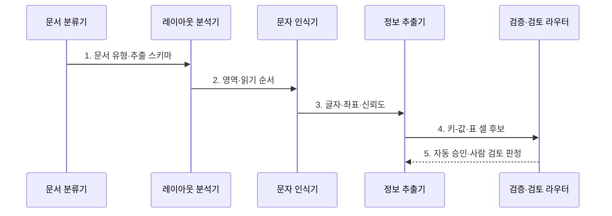

---
sidebar:
  order: 93
  label: "093. Document AI 문서 AI (Document AI)"
  badge:
    text: "미출 · 70%"
    variant: note
title: "Document AI 문서 AI (Document AI)"
date: "2026-07-25T22:45:00+09:00"
tags:
  - "notes-latest_tech"
weight: 93
extra:
  question_no: "093"
  source_status: "미출"
  source_history: ""
  priority: 70
  priority_note: "문서 구조·의미 통합이 기업 자동화 핵심"
---

## 미리 알고가기

- **Document AI**: 스캔 문서, PDF를 구조화 데이터로 변환하는 기술
- **핵심 요소**: 레이아웃 이해, 필드 추출, 검수 흐름의 통합
- **활용**: 백오피스 자동화 및 문서 기반 RAG 품질 개선

## Ⅰ. 개요
- 정의/개념: 문서 구조와 필드를 업무 데이터로 바꾸는 AI
- 배경/필요성: 문자 인식의 **레이아웃·필드 관계 복원** 한계
### 쉽게 이해하기 (학습용)
- 문서의 글자뿐 아니라 표, 항목과 값의 관계까지 구조화하는 기술입니다.

## Ⅱ. 특징
- 문서 유형별 **레이아웃·읽기 순서** 복원
- 키-값·표 셀의 **업무 스키마 매핑**
- 신뢰도·업무 규칙 기반 **사람 검토 분기**
### 쉽게 이해하기 (학습용)
- 문서 종류와 배치를 읽어 값을 추출하되 흐리거나 낯선 양식은 사람에게 넘깁니다.

## Ⅲ. 구조 및 구성요소

| 구성요소 | 책임 |
|:---|:---|
| 문서 분류기 | 문서 유형과 적용할 추출 스키마를 결정함 |
| 레이아웃 분석기 | 문단·표·키값·서명 영역과 읽기 순서를 표현함 |
| 문자 인식기 | 글자·좌표·인식 신뢰도를 산출함 |
| 정보 추출기 | 키-값 관계와 표 셀을 업무 스키마에 매핑함 |
| 검증·검토 라우터 | 규칙·신뢰도·원문 좌표로 자동 승인과 사람 검토를 나눔 |

### 쉽게 이해하기 (학습용)
- 문서 분류기·구조 분석기·문자 인식기·정보 추출기·검토 라우터가 자료를 이어 처리합니다.

## Ⅳ. 흐름도

1. **문서 유형·추출 스키마**: 양식별 필드와 검증 규칙 선택
2. **영역·읽기 순서**: 문단·표·서명 배치 관계 복원
3. **글자·좌표·신뢰도**: 인식 결과와 불확실성 동시 산출
4. **키-값·표 셀 후보**: 업무 스키마에 필드 관계 매핑
5. **자동 승인·사람 검토 판정**: 규칙·신뢰도 기준으로 처리 경로 분기
### 쉽게 이해하기 (학습용)
- 문서를 보정해 구조와 값을 추출하고 신뢰할 수 있는 값만 자동 반영하며 나머지는 사람이 고칩니다.
## Ⅴ. 종류 및 비교
| 처리 방식 | Document AI | 문자 인식 | 인식+언어모델 |
|:---|:---|:---|:---|
| 적용 기준 | 반복 업무 문서 | 텍스트 전사 | 다양한 의미 보정 |
| 핵심 특징 | 구조·필드 추출·검증 | 글자·좌표 추출 | 문맥 기반 보정·변환 |
| 한계 | 학습 외 양식 누락 | 필드 관계 복원 미흡 | 원문 변조 가능성 |

> 요약: 문서 특성에 맞는 추출 파이프라인 선택
### 쉽게 이해하기 (학습용)
- 문자 인식, 문서 구조화, 언어 모델 보정은 처리 범위와 원문 변형 위험이 다릅니다.

## Ⅵ. 실무 고려사항 및 대책
| 고려사항 | 대책 | 효과 |
|:---|:---|:---|
| 신규 양식의 필드 누락 | 문서 유형별 **추출 스키마**와 예외 분기 | 양식 변화 대응 |
| 저신뢰 금액·식별자 | 자료형·업무 규칙과 **원문 좌표** 대조 | 오류 자동 반영 차단 |
| 표 셀·읽기 순서 왜곡 | 레이아웃 기반 **구조 검증** | 필드 관계 복원 |
### 쉽게 이해하기 (학습용)
- 문서 값을 자동 입력하되 흐린 금액이나 새 양식은 담당자가 원문과 대조합니다.
## Ⅶ. 결론
- **양식 변동·인식 신뢰도**로 자동화 범위를 정하고 저신뢰 필드는 **원문 기반 사람 검토**로 분기
### 쉽게 이해하기 (학습용)
- 글자 인식에서 끝내지 않고 문서 구조와 값의 확실성을 확인해 자동 처리 범위를 정해야 합니다.
