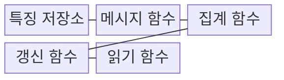
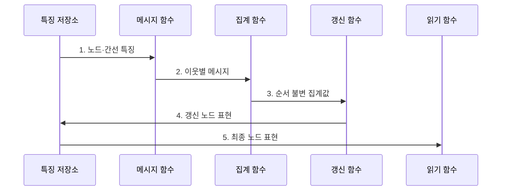

---
sidebar:
  order: 94
  label: "094. GNN 그래프 신경망 (Graph Neural Network)"
  badge:
    text: "기출 · 70%"
    variant: note
title: "GNN 그래프 신경망 (Graph Neural Network)"
date: "2026-07-27T23:59:59+09:00"
tags:
  - "notes-latest_tech"
weight: 94
extra:
  question_no: "094"
  source_status: "기출"
  source_history: "138회"
  priority: 70
  priority_note: "그래프 관계 학습이 최신 AI 구조 쟁점"
---

## 미리 알고가기

- **GNN(Graph Neural Network)**: 노드와 간선의 관계를 집계해 그래프 표현을 학습하는 신경망
- **GCN(Graph Convolutional Network, 지시엔)**: 이웃 노드 특징을 정규화해 집계하는 그래프 합성곱 신경망
- **GAT(Graph Attention Network, 지에이티)**: 이웃별 중요도 가중치를 학습하는 그래프 어텐션 신경망
- **GraphSAGE**: 이웃 노드 표본화 기반 귀납적 표현 학습

## Ⅰ. 개요

- 정의/개념: 이웃 메시지를 집계해 그래프 표현을 배우는 신경망
- 배경/필요성: 독립 표본 모델의 **노드·간선 관계 학습** 한계

### 쉽게 이해하기 (학습용)
- 이웃 관계를 집계해 개별 노드·링크와 전체 그래프를 판단합니다.

## Ⅱ. 특징

> 전파 층수가 늘수록 파란 노드 간 표현 분산이 감소해 서로 구별하기 어려워지며, 특정 모델 성능의 실측값이 아닌 과평활 원리의 정규화 개념 좌표다.

- **메시지 함수**가 이웃 노드·간선에서 전달할 정보를 계산한다.
- **순서 불변 집계·갱신**으로 노드 표현을 반복 개선한다.
- **과평활·과압축**이 깊은 전파에서 노드 구별력을 낮춘다.

### 쉽게 이해하기 (학습용)
- 이웃 순서가 바뀌어도 결과는 같아야 하지만 너무 많은 정보를 반복 집계하면 노드 구별력이 약해집니다.

## Ⅲ. 구조 및 구성요소

| 구성요소 | 책임 |
|:---|:---|
| 특징 저장소 | 노드·간선 연결과 초기 특징 보관 |
| 메시지 함수 | 이웃·간선 정보 전달값 계산 |
| 집계 함수 | 이웃 메시지 순서 무관 결합 |
| 갱신 함수 | 현재 표현과 집계값 결합 |
| 읽기 함수 | 노드 표현을 과업별 출력으로 변환 |

### 쉽게 이해하기 (학습용)
- 이웃 메시지를 모아 노드 표현을 갱신한 뒤 과업별 결과를 냅니다.

## Ⅳ. 흐름도

1. **노드·간선 특징**: 그래프 연결과 초기 상태 제공
2. **이웃별 메시지**: 이웃·간선에서 전달할 특징 계산
3. **순서 불변 집계값**: 이웃 순서와 무관하게 메시지 결합
4. **갱신 노드 표현**: 현재 상태와 집계값으로 표현 갱신
5. **최종 노드 표현**: 노드·링크·그래프 과업 출력 생성

### 쉽게 이해하기 (학습용)
- 이웃 정보를 필요한 거리만큼 전달해 각 노드의 표현을 갱신합니다.

## Ⅴ. 종류 및 비교

| GNN 방식 | GCN | GraphSAGE | GAT |
|:---|:---|:---|:---|
| 적용 기준 | 고정 그래프 반지도 | 대규모·변화 그래프 | 중요도 학습 필요 시 |
| 핵심 특징 | 정규화 이웃 집계 | 이웃 표본화·귀납 학습 | 이웃별 어텐션 가중치 |
| 한계 | 과평활 | 표본 편향·정보 누락 | 높은 연산량·잡음 민감 |

> 요약: 그래프 규모와 이웃 특성에 따른 모델 선택 |

### 쉽게 이해하기 (학습용)
- 전체·표본·가중 집계 중 그래프 규모와 이웃 특성에 맞는 방식을 고릅니다.

## Ⅵ. 실무 고려사항 및 대책

| 고려사항 | 대책 | 효과 |
|:---|:---|:---|
| 깊은 전파의 과평활 | 잔차 연결·**전파 층수 제한** | 노드 구별력 보존 |
| 큰 이웃 집합의 계산 폭증 | **이웃 표본화**·미니배치 적용 | 메모리·연산량 통제 |
| 시간 관계의 평가 누출 | 시간 순서 기반 **그래프 분할** | 신규 노드 일반화 검증 |

### 쉽게 이해하기 (학습용)
- 거래망과 분자 구조의 관계를 학습하되 새 계좌와 새 분자에서도 맞는지 따로 검증해야 합니다.

## Ⅶ. 결론

- **이웃 범위·그래프 변화**에 맞는 집계를 선택하고 **과평활·표본 편향** 통제

### 쉽게 이해하기 (학습용)
- 어떤 이웃의 정보를 어떻게 모으고 몇 단계 전달할지 정해 노드 구별력이 유지되는지 확인해야 합니다.
