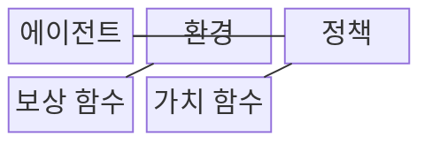
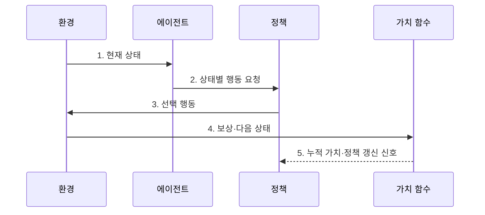

---
sidebar:
  order: 95
  label: "095. 강화학습 (Reinforcement Learning)"
  badge:
    text: "기출 · 60%"
    variant: note
title: "강화학습 (Reinforcement Learning)"
date: "2026-07-31T12:01:24+09:00"
tags:
  - "notes-latest-tech"
weight: 95
extra:
  question_no: "095"
  source_status: "기출"
  source_history: "131회, 132회"
  priority: 60
  priority_note: "순차 의사결정 학습의 반복 출제 기반"
---

> **키워드:** 강화학습 (Reinforcement Learning)

## Ⅰ. 개요

핵심 용어

- **강화학습**: 에이전트가 환경과 상호작용하며 기대 누적 보상을 높이는 정책을 학습하는 기법이다.
- **지연 보상**: 행동 직후가 아니라 이후 상태나 종료 시점에 제공되는 보상이다.

- 정의/개념: **강화학습**은 환경과 상호작용하며 기대 누적 보상을 높이는 정책 학습 기법
- 배경/필요성: 정답 라벨은 지연 보상의 **순차 행동 기여도 산출 불가**

### 쉽게 이해하기 (학습용)

- 시행착오를 통해 장기 누적 보상이 큰 행동 규칙을 배우는 기법입니다.

## Ⅱ. 특징

핵심 용어

- **정책**: 상태별로 선택할 행동이나 행동 확률을 정의한 규칙이다.
- **가치 함수**: 상태 또는 행동에서 앞으로 얻을 기대 누적 보상을 추정하는 함수이다.
- **탐색·활용 균형**: 새로운 행동을 시험하는 탐색과 현재 우수한 행동을 쓰는 활용의 비율을 조절하는 원칙이다.

- 에이전트가 행동하고 상태·보상을 받는 **정책 기반 상호작용**
- 정책의 기대 누적 보상을 추정하는 **가치 함수**
- 정책 품질을 위한 **탐색·활용 균형**과 목표 정렬을 위한 **보상 설계**

### 쉽게 이해하기 (학습용)

- 새로운 행동을 시도하는 탐색과 현재 가치가 높은 행동을 쓰는 활용을 적절히 섞어야 합니다.

## Ⅲ. 구조 및 구성요소

핵심 용어

- **에이전트**: 환경 상태를 관측하고 정책에 따라 행동을 선택하는 학습 주체이다.
- **환경**: 에이전트의 행동을 받아 다음 상태와 보상을 반환하는 대상이다.
- **보상 함수**: 행동 결과가 목표에 기여한 정도를 즉시 보상 신호로 계산한다.

| 구성요소 | 책임 |
|:---|:---|
| 에이전트 | 정책에 따른 **행동 선택** |
| 환경 | 행동 결과인 **상태·보상** 반환 |
| 정책 | 상태별 **행동 확률·규칙** 정의 |
| 보상 함수 | 즉시 성과의 **보상 신호** 산출 |
| 가치 함수 | **기대 누적 보상** 추정 |

### 쉽게 이해하기 (학습용)

- 에이전트가 환경의 보상으로 정책과 미래 가치 추정을 갱신합니다.

## Ⅳ. 흐름도

핵심 용어

- **경험**: 현재 상태·행동·보상·다음 상태와 종료 여부를 묶은 학습 자료이다.
- **정책 갱신**: 장기 보상 추정에 따라 상태별 행동 확률이나 규칙을 개선하는 과정이다.

**동작 원리**

1. **현재 상태**: 환경의 의사결정 정보 관측
2. **상태별 행동 요청**: 탐색·활용 전략에 따른 정책 조회
3. **선택 행동**: 정책이 결정한 행동을 환경에 적용
4. **보상·다음 상태**: 행동 결과와 종료 여부를 경험으로 구성
5. **누적 가치·정책 갱신 신호**: 장기 보상 추정으로 행동 확률 개선

### 쉽게 이해하기 (학습용)

- 행동 뒤 받은 보상과 다음 상태로 선택 규칙을 반복해서 고칩니다.

## Ⅴ. 종류 및 비교

핵심 용어

- **온정책(On-policy)**: 현재 학습 중인 정책이 직접 수집한 경험으로 그 정책을 갱신하는 방식이다.
- **오프정책(Off-policy)**: 과거 정책이나 다른 정책이 수집한 경험을 재사용해 목표 정책을 학습하는 방식이다.

| 학습 방식 | 온정책 (On-policy) | 오프정책 (Off-policy) |
|:---|:---|:---|
| 적용 기준 | **현재 정책** 유지 시 | **로그·과거 경험** 존재 시 |
| 핵심 특징 | 현재 정책의 **경험으로 갱신** | 과거·타 정책의 **경험 재사용** |
| 한계 | **표본 효율·재사용** 제한 | **분포 차이 보정** 필요 |

> 요약: **경험 활용 전략**에 따른 강화학습 방식 선택

### 쉽게 이해하기 (학습용)

- 현재 정책의 경험만 쓸지 과거·다른 정책의 경험도 재사용할지의 차이입니다.

## Ⅵ. 실무 고려사항 및 대책

핵심 용어

- **보상 해킹**: 에이전트가 설계 의도와 다른 행동으로 보상 수치만 높이는 문제이다.
- **안전 행동 집합**: 실제 환경에서 허용할 수 있는 행동만 미리 정의한 제약 범위이다.
- **분포 차이**: 경험을 만든 정책과 현재 학습하는 정책의 상태·행동 분포가 다른 문제이다.

| 문제 | 대책 | 효과 |
|:---|:---|:---|
| **보상 해킹·목표 불일치** | 제약 조건과 **다중 보상 지표** 설계 | 비의도 **정책 억제** |
| **위험 행동 탐색** | 시뮬레이터·**안전 행동 집합** 적용 | 실제 환경의 **손상 방지** |
| 오프정책 **분포 차이** | 중요도 보정·**경험 버퍼** 품질 관리 | 정책 갱신의 **편향 완화** |

### 쉽게 이해하기 (학습용)

- 실제 설비에서 위험한 탐색을 하지 않고 시뮬레이터에서 안전성을 확인한 정책만 현장에 적용합니다.

## Ⅶ. 결론

핵심 용어

- **보상 정렬**: 보상 함수가 실제 업무 목표와 안전 제약을 올바르게 반영하도록 맞추는 과정이다.
- **탐색 위험**: 새로운 행동을 시험하는 과정에서 실제 환경에 손상이나 손실을 일으킬 가능성이다.

- 장기 보상·탐색 위험이 있는 과업에 **강화학습**을 적용하고 **보상 정렬** 검증

### 쉽게 이해하기 (학습용)

- 점수를 높이는 행동이 실제 목표를 해치지 않도록 보상 규칙과 허용 행동 범위를 먼저 정해야 합니다.
