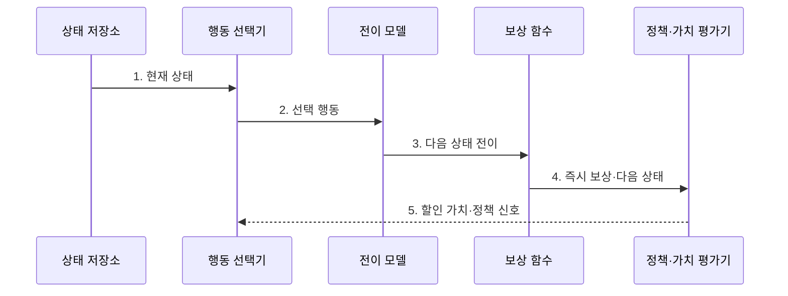

---
sidebar:
  order: 96
  label: "096. 마르코프 결정과정 (Markov Decision Process)"
  badge:
    text: "기출 · 50%"
    variant: note
title: "마르코프 결정과정 (Markov Decision Process)"
date: "2026-07-31T08:53:06+09:00"
tags:
  - "notes-latest-tech"
weight: 96
extra:
  question_no: "096"
  source_status: "기출"
  source_history: "131회, 132회"
  priority: 50
  priority_note: "상태·행동·보상 모델이 강화학습 기반"
---

## Ⅰ. 개요

핵심 용어

- **마르코프 결정과정(Markov Decision Process, MDP)**: 상태·행동·전이확률·보상으로 순차 의사결정 환경을 표현하는 수학 모델이다.
- **순차 의사결정**: 현재 행동이 다음 상태와 이후 보상에 연속해서 영향을 주는 의사결정 문제이다.

- 정의/개념: **마르코프 결정과정(Markov Decision Process, MDP)** 은 상태·행동·전이확률·보상으로 순차 의사결정을 표현하는 수학 모델
- 배경/필요성: 단발 의사결정의 **미래 상태·장기 보상** 미반영

#### 한줄 요약

- 현재 칸과 행동, 다음 칸의 확률과 점수를 규칙표로 정리한 보드게임 모델과 같습니다.

## Ⅱ. 특징

핵심 용어

- **마르코프 성질**: 현재 상태가 주어지면 다음 상태가 과거 이력과 독립적으로 결정되는 성질이다.
- **전이확률**: 현재 상태와 행동에서 각 다음 상태로 이동할 가능성을 나타낸 확률이다.
- **할인율 $\gamma$**: 미래 보상을 현재 가치에 어느 정도 반영할지 정하는 비율이다.

- 다음 전이에 필요한 과거 정보를 현재 상태로 요약하는 **마르코프 성질**
- 상태·행동별 환경 동역학을 정의하는 **전이확률·보상 함수**
- 행동 선택과 장기 가치 계산을 결정하는 **정책·할인율 $\gamma$**

#### 한줄 요약

- 현재 상태만으로 다음 이동 확률과 점수를 정할 수 있어야 과거 기록을 다시 볼 필요가 없습니다.

## Ⅲ. 구조 및 구성요소

핵심 용어

- **상태**: 다음 전이와 보상을 결정하는 데 필요한 환경 정보를 요약한 표현이다.
- **행동 집합**: 각 상태에서 에이전트가 선택할 수 있도록 허용된 행동의 모음이다.
- **보상 함수**: 상태와 행동 또는 상태 전이에서 얻는 즉시 성과를 수치로 반환한다.

| 구성요소 | 책임 |
|:---|:---|
| 상태 저장소 | 다음 전이를 결정할 **현재 상태** 보관 |
| 행동 선택기 | 상태별 **허용 행동 집합** 제공 |
| 전이 모델 | 상태·행동별 **다음 상태 확률** 산출 |
| 보상 함수 | 상태 전이의 **즉시 보상** 산출 |
| 정책·가치 평가기 | **할인 누적 보상** 기반 행동 선택 |

#### 한줄 요약

- 현재 상태·행동·전이 확률·보상이 환경의 규칙을 이룹니다.

## Ⅳ. 흐름도

핵심 용어

- **정책**: 상태별로 행동을 선택하는 확률이나 규칙이다.
- **할인 가치**: 미래 보상에 할인율을 적용해 현재 시점의 누적 가치로 환산한 값이다.

**동작 원리**

1. **현재 상태**: 과거 이력의 전이 정보를 충분히 요약
2. **선택 행동**: 정책이 상태별 허용 행동에서 결정
3. **다음 상태 전이**: 전이확률에 따라 환경 상태 변화
4. **즉시 보상·다음 상태**: 행동 결과의 성과와 후속 정보 제공
5. **할인 가치·정책 신호**: 미래 보상을 현재 가치에 반영

#### 한줄 요약

- 환경은 전이와 보상을 정하고 별도 알고리즘이 정책을 평가·학습합니다.

## Ⅴ. 종류 및 비교

핵심 용어

- **다중 선택 밴딧**: 행동이 후속 상태를 바꾸지 않는 상황에서 각 행동의 보상을 학습하는 모델이다.
- **부분관측 마르코프 결정과정(Partially Observable Markov Decision Process, POMDP)**: 실제 상태를 직접 알 수 없어 관측 이력으로 믿음 상태를 추정하는 모델이다.
- **믿음 상태**: 관측 이력을 바탕으로 숨은 상태가 각 상태일 확률을 나타낸 분포이다.

**마르코프 결정과정(Markov Decision Process, MDP)** 은 상태를 완전히 관측하고, **부분관측 마르코프 결정과정(Partially Observable Markov Decision Process, POMDP)** 은 관측 이력으로 믿음 상태를 추정한다.

| 의사결정 모델 | MDP | 다중 선택 밴딧 | 부분관측 MDP |
|:---|:---|:---|:---|
| 적용 기준 | **완전 상태 관측** | **상태 전이 없음** | **상태 일부 은닉** |
| 핵심 특징 | **상태·전이·보상 모델** | **독립 행동 보상** | 관측 기반 **믿음 상태** |
| 한계 | **완전 관측 가정** | 순차 **상태 영향 미반영** | **믿음 상태 계산** 복잡 |

> 요약: **모델링 범위·관측 가능성**에 따른 의사결정 모델 선택

#### 한줄 요약

- 행동이 미래 상태를 바꾸지 않으면 밴딧, 상태가 숨으면 부분관측 MDP를 사용합니다.

## Ⅵ. 실무 고려사항 및 대책

핵심 용어

- **마르코프성 부족**: 현재 상태 표현만으로 다음 전이와 보상을 충분히 설명하지 못하는 문제이다.
- **목표 불일치**: 보상 함수가 실제 장기 성과나 제약을 정확히 반영하지 못하는 문제이다.
- **전이 모델 오차**: 추정한 다음 상태 확률이 실제 운영 환경의 변화와 다른 문제이다.

| 문제 | 대책 | 효과 |
|:---|:---|:---|
| 상태의 **마르코프성 부족** | 이력·센서를 **상태 표현**에 추가 | 다음 전이의 **설명력 향상** |
| **보상·실제 목표 불일치** | 장기 성과·제약을 **보상 함수**에 반영 | 정책 목표의 **왜곡 완화** |
| **전이 모델 오차** | 운영 궤적으로 **전이확률** 검증 | 가치 추정의 **편향 감소** |

#### 한줄 요약

- 냉각 제어 전에 무엇을 상태로 보고 어떤 행동을 허용하며 어떤 결과에 보상할지 먼저 정합니다.

## Ⅶ. 결론

핵심 용어

- **관측 가능성**: 의사결정에 필요한 실제 환경 상태를 센서나 입력으로 직접 확인할 수 있는 정도이다.
- **상태 표현**: 전이와 보상을 예측할 수 있도록 관측과 이력을 결합한 정보 구조이다.

- 상태 관측 가능성에 따라 **마르코프 결정과정(Markov Decision Process, MDP)·부분관측 마르코프 결정과정(Partially Observable Markov Decision Process, POMDP)** 을 선택하고 **보상 함수** 검증

#### 한줄 요약

- 현재 정보로 다음 상황을 설명할 수 없으면 이력·센서를 상태에 더하거나 숨은 상태 모델을 사용해야 합니다.
