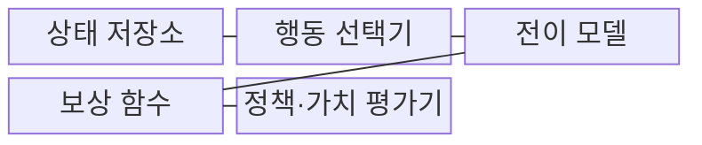
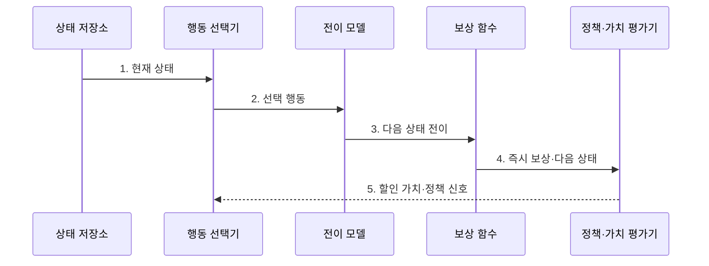

---
sidebar:
  order: 96
  label: "096. MDP 마르코프 결정과정 (Markov Decision Process)"
  badge:
    text: "기출 · 50%"
    variant: note
title: "MDP 마르코프 결정과정 (Markov Decision Process)"
date: "2026-07-27T23:59:59+09:00"
tags:
  - "notes-latest-tech"
weight: 96
extra:
  question_no: "096"
  source_status: "기출"
  source_history: "131회, 132회"
  priority: 50
  priority_note: "상태·행동·보상 모델이 강화학습 기반"
---

## 미리 알고가기

- **마르코프 결정과정(Markov Decision Process, MDP)**: 상태·행동·전이확률·보상으로 순차 의사결정을 표현하는 수학 모델
- **부분관측 마르코프 결정과정(Partially Observable Markov Decision Process, POMDP, 피오엠디피)**: 상태를 직접 알 수 없어 관측 이력으로 믿음 상태를 추정하는 모델
- **할인율 $\gamma$(Gamma, 감마)**: 그리스 문자로 표기하며, 미래 보상을 현재 가치에 반영하는 비율

## Ⅰ. 개요

- 정의/개념: 상태·행동·전이·보상으로 순차 환경을 표현
- 배경/필요성: 단발 의사결정의 **미래 상태·장기 보상** 미반영

### 쉽게 이해하기 (학습용)

- 현재 칸과 행동, 다음 칸의 확률과 점수를 규칙표로 정리한 보드게임 모델과 같습니다.

## Ⅱ. 특징

- **마르코프 성질**로 현재 상태가 다음 전이에 필요한 과거 정보를 요약한다.
- **전이확률·보상 함수**가 상태·행동별 환경 동역학을 정의한다.
- **정책·할인율**이 행동 선택과 장기 가치 계산을 정한다.

### 쉽게 이해하기 (학습용)

- 현재 상태만으로 다음 이동 확률과 점수를 정할 수 있어야 과거 기록을 다시 볼 필요가 없습니다.

## Ⅲ. 구조 및 구성요소

| 구성요소 | 책임 |
|:---|:---|
| 상태 저장소 | 다음 전이를 결정할 현재 정보 보관 |
| 행동 선택기 | 상태에서 허용된 행동 집합 제공 |
| 전이 모델 | 상태·행동별 다음 상태 확률 산출 |
| 보상 함수 | 상태 전이의 즉시 성과 산출 |
| 정책·가치 평가기 | 할인된 누적 보상으로 행동 선택 |

### 쉽게 이해하기 (학습용)

- 현재 상태·행동·전이 확률·보상이 환경의 규칙을 이룹니다.

## Ⅳ. 흐름도

1. **현재 상태**: 과거 이력의 전이 정보를 충분히 요약
2. **선택 행동**: 정책이 상태별 허용 행동에서 결정
3. **다음 상태 전이**: 전이확률에 따라 환경 상태 변화
4. **즉시 보상·다음 상태**: 행동 결과의 성과와 후속 정보 제공
5. **할인 가치·정책 신호**: 미래 보상을 현재 가치에 반영

### 쉽게 이해하기 (학습용)

- 환경은 전이와 보상을 정하고 별도 알고리즘이 정책을 평가·학습합니다.

## Ⅴ. 종류 및 비교

| 의사결정 모델 | MDP | 다중 선택 밴딧 | 부분관측 MDP |
|:---|:---|:---|:---|
| 적용 기준 | 완전 상태 관측 | 상태 전이 없음 | 상태 일부 은닉 |
| 핵심 특징 | 상태·전이·보상 모델 | 독립 행동 보상 | 관측 기반 믿음 상태 |
| 한계 | 완전 관측 가정 | 순차 상태 영향 미반영 | 믿음 상태 계산 복잡 |

> 요약: 모델링 범위와 관측 가능성에 따라 적합 환경을 선택함

### 쉽게 이해하기 (학습용)

- 행동이 미래 상태를 바꾸지 않으면 밴딧, 상태가 숨으면 부분관측 MDP를 사용합니다.

## Ⅵ. 실무 고려사항 및 대책

| 고려사항 | 대책 | 효과 |
|:---|:---|:---|
| 상태의 마르코프성 부족 | 이력·센서를 **상태 표현**에 추가 | 다음 전이 설명력 향상 |
| 보상과 실제 목표 불일치 | 장기 성과·제약을 **보상 함수**에 반영 | 정책 목표 왜곡 완화 |
| 전이 모델 오차 | 운영 궤적으로 **전이확률** 검증 | 가치 추정 편향 감소 |

### 쉽게 이해하기 (학습용)

- 냉각 제어 전에 무엇을 상태로 보고 어떤 행동을 허용하며 어떤 결과에 보상할지 먼저 정합니다.

## Ⅶ. 결론

- **상태 완전성·전이 불확실성**을 기준으로 MDP·POMDP를 선택하고 **보상 정렬** 검증

### 쉽게 이해하기 (학습용)

- 현재 정보로 다음 상황을 설명할 수 없으면 이력·센서를 상태에 더하거나 숨은 상태 모델을 사용해야 합니다.
