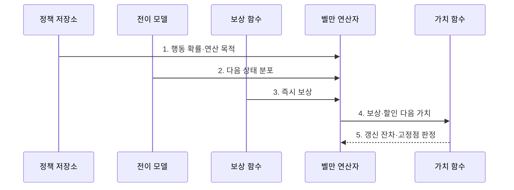

---
sidebar:
  order: 97
  label: "097. 벨만 방정식 (Bellman Equation)"
  badge:
    text: "기출 · 50%"
    variant: note
title: "벨만 방정식 (Bellman Equation)"
date: "2026-07-31T08:53:32+09:00"
tags:
  - "notes-latest_tech"
weight: 97
extra:
  question_no: "097"
  source_status: "기출"
  source_history: "131회, 132회"
  priority: 50
  priority_note: "가치 갱신 원리가 강화학습 핵심"
---

## 미리 알고가기

- **벨만 방정식(Bellman Equation, 벨먼 이퀘이션)**: 고안자 이름을 붙인 식으로, 현재 가치를 즉시 보상과 다음 가치로 재귀 분해
- **상태가치 $V(s)$(브이 오브 에스)·행동가치 $Q(s,a)$(큐 오브 에스 에이)**: 상태 또는 상태·행동에서의 기대 누적 보상
- **할인율 $\gamma$(Gamma, 감마)·정책 $\pi$(Pi, 파이)**: 그리스 문자로 미래 반영률과 행동 확률 규칙을 표기

## Ⅰ. 개요

- 정의/개념: **벨만 방정식**은 현재 가치를 즉시 보상과 할인된 다음 가치로 분해하는 재귀식
- 배경/필요성: 미래 경로의 완전 전개는 상태 증가로 **장기 가치 계산량 폭증**

### 쉽게 이해하기 (학습용)

- 현재 위치의 가치를 즉시 보상과 할인된 다음 위치 가치로 나누어 계산합니다.

## Ⅱ. 특징

> 개념도: 할인율 증가에 따른 **벨만 반복 잔차**의 느린 수렴

- 주어진 정책의 행동 확률로 가치를 평균하는 **벨만 기대 방정식**
- 가능한 행동 가치의 최댓값을 선택하는 **벨만 최적 방정식**
- 반복 갱신으로 해를 구하는 **가치 고정점**

### 쉽게 이해하기 (학습용)

- 현재 정책의 평균 성적을 구하는 식과 최선 행동의 가치를 구하는 식을 구분합니다.

## Ⅲ. 구조 및 구성요소

| 구성요소 | 책임 |
|:---|:---|
| 정책 저장소 | 상태별 **행동 선택 확률** 보관 |
| 전이 모델 | 행동별 **다음 상태 확률** 제공 |
| 보상 함수 | 상태 전이의 **즉시 보상** 산출 |
| 가치 함수 | 상태·행동의 **기대 누적 보상** 보관 |
| 벨만 연산자 | 기대·최적 **가치 갱신 규칙** 적용 |

### 쉽게 이해하기 (학습용)

- 행동 규칙과 보상표로 상태 가치 장부를 반복 갱신합니다.

## Ⅳ. 흐름도

**동작 원리**

1. **행동 확률·연산 목적**: 정책 평가와 최적 가치 계산을 구분
2. **다음 상태 분포**: 가능한 후속 상태의 확률 가중치 제공
3. **즉시 보상**: 현재 전이에서 얻는 가치 산출
4. **보상·할인 다음 가치**: 장기 가치를 재귀적으로 분해
5. **갱신 잔차·고정점 판정**: 반복 변화량으로 수렴 여부 결정

### 쉽게 이해하기 (학습용)

- 즉시 보상과 다음 가치로 장부를 갱신하고 변화가 충분히 작아지면 멈춥니다.

## Ⅴ. 종류 및 비교

| 벨만 방정식 | 벨만 기대 방정식 | 벨만 최적 방정식 |
|:---|:---|:---|
| 적용 기준 | **정책 평가** 시 | **정책 최적화** 시 |
| 핵심 특징 | 정책 확률로 **행동 가치 평균** | 행동 가치의 **최댓값 선택** |
| 한계 | 주어진 **정책 품질**에 종속 | **환경 모델·탐색 비용** 필요 |

> 요약: **평가·최적화 목적**에 따른 벨만 방정식 선택

### 쉽게 이해하기 (학습용)

- 정책의 평균 가치는 기대식으로, 최선 행동의 가치는 최적식으로 구합니다.

## Ⅵ. 실무 고려사항 및 대책

| 고려사항 | 대책 | 효과 |
|:---|:---|:---|
| **할인율 설정 민감도** | 과업 시간 범위에 맞춰 **할인율** 검증 | **단기·장기 가치** 균형 |
| 가치 반복의 **미수렴** | 갱신 잔차·**종료 임계값** 설정 | **고정점 판정** 명확화 |
| **전이 모델 부정확성** | 표본 기반 가치 추정과 **모델 오차** 비교 | 가치 추정의 **편향 완화** |

### 쉽게 이해하기 (학습용)

- 현재 배차 규칙을 평가할 때와 더 나은 행동을 찾을 때 서로 다른 벨만 연산자를 사용합니다.

## Ⅶ. 결론

- **평가·최적화 목적**에 맞는 벨만 연산자를 선택하고 **수렴 잔차** 통제

### 쉽게 이해하기 (학습용)

- 어떤 가치를 구할지와 반복 계산이 한 값에 수렴하는 조건을 먼저 정해야 합니다.
