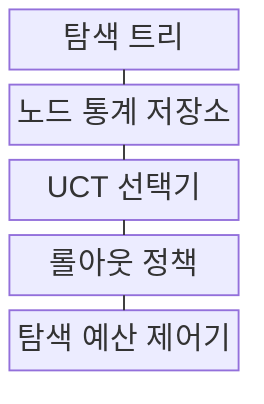
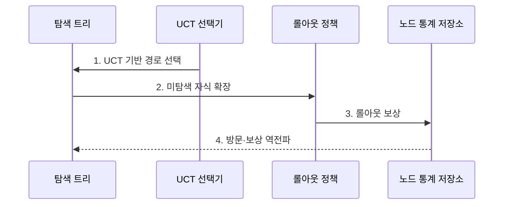

---
sidebar:
  order: 98
  label: "098. MCTS 몬테카를로 트리탐색 (Monte Carlo Tree Search)"
  badge:
    text: "기출 · 50%"
    variant: note
title: "MCTS 몬테카를로 트리탐색 (Monte Carlo Tree Search)"
date: "2026-07-27T23:59:59+09:00"
tags:
  - "notes-latest_tech"
weight: 98
extra:
  question_no: "098"
  source_status: "기출"
  source_history: "135회"
  priority: 50
  priority_note: "탐색·평가 결합이 추론 문제에 재부상"
---

## 미리 알고가기

- **몬테카를로 트리탐색(Monte Carlo Tree Search, MCTS, 엠씨티에스)**: 무작위 표본 추정을 뜻하는 몬테카를로 방식으로 보상 통계를 누적하는 트리 탐색
- **트리 상한 신뢰구간(Upper Confidence Bounds Applied to Trees, UCT, 유시티)**: 평균 가치와 방문 보너스로 활용·탐험을 조절하는 선택식

## Ⅰ. 개요

- 정의/개념: 모의 보상으로 유망한 분기를 찾는 트리 탐색
- 배경/필요성: 완전 탐색 없이 **유망 분기**에 계산 예산 집중 필요

### 쉽게 이해하기 (학습용)

- 모의 실행 점수를 노드에 누적해 유망한 갈림길에 더 많은 탐색 예산을 배분합니다.

## Ⅱ. 특징

> 파란 탐험 보너스는 적게 방문한 자식에서 크고 방문 수가 늘수록 감소하며, 부모 방문 수 100을 가정한 UCT 공식 계산값이지 탐색 승률 실측값은 아니다.

- UCT가 평균 가치와 미방문 탐험 보너스를 함께 고려한다.
- 선택·확장·시뮬레이션·역전파로 노드 통계를 갱신한다.
- 탐색 예산 종료 후 방문 수·가치 통계로 행동을 선택한다.

### 쉽게 이해하기 (학습용)

- 성적이 좋은 길을 더 보면서 덜 가본 길도 시험하지만 모의 방식이 치우치면 결과도 왜곡됩니다.

## Ⅲ. 구조 및 구성요소

| 구성요소 | 책임 |
|:---|:---|
| 탐색 트리 | 상태·행동을 노드·간선으로 보관 |
| 노드 통계 저장소 | 방문 횟수·누적 보상 보관 |
| UCT 선택기 | 평균 가치·탐험 보너스로 자식 선택 |
| 롤아웃 정책 | 확장 노드에서 모의 행동 수행 |
| 탐색 예산 제어기 | 반복 횟수·시간·종료 조건 통제 |

### 쉽게 이해하기 (학습용)

- 갈림길별 방문 횟수와 성적을 기록해 다음 탐색 경로를 정합니다.

## Ⅳ. 흐름도

### 동작 원리

1. **UCT 기반 경로 선택**: 활용 가치와 미방문 탐험 보너스 균형
2. **미탐색 자식 확장**: 선택 노드의 새 행동을 트리에 추가
3. **롤아웃 보상**: 모의 정책으로 말단 결과의 가치 추정
4. **방문·보상 역전파**: 선택 경로의 방문 수·평균 가치 갱신

### 쉽게 이해하기 (학습용)

- 선택한 경로를 모의 실행하고 얻은 점수를 루트까지 역전파합니다.

## Ⅴ. 종류 및 비교

| 탐색 방식 | MCTS | 미니맥스 | 신경망 유도 MCTS |
|:---|:---|:---|:---|
| 적용 기준 | 시뮬레이션·통계 가능 | 상태 평가함수 존재 | 학습 모델 존재 |
| 핵심 특징 | UCT·롤아웃 통계 | 전개·평가·역전파 | 정책·가치망 유도 탐색 |
| 한계 | 롤아웃 편향·분산 | 분기 폭발·평가 오차 | 학습 편향·연산 비용 |

> 요약: 시뮬레이션 및 모델 유무에 따라 탐색 알고리즘을 선택함

### 쉽게 이해하기 (학습용)

- 평가 함수·모의 통계·학습 모델 중 문제 조건에 맞는 탐색 방식을 고릅니다.

## Ⅵ. 실무 고려사항 및 대책

| 고려사항 | 대책 | 효과 |
|:---|:---|:---|
| 롤아웃 정책 편향 | 복수 정책·도메인 규칙으로 **모의 보상** 검증 | 가치 추정 왜곡 완화 |
| 탐험 상수 민감 | 문제별 **UCT 탐험 계수** 검증 | 활용·탐험 균형 |
| 탐색 예산 부족 | 방문 수·가치 안정도 기반 **종료 조건** | 불안정 행동 선택 감소 |

### 쉽게 이해하기 (학습용)

- 여러 복구 순서와 이동 경로를 가상으로 시험하고 누적 결과로 다음 행동을 정합니다.

## Ⅶ. 결론

- **롤아웃 신뢰도·탐색 예산**이 확보된 문제에 MCTS를 적용하고 **UCT 균형** 조정

### 쉽게 이해하기 (학습용)

- 모의 횟수가 적거나 정책이 치우치면 유망해 보인 경로가 실제 최선이 아닐 수 있습니다.
