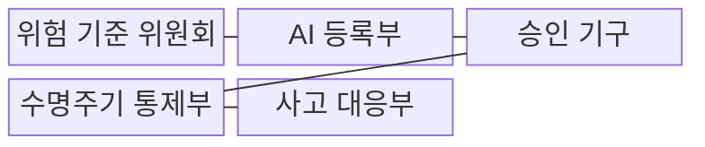
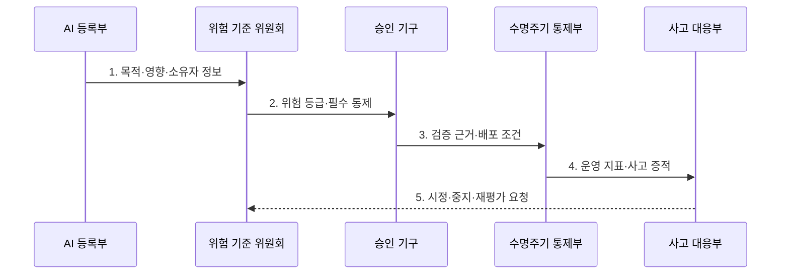

---
sidebar:
  order: 99
  label: "099. AI 거버넌스 (AI Governance)"
  badge:
    text: "기출 · 80%"
    variant: note
title: "AI 거버넌스 (AI Governance)"
date: "2026-07-31T08:54:38+09:00"
tags:
  - "notes-latest_tech"
weight: 99
extra:
  question_no: "099"
  source_status: "기출"
  source_history: "138회"
  priority: 80
  priority_note: "조직 책임·통제 체계가 최신 정책 출제축"
---

## 미리 알고가기

- **인공지능 거버넌스(Artificial Intelligence Governance, AI Governance, 에이아이 거버넌스)**: 조직의 AI 의사결정권·책임·위험 통제를 총괄하는 감독 체계
- **위험 등급(Risk Tier)**: AI의 영향도에 따라 검증·승인·감시 강도를 구분하는 기준

> **키워드:** AI 거버넌스 (AI Governance)

## Ⅰ. 개요

- 정의/개념: **AI 거버넌스**는 조직의 AI 의사결정권·책임·위험 통제를 감독하는 체계
- 배경/필요성: 프로젝트별 기준 차이로 전사 위험과 책임의 **일관된 통제 불가**

### 쉽게 이해하기 (학습용)

- 조직 전체에서 AI의 책임자·위험 기준·승인·중지 절차를 정하고 감독하는 체계입니다.

## Ⅱ. 특징

- 검증·승인·감시 강도를 결정하는 **AI 목록·영향도 등급**
- 사업·모델·법무·보안의 의사결정권을 구분하는 **다기능 책임 배분**
- 통제 효과를 입증하는 **등록부·계보·검증·사고 증적**

### 쉽게 이해하기 (학습용)

- 위험 등급별 책임자 승인을 거치고 운영 기록으로 통제가 실제 작동하는지 확인합니다.

## Ⅲ. 구조 및 구성요소

| 구성요소 | 책임 |
|:---|:---|
| 위험 기준 위원회 | 영향도별 **금지·허용·통제 기준** 수립 |
| AI 등록부 | 목적·소유자·사용 범위·**위험 등급** 보관 |
| 승인 기구 | 독립 검토와 **배포·중지 권한** 집행 |
| 수명주기 통제부 | 개발·검증·변경·운영 **증적 연결** |
| 사고 대응부 | 위반 조사·시정·**위험 재평가** 수행 |

### 쉽게 이해하기 (학습용)
- 위험 기준이 AI 목록·승인·수명주기 통제·사고 대응을 연결합니다.

## Ⅳ. 흐름도

**동작 원리**

1. **목적·영향·소유자 정보**: AI 사용 사례와 책임 주체 등록
2. **위험 등급·필수 통제**: 영향도에 비례한 검증 강도 결정
3. **검증 근거·배포 조건**: 독립 검토 결과로 승인·제한 판정
4. **운영 지표·사고 증적**: 통제 효과와 위반 상태 추적
5. **시정·중지·재평가 요청**: 중대 변경·사고에 따른 등급 재심사

### 쉽게 이해하기 (학습용)
- AI를 위험 등급별로 승인하고 사고나 중대한 변경이 생기면 재심사·중지합니다.

## Ⅴ. 종류 및 비교

| 관리 체계 | AI 거버넌스 | AI 경영시스템 | AI 위험관리 |
|:---|:---|:---|:---|
| 적용 기준 | **포트폴리오 통제** 시 | **관리체계 심사** 시 | **개별 위험 관리** 시 |
| 핵심 특징 | 전사 **의사결정·책임 감독** | 정책·절차의 **반복 개선** | 개별 위험의 **식별·처리** |
| 한계 | 개별 **검증법 별도 필요** | **모델 품질 인증**과 구별 | **조직 책임 대체 불가** |

> 요약: **책임·관리 범위**에 따른 거버넌스 체계 구분

### 쉽게 이해하기 (학습용)
- 거버넌스·경영시스템·위험관리는 조직 책임과 적용 범위가 다릅니다.

## Ⅵ. 실무 고려사항 및 대책

| 고려사항 | 대책 | 효과 |
|:---|:---|:---|
| **AI 목록·소유자 누락** | 전사 **AI 등록부**와 책임자 지정 | 통제 **사각지대 축소** |
| **영향도·승인 강도 불일치** | 위험 등급별 **검증·승인 기준** 적용 | 고영향 AI의 **통제 강화** |
| 사고 후 **책임 공백** | 중지 권한·**시정 책임** 사전 배분 | **피해 확산 방지** |

### 쉽게 이해하기 (학습용)
- 영향이 큰 AI는 명확한 책임자와 승인 근거, 인간 재검토와 중지 기준을 함께 운영해야 합니다.

## Ⅶ. 결론

- AI 영향도·조직 책임 범위에 따라 **승인권**을 배분하고 **시정·중지 체계** 운영

### 쉽게 이해하기 (학습용)
- 규칙을 만드는 데 그치지 않고 개발과 운영에서 실제로 위험을 줄이는지 계속 확인해야 합니다.
