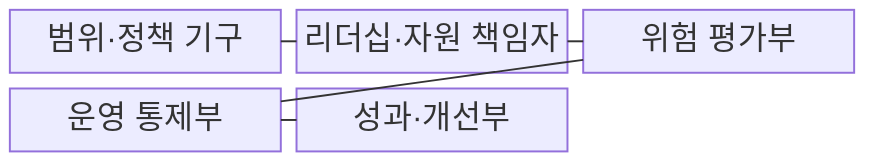
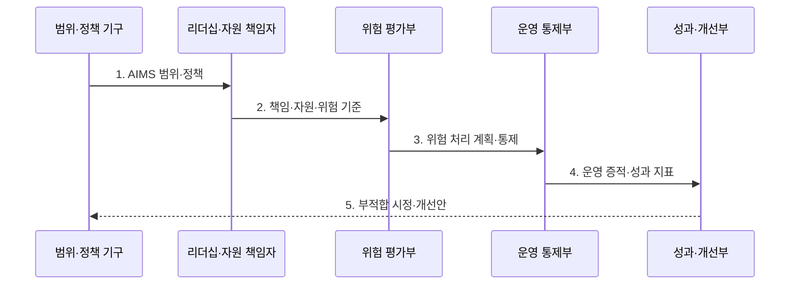

---
sidebar:
  order: 100
  label: "100. ISO/IEC 42001 AI 경영시스템 (AI Management System)"
  badge:
    text: "기출 · 70%"
    variant: note
title: "ISO/IEC 42001 AI 경영시스템 (AI Management System)"
date: "2026-07-31T08:55:06+09:00"
tags:
  - "notes-latest_tech"
weight: 100
extra:
  question_no: "100"
  source_status: "기출"
  source_history: "138회"
  priority: 70
  priority_note: "AI 경영시스템 인증·운영이 주요 쟁점"
---

## Ⅰ. 개요

핵심 용어

- **ISO/IEC 42001**: AI 경영시스템의 수립·운영·유지·지속 개선 요구사항을 정한 국제표준이다.
- **AI 경영시스템(AIMS)**: AI 정책과 목표를 세우고 이를 달성할 조직 절차와 통제를 지속 개선하는 관리체계이다.

- 정의/개념: **ISO/IEC 42001**은 AI 경영시스템의 수립·운영·개선 요구사항을 정한 국제표준
- 배경/필요성: 개별 모델 점검만으로는 조직의 AI 책임·위험에 대한 **지속 관리 불가**

#### 한줄 요약

- 조직의 AI 정책·책임·운영·심사·개선 과정이 작동하는지 보는 경영시스템 표준입니다.

## Ⅱ. 특징

핵심 용어

- **PDCA**: 정책과 통제를 계획하고 실행한 뒤 성과를 점검하고 문제를 개선하는 경영 순환이다.
- **모델 보증**: 개별 AI 모델이 정해진 성능·안전 요구를 충족한다고 평가하고 입증하는 활동이다.

- 조직 맥락 기반 **AIMS 범위·책임 설정**
- **PDCA** 기반 정책·운영·평가·시정 연결
- 데이터·영향·공급자 통제와 **모델 보증 한계**

#### 한줄 요약

- 조직의 AI 관리 방식을 개선하는 표준이며 인증서 자체가 개별 모델의 안전 보증은 아닙니다.

## Ⅲ. 구조 및 구성요소

핵심 용어

- **AIMS 경계**: 경영시스템을 적용할 조직·업무·AI·공급자의 범위를 정한 한계이다.
- **위험 평가**: AI의 위험·기회·영향을 식별하고 우선순위를 결정하는 활동이다.
- **부적합 시정**: 요구사항을 충족하지 못한 원인을 제거하고 재발 방지 효과를 확인하는 조치이다.

| 구성요소 | 책임 |
|:---|:---|
| 범위·정책 기구 | **AIMS 경계·목표·정책** 수립 |
| 리더십·자원 책임자 | **책임·권한·역량·자원** 배정 |
| 위험 평가부 | AI **위험·기회·영향** 평가 |
| 운영 통제부 | **수명주기 절차·증적** 관리 |
| 성과·개선부 | 내부 심사와 **부적합 시정·개선** |

#### 한줄 요약
- 정책 아래 위험 평가·운영 통제·성과 측정·개선을 연결합니다.

## Ⅳ. 흐름도

핵심 용어

- **위험 처리 계획**: 평가한 위험을 회피·완화·수용하기 위한 통제와 담당자·기한을 정한 계획이다.
- **운영 증적**: 경영시스템의 절차와 통제가 실제 수행됐음을 보여 주는 기록이다.

**동작 원리**

1. **AIMS 범위·정책**: 조직 맥락과 이해관계자 요구로 관리 경계 결정
2. **책임·자원·위험 기준**: 통제 소유자와 평가 기준 배정
3. **위험 처리 계획·통제**: AI 수명주기에 필요한 조치 실행
4. **운영 증적·성과 지표**: 내부 심사로 통제 효과 측정
5. **부적합 시정·개선안**: 원인 제거 결과를 다음 계획에 반영

#### 한줄 요약
- 계획한 AI 통제를 실행·점검하고 부적합을 시정해 다음 계획에 반영합니다.

## Ⅴ. 종류 및 비교

핵심 용어

- **ISO/IEC 27001**: 정보보호 위험과 통제를 운영하는 정보보호 경영시스템 요구사항 표준이다.
- **ISO/IEC 23894**: 조직이 AI 위험관리를 수행하는 방법을 안내하는 지침 표준이다.

| ISO 표준 | ISO/IEC 42001 | ISO/IEC 27001 | ISO/IEC 23894 |
|:---|:---|:---|:---|
| 적용 기준 | AI 관리체계의 **지속 개선** 시 | 정보보호 **통제 운영** 시 | AI **위험 평가 보강** 시 |
| 핵심 특징 | **AI 경영시스템 요구사항** | **정보보호 경영시스템** | **AI 위험관리 지침** |
| 한계 | **제품 성능 인증**과 구별 | **AI 고유 위험** 범위 부족 | **인증 요구사항**과 구별 |

> 요약: **경영시스템·위험지침** 역할에 따른 ISO 표준 구분

#### 한줄 요약
- ISO/IEC 42001은 경영시스템, 23894는 AI 위험관리 지침에 초점을 둡니다.

## Ⅵ. 실무 고려사항 및 대책

핵심 용어

- **범위 누락**: 외부 모델이나 공급자 등 실제 AI 운영 요소가 AIMS 적용 경계에서 빠지는 문제이다.
- **통제 증적 부족**: 통제 책임과 수행 기록이 연결되지 않아 심사에서 효과를 입증하지 못하는 문제이다.
- **인증 오인**: 경영시스템 인증을 개별 모델의 성능·안전 보증으로 잘못 해석하는 문제이다.

| 문제 | 대책 | 효과 |
|:---|:---|:---|
| **AIMS 범위 누락** | 외부 모델·공급자를 **적용 범위**에 포함 | 공급망의 **통제 공백 축소** |
| **통제 증적 부족** | 수명주기별 **책임자·운영 기록** 연결 | 심사의 **추적성 확보** |
| 인증의 **모델 보증 오인** | 제품 성능·안전성을 **별도 평가** | 인증 범위의 **오해 방지** |

#### 한줄 요약
- 기존 보안 감사 틀을 활용하되 AI 데이터·영향·모델 변경에 필요한 통제와 증거를 추가해야 합니다.

## Ⅶ. 결론

핵심 용어

- **통제 효과**: 적용한 절차와 조치가 실제로 위험과 부적합을 줄인 정도이다.
- **지속 개선**: 성과 평가와 시정 결과를 다음 계획에 반영해 경영시스템을 반복 향상하는 활동이다.

- 조직 범위·AI 위험 수준에 맞춰 **AIMS**를 운영하고 **통제 효과** 기반 시정·개선

#### 한줄 요약
- 인증서보다 AI 관리 절차가 일상에서 작동하고 문제가 생길 때 실제로 고쳐지는지가 중요합니다.
