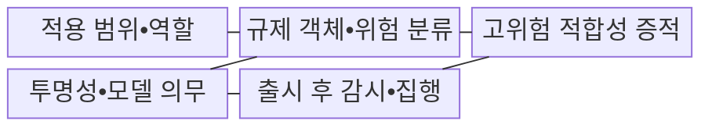
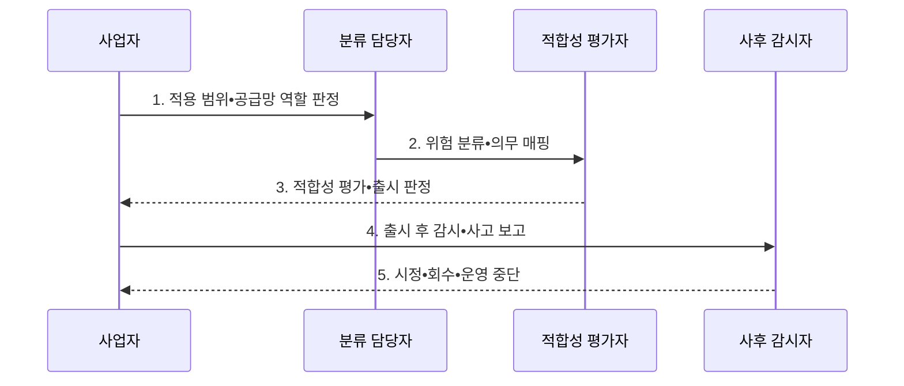

---
sidebar:
  order: 101
  label: "101. EU AI Act (유럽연합 인공지능법)"
  badge:
    text: "기출 • 70%"
    variant: note
title: "EU AI Act (유럽연합 인공지능법)"
date: "2026-08-04T14:14:09+09:00"
tags:
  - "notes-latest_tech"
weight: 101
extra:
  question_no: "101"
  source_status: "기출"
  source_history: "138회"
  priority: 70
  priority_note: "위험등급 기반 규제가 최신 정책 핵심"
---

## Ⅰ. 개요

핵심 용어

- **유럽연합 인공지능법(European Union Artificial Intelligence Act, EU AI Act)**: 인공지능의 용도•위험 수준과 공급망 역할에 따라 금지•적합성•투명성 의무를 정한 유럽연합 규제이다.
- **유럽연합 규정 2024/1689(Regulation (European Union) 2024/1689, Regulation (EU) 2024/1689)**: EU AI Act의 공식 법령 번호이다.

- 정의/개념: EU 규정 2024/1689에 따라 AI의 위험•역할별 의무를 정한 **EU AI Act 규제**
- 배경/필요성: 기존 일반 규정은 **AI 위험 등급•공급망 책임별 통제 강도 구분 곤란**

#### 한줄 요약
- AI의 용도와 사업자 역할에 따라 금지•검증•고지•감시 의무를 다르게 적용하는 유럽연합 법규입니다.

## Ⅱ. 특징

핵심 용어

- **역외 적용**: 사업자 소재지와 별개로 EU 시장 제공이나 EU 내 출력 사용 조건에 따라 규제가 적용되는 원칙이다.
- **공급망 역할**: 공급자•배포자•수입자 등 AI 제공과 사용 과정에서 사업자가 맡는 법적 지위이다.

- EU 시장•출력 사용 기준의 **역외 적용**
- AI 시스템•범용 모델과 **위험 유형별 의무**
- **공급망 역할별 문서•감시•사고 책임**

#### 한줄 요약
- 같은 AI라도 적용 시점과 용도, 공급자•배포자 등 역할에 따라 준비할 의무가 달라집니다.

## Ⅲ. 구조 및 구성요소

핵심 용어

- **고위험 AI**: 안전이나 기본권에 큰 영향을 줄 수 있어 위험관리•데이터•문서•인간 감독 의무가 부과되는 AI 시스템이다.
- **위험 기반 분류**: AI의 목적•사용 맥락•피해 가능성에 따라 금지•고위험•투명성 대상•저위험으로 규제 강도를 구분하는 체계이다.
- **공급자(Provider)**: AI 시스템을 개발하여 시장에 출시하거나 서비스하는 주체이다.
- **배포자(Deployer)**: AI 시스템을 자신의 업무에 실제 사용하는 주체이다.
- **범용 인공지능 모델(General-Purpose Artificial Intelligence Model, GPAI Model)**: 여러 하위 과업에 적용할 수 있어 기술문서•정보 제공 및 시스템 위험 의무가 적용될 수 있는 범용 모델이다.
- **적합성 평가**: 출시 전 고위험 AI가 법정 요구사항을 충족하는지 증적과 절차로 확인하는 평가이다.
- **출시 후 감시**: 배포 이후 성능•위험•사고를 추적하고 필요한 시정조치를 수행하는 활동이다.

AI의 고위험 통제 항목: **적합성 평가•출시 후 감시**, 연결 기준: 공급망 역할

| 구성요소 | 책임 |
|:---|:---|
| 적용 범위•역할 | 시장 사용 지역•공급자•배포자•수입자 등 계약 책임 기록 |
| 규제 객체•위험 분류 | 시스템과 모델 구분 및 금지•고위험•투명성 근거 연결 |
| 고위험 적합성 증적 | 위험관리, 데이터, 문서, 로그, 인간 감독 및 평가 자료 |
| 투명성•모델 의무 | 시스템 고지•표시 및 범용 AI 공급자 문서•위험 의무 |
| 출시 후 감시•집행 | 운영 감시, 사고 보고, 시정조치 및 감독기관 대응 기록 |

#### 한줄 요약
- 사업자 역할과 위험 등급을 문서•고지•출시 후 감시 증거에 연결합니다.

## Ⅳ. 흐름도

핵심 용어

- **위험 분류**: AI의 용도와 영향에 따라 금지•고위험•투명성 대상 등의 규제 범주를 판정하는 과정이다.
- **중대 사고**: 건강•안전•기본권 등에 중대한 피해를 일으켜 보고와 시정이 필요한 사건이다.

AI의 연결 항목: **위험 분류•중대 사고**, 통제 시점: 출시 전 평가•출시 후 감시

1. **적용 범위•공급망 역할 판정**: 역외 적용과 사업자 책임 결정
2. **위험 분류•의무 매핑**: 금지•고위험•투명성 통제 연결
3. **적합성 평가•출시 판정**: 증적 기반 출시•보완 여부 결정
4. **출시 후 감시•사고 보고**: 성능•위험•중대 사고 추적
5. **시정•회수•운영 중단**: 비준수 위험의 피해 확산 방지

#### 한줄 요약
- 적용 시점과 역할을 확인하고 AI 시스템•범용모델을 분류해 필요한 의무를 연결합니다.

## Ⅴ. 종류 및 비교

핵심 용어

- **금지된 AI 관행**: 허용할 수 없는 조작•악용 등으로 법이 사용 자체를 금지한 AI 용도이다.
- **투명성 의무 AI**: AI 상호작용이나 합성 콘텐츠임을 이용자에게 알리는 의무가 적용되는 AI이다.

AI의 용도와 영향에 따라 금지 관행, 고위험 시스템, 투명성 의무 대상으로 구분한다.

| 위험 유형 | 금지된 AI 관행 | 고위험 AI 시스템 | 투명성 의무 AI |
|:---|:---|:---|:---|
| 적용 기준 | 허용 불가 조작•악용 용도 | 안전•기본권 중대 영향 용도 | AI 상호작용•합성 콘텐츠 |
| 핵심 특징 | 허용되지 않는 사용 금지 | 위험관리•데이터•감독 의무 | AI 상호작용•합성물 고지 |
| 한계 | 예외•적용 범위 판정 | 준수 증적•공급망 조정 부담 | 고지로 실질 위험 제거 불가 |

> 요약: 위험•용도•역할별 규제 준수 필요

#### 한줄 요약
- 금지 관행, 출시 전 강한 통제가 필요한 고위험 시스템, 특정 고지가 필요한 AI를 구분합니다.

## Ⅵ. 실무 고려사항 및 대책

핵심 용어

- **위험 등급 누락**: 사용 목적이나 공급망 역할을 잘못 판정해 적용해야 할 규제 의무가 빠지는 문제이다.
- **적합성 증적 부족**: 고위험 AI의 위험관리•데이터•로그•인간 감독 요구 충족을 입증하지 못하는 문제이다.

| 문제 | 대책 | 효과 |
|:---|:---|:---|
| 용도•역할 오판으로 **위험 등급 누락** | 사용 목적•공급망 역할별 분류 기록 | 적용 의무 **추적성 확보** |
| 고위험 AI의 **적합성 증적 부족** | 위험관리•데이터•로그•감독 증적 연결 | 출시 전 **준수 입증** |

#### 한줄 요약
- 채용 AI와 생성형 AI는 용도와 공급망 역할을 구분해 각각의 문서•고지•감시 의무를 관리합니다.

## Ⅶ. 결론

핵심 용어

- **출시 의무**: AI를 시장에 제공하기 전에 분류•평가•문서화•등록 등으로 충족해야 하는 요구사항이다.
- **감시 의무**: 출시 후 성능과 사고를 추적하고 보고•시정해야 하는 요구사항이다.

- 결정 기준: **위험 유형•공급망 역할**, 적용 법규: **EU AI Act의 출시•감시 의무**

#### 한줄 요약
- 규제 적용 시점과 사업자 역할별 의무를 제품의 설계•출시•운영 절차에 연결해야 합니다.
