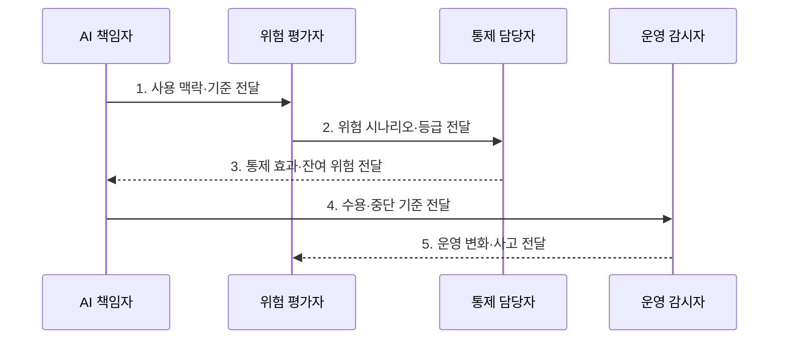

---
sidebar:
  order: 102
  label: "102. AI Risk Management (AI 위험관리)"
  badge:
    text: "기출 · 70%"
    variant: note
title: "AI Risk Management (AI 위험관리)"
date: "2026-07-27T23:59:59+09:00"
tags:
  - "notes-latest_tech"
weight: 102
extra:
  question_no: "102"
  source_status: "기출"
  source_history: "138회"
  priority: 70
  priority_note: "위험 식별·평가·통제가 거버넌스 핵심"
---

## 미리 알고가기

- **AI 위험(AI Risk)**: AI의 데이터·모델·사용 맥락에서 사람·조직·사회에 피해가 발생할 가능성과 영향
- **AI 위험관리(AI Risk Management)**: AI 위험을 식별·분석·처리하고 통제 효과와 운영 변화를 반복 감시하는 활동
- **잔여 위험(Residual Risk)**: 통제를 적용한 뒤에도 남아 책임자의 수용·추가 완화·중단 판단이 필요한 위험

## Ⅰ. 개요

- 정의/개념: AI 피해를 식별·평가·처리·감시하는 활동
- 배경/필요성: 배포 전 정확도만으로 **용도·데이터·공격 변화**의 지속 통제 곤란

### 쉽게 이해하기 (학습용)
- AI의 잠재적 피해를 찾아 줄이고 남은 위험과 운영 변화를 계속 확인하는 활동입니다.

## Ⅱ. 특징

- 데이터·보안·오남용·기본권의 **종합 위험 식별**
- 가능성·영향·가역성·불확실성 기반 **위험 평가**
- 강행 규정 제외와 배포 후 **잔여 위험 감시**

### 쉽게 이해하기 (학습용)
- 발생 가능성과 피해뿐 아니라 되돌릴 수 있는지와 취약 집단의 영향도 보고 법 위반은 위험 수용 대상에서 제외합니다.

## Ⅲ. 구조 및 구성요소

| 구성요소 | 책임 |
|:---|:---|
| 위험 기준·승인 | 위험 등급, 허용 한도와 잔여 위험 승인권자 정의 |
| AI 목록·맥락 | 목적, 데이터, 모델, 사용자와 운영환경 등록 |
| 위험 대장·평가 | 시나리오, 원인, 영향, 통제와 우선순위 기록 |
| 통제·담당자 | 예방·탐지·대응 통제 이행 및 효과 검증 자료 |
| 감시·사고 대응 | 지표 추적, 사고 보고 및 재평가·중지 절차 |

### 쉽게 이해하기 (학습용)
- 위험 기준·대장·통제·사고 대응을 연결해 누가 어떤 위험을 승인했는지 남깁니다.

## Ⅳ. 흐름도

- **1. 사용 맥락·기준 전달**: 목적·데이터·영향 집단·허용 한도 확정
- **2. 위험 시나리오·등급 전달**: 가능성·영향·가역성 기반 우선순위 결정
- **3. 통제 효과·잔여 위험 전달**: 예방·탐지·대응 조치 후 위험 재평가
- **4. 수용·중단 기준 전달**: 책임자의 잔여 위험 승인·회피 결정
- **5. 운영 변화·사고 전달**: 위험 대장과 통제의 반복 갱신

### 쉽게 이해하기 (학습용)
- 위험을 우선순위대로 처리하고 통제 효과를 검증한 뒤 책임자가 남은 위험을 승인합니다.

## Ⅴ. 종류 및 비교

| 위험 영역 | 데이터 품질 위험 | 보안·오남용 위험 | 법적·사회적 위험 |
|:---|:---|:---|:---|
| 적용 기준 | 학습·평가 데이터 관리 | 모델·도구·접근 통제 | 권리·규제·영향 검토 |
| 핵심 특징 | 대표성·오염·드리프트 | 공격·유출·목적 외 사용 | 차별·책임·준수 위험 |
| 한계 | 실제 운영 분포 변화 | 새 공격·연쇄 행동 | 가치 충돌·법역 차이 |

> 요약: 위험 유형별 원인과 대응 필요

### 쉽게 이해하기 (학습용)
- 데이터 품질, 보안·오남용, 법적·사회적 위험은 원인과 대응 통제가 달라 따로 관리합니다.

## Ⅵ. 실무 고려사항 및 대책

| 고려사항 | 대책 | 효과 |
|:---|:---|:---|
| 맥락 누락으로 **위험 시나리오** 과소평가 | 목적·영향 집단·오용 경로 공동 식별 | 위험 대장 **포괄성 향상** |
| 통제 후 **잔여 위험** 승인 불명확 | 허용 한도·중단 기준과 책임자 지정 | 위험 수용 **책임 추적성** 확보 |

### 쉽게 이해하기 (학습용)
- 금융 AI는 환각과 개인정보 유출을, 제조 AI는 환경 변화에 따른 오탐·미탐을 중점 관리합니다.

## Ⅶ. 결론

- **위험 등급·통제 효과·잔여 위험**으로 AI의 수용·완화·중단을 결정

### 쉽게 이해하기 (학습용)
- 출시 전 한 번 평가하는 데 그치지 않고 운영 환경이 바뀔 때마다 위험과 통제를 다시 확인해야 합니다.
