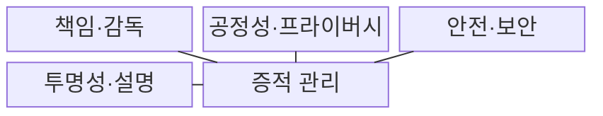
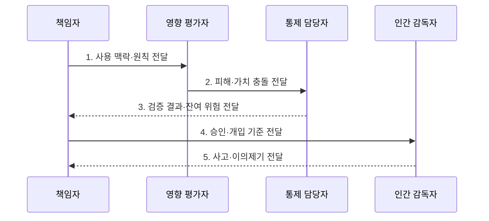

---
sidebar:
  order: 103
  label: "103. Responsible AI (책임 있는 AI)"
  badge:
    text: "기출 · 70%"
    variant: note
title: "Responsible AI (책임 있는 AI)"
date: "2026-07-31T08:46:44+09:00"
tags:
  - "notes-latest_tech"
weight: 103
extra:
  question_no: "103"
  source_status: "기출"
  source_history: "138회"
  priority: 70
  priority_note: "공정성·투명성·책임성이 반복 쟁점"
---

## Ⅰ. 개요

핵심 용어

- **책임 있는 인공지능(Responsible Artificial Intelligence, Responsible AI)**: 공정성·투명성·안전성 원칙을 측정 가능한 기술·조직 통제로 구현하는 인공지능 운영 접근이다.
- **책임 공백**: AI의 오류나 피해 발생 시 검토·시정·구제 책임자가 정해지지 않은 상태이다.

- 정의/개념: 공정성·투명성·안전성 원칙을 구현하는 **책임 있는 인공지능(Responsible Artificial Intelligence, Responsible AI) 기반 기술·조직 통제**
- 배경/필요성: 정확도만으로는 차별·안전 실패와 **책임 공백** 식별 곤란

#### 한줄 요약
- 자동차에 브레이크·안전검사·운전자 책임을 함께 두듯 AI에도 보호장치와 책임 절차를 둡니다.

## Ⅱ. 특징

핵심 용어

- **통제 비례성**: AI의 사용 맥락과 피해 규모에 비례해 검증·감독 강도를 정하는 원칙이다.
- **잔여 위험**: 기술·조직 통제를 적용한 뒤에도 남아 책임자의 승인과 추적이 필요한 위험이다.
- **인간 감독**: AI 판단을 사람이 검토·개입·중단하고 이의제기를 처리하는 통제이다.

- 사용 맥락·피해 규모 기반 **통제 비례성**
- 신뢰성 가치 충돌과 **잔여 위험 기록**
- 데이터·모델 검증과 **인간 감독·사고 대응**

#### 한줄 요약
- 정확성·공정성·프라이버시가 충돌할 수 있어 책임자가 근거와 남은 위험을 확인해야 합니다.

## Ⅲ. 구조 및 구성요소

핵심 용어

- **공정성**: 관련 집단 사이에 정당화하기 어려운 성능·피해 차이가 발생하지 않도록 하는 원칙이다.
- **투명성**: AI의 목적·한계·사용 사실과 판단 근거를 이해관계자에게 제공하는 원칙이다.
- **증적 관리**: 검증·승인·변경·사고 기록을 연결해 통제 수행과 책임을 입증하는 활동이다.

| 구성요소 | 책임 |
|:---|:---|
| 책임·감독 | 위험 승인 권한, 인간 개입 지점 및 이의제기 절차 |
| 공정성·프라이버시 | 집단 피해 방지 및 개인정보 처리 제한 기준 |
| 안전·보안 | 오작동·공격 시 허용 동작과 차단·복구 수단 |
| 투명성·설명 | 목적·한계·출력 근거 제공 수단 |
| 증적 관리 | 검증 결과, 승인·사고 이력을 연결한 기록 |

#### 한줄 요약
- 책임자와 차별·정보보호 검사, 안전장치, 설명 수단, 변경 기록을 하나의 운영 절차로 연결합니다.

## Ⅳ. 흐름도

핵심 용어

- **가치 충돌**: 정확성·공정성·프라이버시·안전성 같은 목표를 동시에 최대화하기 어려운 상태이다.
- **이의제기**: AI 판단의 영향을 받은 사람이 근거를 확인하고 재심이나 구제를 요청하는 절차이다.

- **1. 사용 맥락·원칙 전달**: 영향 집단과 공정성·안전 목표 확정
- **2. 피해·가치 충돌 전달**: 정확성·공정성·프라이버시 상충 측정
- **3. 검증 결과·잔여 위험 전달**: 기술·조직 통제의 효과와 한계 기록
- **4. 승인·개입 기준 전달**: 인간 재심·중단·구제 책임 지정
- **5. 사고·이의제기 전달**: 운영 증적 기반 통제·원칙 갱신

#### 한줄 요약
- 책임자를 정하고 사용 맥락의 위험을 측정한 뒤 보호장치를 승인·운영합니다.

## Ⅴ. 종류 및 비교

핵심 용어

- **인공지능 윤리(Artificial Intelligence Ethics, AI 윤리)**: AI 개발과 사용에서 지켜야 할 가치·금지 원칙을 제시하는 영역이다.
- **인공지능 거버넌스(Artificial Intelligence Governance, AI 거버넌스)**: 조직의 AI 의사결정권·책임·승인·감사를 운영하는 감독 체계이다.

인공지능(Artificial Intelligence, AI)의 책임 체계는 가치 원칙, 의사결정 구조, 구현 통제로 구분한다.

| 책임 체계 | 책임 있는 AI | AI 윤리 | AI 거버넌스 |
|:---|:---|:---|:---|
| 적용 기준 | 개발·배포 위험 통제 | 가치 판단 원칙 정립 | 조직·승인 체계 운영 |
| 핵심 특징 | 검증·통제로 원칙 구현 | 가치·금지 원칙 제시 | 권한·책임·감사 구조 |
| 한계 | 지표 상충·운영 비용 | 추상 선언 위험 | 형식적 위원회 위험 |

> 요약: 원칙의 기술·조직적 구현 필요

#### 한줄 요약
- 윤리는 가치 원칙, 거버넌스는 결정 구조, 책임 있는 AI는 원칙을 구현하는 통제 활동입니다.

## Ⅵ. 실무 고려사항 및 대책

핵심 용어

- **공정성 훼손**: 집단별 오류나 피해 차이가 정당한 기준 없이 커지는 문제이다.
- **이의제기 공백**: 자동 판단을 사람이 재검토하고 수정·구제할 절차가 없는 문제이다.

| 문제 | 대책 | 효과 |
|:---|:---|:---|
| 집단별 오류 차이로 **공정성 훼손** | 집단별 성능·피해와 임계값 공동 검증 | 차별 위험 **측정·완화** |
| 자동 판단의 **이의제기·책임 공백** | 인간 재심·중단·구제 절차 지정 | 의사결정 **책임성 확보** |

#### 한줄 요약
- 집단별 오류를 검사하고 고위험 판단은 사람이 재심하며 이상 출력은 차단하는 통제를 적용합니다.

## Ⅶ. 결론

핵심 용어

- **기술 통제**: 데이터·모델·출력의 위험을 측정하고 차단하도록 시스템에 구현한 보호조치이다.
- **감독 수준**: AI 위험에 따라 사람이 검토·승인·개입해야 하는 범위와 강도이다.

- 결정 기준: **가치 충돌·잔여 위험**, 결정 대상: **기술 통제·인간 감독 수준**

#### 한줄 요약
- 완전무결하다고 선언하기보다 측정된 한계와 남은 위험을 책임자가 판단하고 추적해야 합니다.
