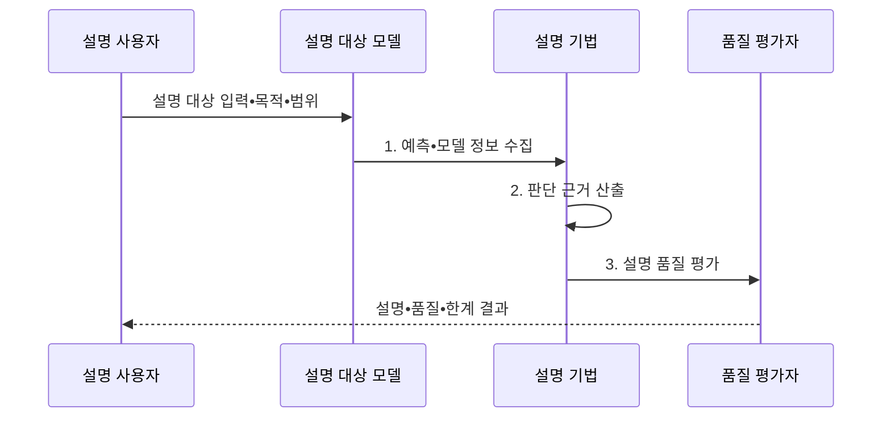

---
sidebar:
  order: 104
  label: "104. Explainable AI (설명 가능한 AI)"
  badge:
    text: "기출 • 60%"
    variant: note
title: "Explainable AI (설명 가능한 AI)"
date: "2026-08-04T14:16:45+09:00"
tags:
  - "notes-latest_tech"
weight: 104
extra:
  question_no: "104"
  source_status: "기출"
  source_history: "122회, 135회"
  priority: 60
  priority_note: "설명 가능성과 신뢰성 확보가 반복 출제"
---

## Ⅰ. 개요

핵심 용어

- **설명 가능한 인공지능(Explainable Artificial Intelligence, XAI)**: 인공지능의 판단 근거를 사람이 이해하고 검증할 수 있는 형태로 제공하는 기술이다.
- **판단 근거**: 모델 출력에 영향을 준 특징•규칙•사례 또는 내부 관계를 나타내는 정보이다.

- 정의/개념: AI의 판단 근거를 사람이 이해•검증할 형태로 제공하는 **XAI 기술**
- 배경/필요성: 예측값만으로 **오류 원인•편향•이의제기 근거 확인 곤란**

#### 한줄 요약
- 결과에 영향을 준 규칙•특징•사례를 사용 목적에 맞게 사람이 이해할 수 있도록 보여 줍니다.

## Ⅱ. 특징

핵심 용어

- **사후 설명**: 학습이 끝난 모델의 입력•출력이나 내부 정보를 분석해 판단 근거를 추정하는 방식이다.
- **충실도**: 설명이 원모델의 실제 판단 과정을 정확히 반영하는 정도이다.
- **안정성**: 의미가 비슷한 입력에서 설명이 과도하게 달라지지 않는 성질이다.

- 모델 자체 해석과 **사후 설명** 구분
- 개별 출력의 국소 설명과 **전역 설명** 구분
- 충실도•안정성•이해도와 **보증 한계** 평가

#### 한줄 요약
- 설명이 원래 모델 판단을 충실히 반영하는지와 작은 변화에도 지나치게 흔들리지 않는지 검증합니다.

## Ⅲ. 구조 및 구성요소

핵심 용어

- **설명 범위**: 개별 출력과 모델 전체 동작 가운데 설명할 대상을 정한 영역이다.
- **설명 산출물**: 규칙•기여도•사례 등 사용자 역할과 목적에 맞게 표현한 판단 근거이다.
- **품질 평가**: 충실도•안정성•이해도를 측정해 설명의 사용 가능 범위와 한계를 판정한다.

| 구성요소 | 책임 |
|:---|:---|
| 설명 대상 모델 | 동작 또는 출력 근거를 분석할 시스템 |
| 설명 범위 | 출력 개별 또는 전체 모델 중 설명할 범위 |
| 설명 기법 | 규칙•기여도•사례 등 근거 산출 방법 |
| 설명 산출물 | 사용자 역할•목적에 맞는 근거 표현 |
| 품질 평가 | 충실도•안정성•이해도로 한계 판정 |

#### 한줄 요약
- 누구에게 어떤 결정을 어느 범위로 설명하고 품질을 어떻게 검증할지 정합니다.

## Ⅳ. 흐름도

핵심 용어

- **설명 사용자**: 모델의 판단을 검토•운영•이의제기하기 위해 설명을 사용하는 이해관계자이다.
- **기여도**: 입력 특징이 특정 예측값에 미친 영향의 방향과 크기를 나타낸 값이다.

1. **예측•모델 정보 수집**: 설명에 필요한 입력•출력•내부 정보 확보
2. **판단 근거 산출**: 기여도•규칙•사례를 목적에 맞게 표현
3. **설명 품질 평가**: 충실도•안정성•이해도와 한계 판정

#### 한줄 요약
- 목적에 맞는 설명을 만들고 원모델 충실도와 안정성을 확인해 사람의 판단을 돕습니다.

## Ⅴ. 종류 및 비교

핵심 용어

- **국소 설명**: 특정 입력에 대한 개별 예측의 판단 근거를 설명하는 방식이다.
- **전역 설명**: 모델 전체가 평균적으로 어떤 특징과 규칙에 따라 동작하는지 설명하는 방식이다.

| 설명 범위 | 국소 설명 | 전역 설명 |
|:---|:---|:---|
| 적용 기준 | 개별 결정 검토•이의제기 | 모델 선택•편향 조사•감시 |
| 핵심 특징 | 특정 예측의 특징 기여 | 전체 모델의 평균 동작 |
| 한계 | 다른 입력으로 일반화 불가 | 개별 예측 세부 누락 |

> 요약: 설명 목적에 따른 범위 선택 필요

#### 한줄 요약
- 국소 설명은 개별 결과의 근거를, 전역 설명은 모델 전체의 동작 경향을 보여 줍니다.

## Ⅵ. 실무 고려사항 및 대책

핵심 용어

- **충실도 불일치**: 설명이 그럴듯하지만 원모델의 실제 판단을 제대로 반영하지 못하는 문제이다.
- **설명 불안정**: 입력의 작은 변화나 반복 실행에 따라 판단 근거가 크게 달라지는 문제이다.

| 문제 | 대책 | 효과 |
|:---|:---|:---|
| 설명과 원모델 판단의 **충실도 불일치** | 삭제•교란 기반 충실도 검증 | 설명의 **판단 근거성** 확보 |
| 작은 입력 변화로 **설명 불안정** | 반복•근방 표본의 설명 일관성 측정 | 국소 설명 **재현성 향상** |

#### 한줄 요약
- 설명은 담당자의 재심을 돕지만 그 자체로 모델에 차별이나 오류가 없음을 보장하지 않습니다.

## Ⅶ. 결론

핵심 용어

- **이의제기 설명**: 개인의 특정 판단을 검토하고 재심을 요청할 수 있도록 제공하는 국소 근거이다.
- **모델 감시 설명**: 모델 전체의 편향과 동작 변화를 추적하기 위해 사용하는 전역 근거이다.

- 개별 이의제기는 **국소 설명**, 모델 감시는 **전역 설명** 선택

#### 한줄 요약
- 설명은 판단과 위험 평가를 돕는 증거일 뿐 모델이 안전하다는 보증서는 아닙니다.
