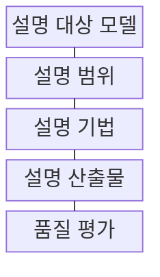
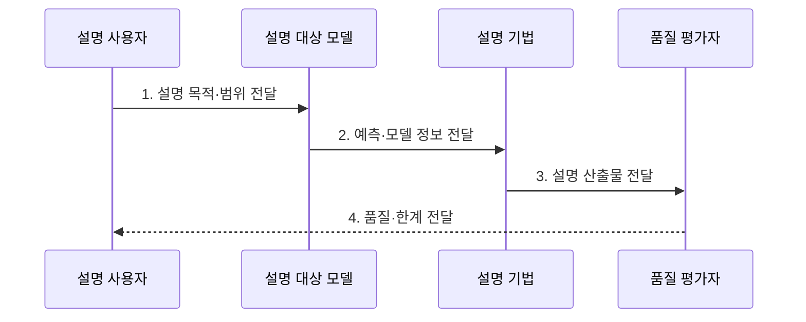

---
sidebar:
  order: 104
  label: "104. Explainable AI (설명 가능한 AI)"
  badge:
    text: "기출 · 60%"
    variant: note
title: "Explainable AI (설명 가능한 AI)"
date: "2026-07-27T23:59:59+09:00"
tags:
  - "notes-latest_tech"
weight: 104
extra:
  question_no: "104"
  source_status: "기출"
  source_history: "122회, 135회"
  priority: 60
  priority_note: "설명 가능성과 신뢰성 확보가 반복 출제"
---

## 미리 알고가기

- **설명 가능한 인공지능(Explainable Artificial Intelligence, XAI)**: AI의 판단 근거를 사람이 이해하고 검증할 수 있는 형태로 제공하는 기술
- **국소·전역 설명(Local·Global Explanation)**: 개별 예측의 근거와 모델 전체의 평균 동작을 각각 설명하는 범위
- **충실도(Fidelity)**: 설명이 사람이 보기 좋은 정도가 아니라 원모델의 실제 판단을 얼마나 정확히 반영하는지 나타내는 기준

## Ⅰ. 개요

- 정의/개념: AI 동작·출력 근거를 이해 가능한 형태로 표현
- 배경/필요성: 예측값만으로 **오류 원인·편향·이의제기 근거** 확인 곤란

### 쉽게 이해하기 (학습용)
- 결과에 영향을 준 규칙·특징·사례를 사용 목적에 맞게 사람이 이해할 수 있도록 보여 줍니다.

## Ⅱ. 특징

- 모델 자체 해석과 **사후 설명** 구분
- 개별 출력의 국소 설명과 **전역 설명** 구분
- 충실도·안정성·이해도와 **보증 한계** 평가

### 쉽게 이해하기 (학습용)
- 설명이 원래 모델 판단을 충실히 반영하는지와 작은 변화에도 지나치게 흔들리지 않는지 검증합니다.

## Ⅲ. 구조 및 구성요소

| 구성요소 | 책임 |
|:---|:---|
| 설명 대상 모델 | 동작 또는 출력 근거를 분석할 시스템 |
| 설명 범위 | 출력 개별 또는 전체 모델 중 설명할 범위 |
| 설명 기법 | 규칙·기여도·사례 등 근거 산출 방법 |
| 설명 산출물 | 사용자 역할·목적에 맞는 근거 표현 |
| 품질 평가 | 충실도·안정성·이해도로 한계 판정 |

### 쉽게 이해하기 (학습용)
- 누구에게 어떤 결정을 어느 범위로 설명하고 품질을 어떻게 검증할지 정합니다.

## Ⅳ. 흐름도

### 동작 원리

- **1. 설명 목적·범위 전달**: 오류 분석·이의제기에 맞는 국소·전역 선택
- **2. 예측·모델 정보 전달**: 기여도·규칙·사례 산출에 필요한 정보 제공
- **3. 설명 산출물 전달**: 사용자 역할에 맞는 판단 근거 표현
- **4. 품질·한계 전달**: 충실도·안정성·이해도 검증 결과 제공

### 쉽게 이해하기 (학습용)
- 목적에 맞는 설명을 만들고 원모델 충실도와 안정성을 확인해 사람의 판단을 돕습니다.

## Ⅴ. 종류 및 비교

| 설명 범위 | 국소 설명 | 전역 설명 |
|:---|:---|:---|
| 적용 기준 | 개별 결정 검토·이의제기 | 모델 선택·편향 조사·감시 |
| 핵심 특징 | 특정 예측의 특징 기여 | 전체 모델의 평균 동작 |
| 한계 | 다른 입력으로 일반화 불가 | 개별 예측 세부 누락 |

> 요약: 설명 목적에 따른 범위 선택 필요

### 쉽게 이해하기 (학습용)
- 국소 설명은 개별 결과의 근거를, 전역 설명은 모델 전체의 동작 경향을 보여 줍니다.

## Ⅵ. 실무 고려사항 및 대책

| 고려사항 | 대책 | 효과 |
|:---|:---|:---|
| 설명과 원모델 판단의 **충실도 불일치** | 삭제·교란 기반 충실도 검증 | 설명의 **판단 근거성** 확보 |
| 작은 입력 변화로 **설명 불안정** | 반복·근방 표본의 설명 일관성 측정 | 국소 설명 **재현성 향상** |

### 쉽게 이해하기 (학습용)
- 설명은 담당자의 재심을 돕지만 그 자체로 모델에 차별이나 오류가 없음을 보장하지 않습니다.

## Ⅶ. 결론

- **설명 목적·충실도·안정성**으로 XAI의 국소·전역 범위와 기법을 결정

### 쉽게 이해하기 (학습용)
- 설명은 판단과 위험 평가를 돕는 증거일 뿐 모델이 안전하다는 보증서는 아닙니다.
