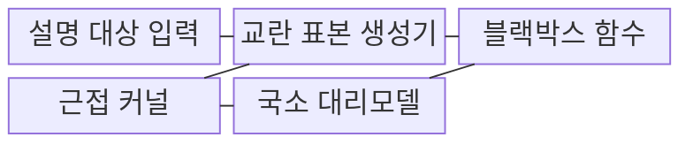
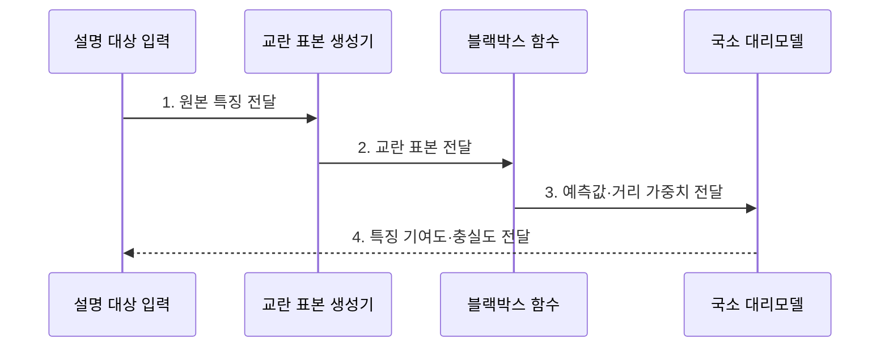

---
sidebar:
  order: 105
  label: "105. LIME (국소 대리 설명)"
  badge:
    text: "기출 · 40%"
    variant: note
title: "LIME (국소 대리 설명)"
date: "2026-07-27T23:59:59+09:00"
tags:
  - "notes-latest_tech"
weight: 105
extra:
  question_no: "105"
  source_status: "기출"
  source_history: "122회, 135회"
  priority: 40
  priority_note: "국소 대리 설명은 설명가능 AI 세부 기법"
---

## 미리 알고가기

- **국소 해석 가능한 모델 불가지론 설명(Local Interpretable Model-agnostic Explanations, LIME)**: 특정 예측 주변의 모델 행동을 단순한 대리 모델로 근사하는 설명 기법
- **교란 표본(Perturbed Sample)**: 설명 대상 입력의 특징을 바꿔 블랙박스 모델의 주변 반응을 관찰하는 표본
- **근접 커널(Proximity Kernel)**: 교란 표본과 원본 입력의 거리를 국소 대리모델 학습 가중치로 변환하는 함수
- **국소 충실도(Local Fidelity)**: 대리모델이 설명 대상 주변에서 블랙박스 예측을 얼마나 정확히 근사하는지 나타내는 기준

## Ⅰ. 개요

- 정의/개념: 입력 주변을 단순 모델로 근사하는 국소 설명
- 배경/필요성: 블랙박스 모델의 **개별 예측·특징 영향** 확인 한계 보완 필요

### 쉽게 이해하기 (학습용)
- 특정 입력을 조금씩 바꾸며 원래 모델의 반응을 모아 주변 경계를 단순한 모델로 흉내 냅니다.

## Ⅱ. 특징

- 예측 호출만 사용하는 **모델 비종속 설명**
- 거리 가중 교란 표본 기반 **국소 대리모델**
- 교란 분포·커널에 따른 **설명 변동성**

### 쉽게 이해하기 (학습용)
- 원본 주변의 모델 반응을 단순하게 흉내 내므로 표본 범위와 거리 기준이 바뀌면 설명도 달라질 수 있습니다.

## Ⅲ. 구조 및 구성요소

| 구성요소 | 책임 |
|:---|:---|
| 설명 대상 입력 | 국소 동작을 설명할 원본 사례 |
| 교란 표본 생성기 | 원본 특징을 변형해 질의할 주변 입력 생성 |
| 근접 커널 | 원본과 표본의 거리를 학습 가중치로 변환 |
| 블랙박스 함수 | 교란 표본에 대한 모델 예측값 반환 |
| 국소 대리모델 | 가중 표본으로 블랙박스 출력을 근사함 |

### 쉽게 이해하기 (학습용)
- 원본 사례, 교란 규칙, 거리 함수, 블랙박스 예측과 국소 대리모델이 필요합니다.

## Ⅳ. 흐름도

- **1. 원본 특징 전달**: 설명할 예측 클래스와 해석 가능한 특징 정의
- **2. 교란 표본 전달**: 원본 주변 특징의 마스킹·변형 표본 생성
- **3. 예측값·거리 가중치 전달**: 블랙박스 반응과 근접 커널 가중치 결합
- **4. 특징 기여도·충실도 전달**: 가중 단순 모델의 계수와 근사 품질 산출

### 쉽게 이해하기 (학습용)
- 주변 표본에 대한 모델 반응을 모아 원본 근처에서만 유효한 작은 설명 모델을 만듭니다.

## Ⅴ. 종류 및 비교

| 국소 설명 기법 | LIME | SHAP |
|:---|:---|:---|
| 적용 기준 | 국소 영역의 빠른 근사 설명 | 기여도의 평균 한계 합 계산 |
| 핵심 특징 | 주변 표본·대리 모델 근사 | 샤플리 값 기반 기여 배분 |
| 한계 | 표본·커널별 설명 변동 | 특징 수 증가 시 계산 비용 |

> 요약: 설명 방식 및 특징 기여도 분석 차이

### 쉽게 이해하기 (학습용)
- LIME은 입력 주변의 국소 경계를 근사하고 SHAP은 기준값 대비 특징별 기여도를 배분합니다.

## Ⅵ. 실무 고려사항 및 대책

| 고려사항 | 대책 | 효과 |
|:---|:---|:---|
| 교란 분포가 원본에서 벗어나 **국소 충실도** 저하 | 도메인 유효 변환·커널 폭 검증 | 대리모델의 **근방 근사력** 향상 |
| 무작위 표본에 따른 **설명 변동성** | 시드·표본 수 고정과 반복 안정성 평가 | 특징 기여도 **재현성 확보** |

### 쉽게 이해하기 (학습용)
- 정상 메일이 스팸으로 분류되면 단어를 바꾼 주변 표본으로 어떤 표현이 판정에 영향을 줬는지 찾습니다.

## Ⅶ. 결론

- **국소 충실도·설명 안정성**으로 LIME의 교란 범위·커널 폭을 결정

### 쉽게 이해하기 (학습용)
- 설명 범위와 조건에 따라 이유가 바뀔 수 있으므로 같은 입력을 반복 설명해 안정성을 확인해야 합니다.
