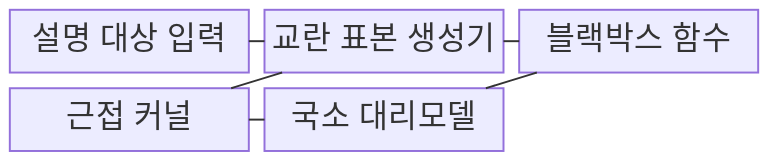
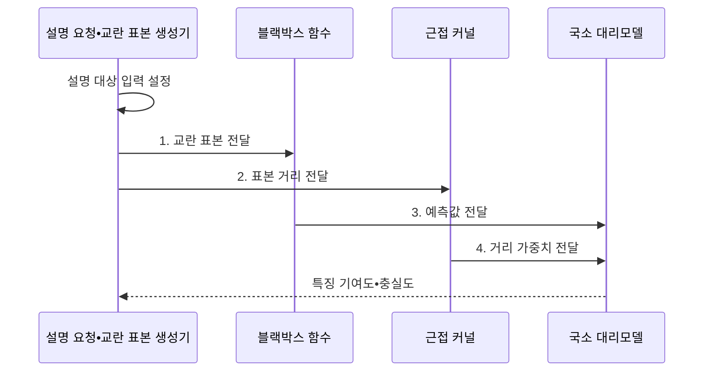

---
sidebar:
  order: 105
  label: "105. LIME (국소 대리 설명)"
  badge:
    text: "기출 • 40%"
    variant: note
title: "LIME (국소 대리 설명)"
date: "2026-08-05T00:44:00+09:00"
tags:
  - "notes-latest_tech"
weight: 105
extra:
  question_no: "105"
  source_status: "기출"
  source_history: "122회, 135회"
  priority: 40
  priority_note: "국소 대리 설명은 설명가능 AI 세부 기법"
---

## Ⅰ. 개요

핵심 용어

- **국소 해석 가능 모델 불가지론 설명(Local Interpretable Model-agnostic Explanations, LIME)**: 특정 예측 주변에서 블랙박스 모델의 행동을 단순한 대리 모델로 근사하는 설명 기법이다.
- **모델 불가지론**: 모델 내부 구조에 의존하지 않고 입력과 출력 호출만으로 설명할 수 있는 성질이다.

- 정의/개념: 입력 주변의 모델 행동을 단순 모델로 근사하는 **LIME 기법**
- 배경/필요성: 블랙박스 출력값만으로는 **개별 예측의 특징 영향** 식별 불가

#### 한줄 요약
- 특정 입력을 조금씩 바꾸며 원래 모델의 반응을 모아 주변 경계를 단순한 모델로 흉내 냅니다.

## Ⅱ. 특징

핵심 용어

- **교란 표본**: 설명 대상 입력의 특징을 바꿔 블랙박스 모델의 주변 반응을 관찰하는 표본이다.
- **국소 대리모델**: 원본 주변 표본에서 블랙박스 예측을 근사하도록 학습한 단순 모델이다.
- **설명 변동성**: 교란 분포•표본•커널 설정에 따라 같은 입력의 설명이 달라지는 성질이다.

- 예측 호출만 사용하는 **모델 비종속 설명**
- 거리 가중 교란 표본 기반 **국소 대리모델**
- 교란 분포•커널에 따른 **설명 변동성**

#### 한줄 요약
- 원본 주변의 모델 반응을 단순하게 흉내 내므로 표본 범위와 거리 기준이 바뀌면 설명도 달라질 수 있습니다.

## Ⅲ. 구조 및 구성요소

핵심 용어

- **근접 커널**: 교란 표본과 원본 입력의 거리를 대리모델 학습 가중치로 변환하는 함수이다.
- **블랙박스 함수**: 내부 구조를 직접 분석하지 않고 입력에 대한 예측값만 반환하는 모델 인터페이스이다.
- **교란 표본 생성기**: 설명 대상 입력 주변의 특징을 바꾼 표본을 만들어 블랙박스의 국소 행동을 관측하게 한다.
- **대리모델 학습**: 근접 가중치를 적용한 표본과 예측값으로 국소 행동을 근사하는 과정이다.

| 구성요소 | 책임 |
|:---|:---|
| 교란 표본 생성기 | 원본 특징을 변형해 질의할 주변 입력 생성 |
| 근접 커널 | 원본과 표본의 거리를 학습 가중치로 변환 |
| 블랙박스 함수 | 교란 표본에 대한 모델 예측값 반환 |
| 국소 대리모델 | 가중 표본으로 블랙박스 출력을 근사함 |

#### 한줄 요약
- 원본 사례, 교란 규칙, 거리 함수, 블랙박스 예측과 국소 대리모델이 필요합니다.

## Ⅳ. 흐름도

핵심 용어

- **마스킹**: 입력 특징 일부를 제거하거나 대체해 모델 반응 변화를 관찰하는 처리이다.
- **거리 가중치**: 원본과 가까운 교란 표본이 대리모델 학습에 더 크게 반영되도록 부여한 값이다.

- **1. 교란 표본 전달**: 원본 주변 특징의 마스킹•변형 표본 생성
- **2. 표본 거리 전달**: 원본과 교란 표본의 거리를 커널 입력으로 전달
- **3. 예측값 전달**: 교란 표본에 대한 블랙박스 반응 전달
- **4. 거리 가중치 전달**: 근접 표본에 높은 학습 가중치 부여

#### 한줄 요약
- 주변 표본에 대한 모델 반응을 모아 원본 근처에서만 유효한 작은 설명 모델을 만듭니다.

## Ⅴ. 종류 및 비교

핵심 용어

- **샤플리 가산 설명(SHapley Additive exPlanations, SHAP)**: 기준 예측과 실제 예측의 차이를 샤플리 값으로 특징별 기여도에 배분하는 설명 기법이다.
- **특징 기여도**: 특정 특징이 모델 예측을 증가시키거나 감소시킨 영향의 크기이다.

LIME과 SHAP은 기여도를 계산하는 원리와 비용이 다르다.

| 국소 설명 기법 | LIME | SHAP |
|:---|:---|:---|
| 적용 기준 | 국소 영역의 빠른 근사 설명 | 기준값 대비 일관된 기여 배분 |
| 핵심 특징 | 주변 표본•대리 모델 근사 | 샤플리 값 기반 기여 배분 |
| 한계 | 표본•커널별 설명 변동 | 특징 수 증가 시 계산 비용 |

> 요약: 설명 방식 및 특징 기여도 분석 차이

#### 한줄 요약
- LIME은 입력 주변의 국소 경계를 근사하고 SHAP은 기준값 대비 특징별 기여도를 배분합니다.

## Ⅵ. 실무 고려사항 및 대책

핵심 용어

- **국소 충실도 저하**: 교란 표본이 원본의 유효 근방을 벗어나 대리모델이 실제 주변 판단을 잘못 근사하는 문제이다.
- **설명 재현성**: 같은 입력과 설정을 반복했을 때 특징 기여도가 일관되게 나오는 정도이다.

| 문제 | 대책 | 효과 |
|:---|:---|:---|
| 교란 분포 이탈에 따른 **국소 충실도 저하** | 도메인 유효 변환•커널 폭 검증 | 대리모델의 **근방 근사력** 향상 |
| 무작위 표본에 따른 **설명 변동성** | 시드•표본 수 고정과 반복 안정성 평가 | 특징 기여도 **재현성 확보** |

#### 한줄 요약
- 정상 메일이 스팸으로 분류되면 단어를 바꾼 주변 표본으로 어떤 표현이 판정에 영향을 줬는지 찾습니다.

## Ⅶ. 결론

핵심 용어

- **국소 충실도**: 대리모델이 설명 대상 입력 주변에서 블랙박스 예측을 정확히 근사하는 정도이다.
- **커널 폭**: 원본에서 얼마나 떨어진 표본까지 국소 설명에 반영할지 정하는 거리 범위이다.

- 결정 기준: **국소 충실도•설명 안정성**, 결정 대상: **LIME의 교란 범위•커널 폭**

#### 한줄 요약
- 설명 범위와 조건에 따라 이유가 바뀔 수 있으므로 같은 입력을 반복 설명해 안정성을 확인해야 합니다.
