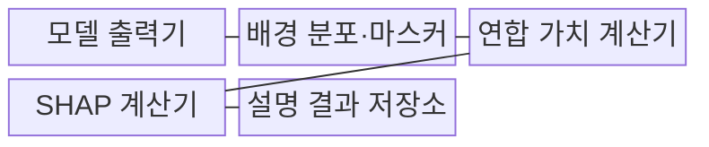
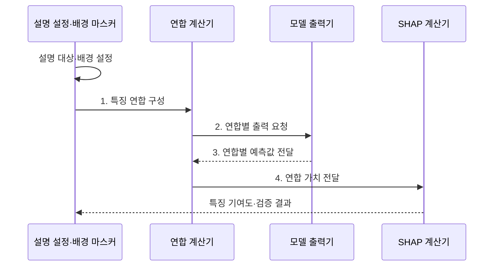

---
sidebar:
  order: 106
  label: "106. SHAP 설명 기법 (SHapley Additive exPlanations)"
  badge:
    text: "기출 · 50%"
    variant: note
title: "SHAP 설명 기법 (SHapley Additive exPlanations)"
date: "2026-07-31T11:59:33+09:00"
tags:
  - "notes-latest_tech"
weight: 106
extra:
  question_no: "106"
  source_status: "기출"
  source_history: "122회, 135회"
  priority: 50
  priority_note: "기여도 기반 설명은 비교 출제 가치"
---

## Ⅰ. 개요

핵심 용어

- **SHAP**: 기준 예측과 개별 예측의 차이를 샤플리 값으로 특징별 기여도에 가산 분해하는 설명 기법이다.
- **샤플리 값**: 특징이 여러 연합에 참여하는 모든 순서에서 만든 한계 기여를 가중 평균한 값이다.

- 정의/개념: **SHAP**은 기준값과 개별 예측의 차이를 특징별 샤플리 값으로 가산 분해하는 설명 기법
- 배경/필요성: 단순 중요도는 상호작용 특징의 **개별 예측 기여도 배분**에 일관된 기준 부족

#### 한줄 요약
- 기준 점수에서 최종 점수까지 각 특징이 올리거나 내린 몫을 모두 더해 계산서를 맞춤

## Ⅱ. 특징

핵심 용어

- **샤플리 공정 배분**: 특징이 예측에 기여한 몫을 대칭성·효율성 등의 원칙에 따라 나누는 방식이다.
- **가산 완전성**: 기준값에 모든 특징 기여도를 더하면 실제 예측값과 일치하는 성질이다.
- **배경 분포**: 특징이 없는 상태의 기대 출력과 대체 값을 정하는 기준 데이터 분포이다.

> 파란 양의 기여와 붉은 음의 기여를 기준값 0.42에 순서대로 합하면 예측값 0.64에 도달하며, 실제 모델 측정값이 아닌 가산 원리 설명용 예시다.

- 모든 특징 순서의 한계 기여를 평균한 **샤플리 공정 배분**
- `예측값 = 기준값 + 기여도 합`의 **가산 완전성**
- 배경 분포·상관 특징 가정에 따른 **설명 민감성**

#### 한줄 요약
- 특징별 몫의 합은 예측 차이와 맞지만 비교 기준 집단이 달라지면 각 몫도 달라짐

## Ⅲ. 구조 및 구성요소

핵심 용어

- **특징 연합**: 특정 예측에서 함께 존재한다고 가정한 특징의 부분집합이다.
- **마스커**: 연합에 포함되지 않은 특징을 배경값으로 대체하는 구성요소이다.
- **한계 기여**: 특징 하나를 연합에 추가하기 전과 후의 모델 출력 차이이다.

| 구성요소 | 책임 |
|:---|:---|
| 모델 출력기 | 특징 연합별 **예측값 계산** |
| 배경 분포·마스커 | 제외 특징의 **기준값 대체** |
| 연합 가치 계산기 | 특징 집합별 **기대 출력 산출** |
| SHAP 계산기 | 가중 평균 기반 **한계 기여 배분** |
| 설명 결과 저장소 | 기준값·특징별 기여도의 **가산 결과 보관** |

#### 한줄 요약
- 특징을 여러 조합으로 가렸다가 드러내며 예측이 얼마나 바뀌는지 모아 각 특징의 몫을 계산함

## Ⅳ. 흐름도

핵심 용어

- **연합 가치**: 특정 특징 연합이 주어졌을 때 모델이 만드는 기대 출력이다.
- **부분집합**: 전체 특징 가운데 일부를 포함하도록 구성한 특징의 집합이다.

1. **특징 연합 구성**: 설명 대상 특징의 포함·제외 **부분집합** 생성
2. **연합별 출력 요청**: 각 특징 조합의 **모델 예측** 요청
3. **연합별 예측값 전달**: 조합별 예측값을 **연합 계산기**에 반환
4. **연합 가치 전달**: 특징 추가 전후의 **출력 차이** 전달

#### 한줄 요약
- 기준 집단을 정해 특징을 하나씩 넣고 뺀 점수 차이를 평균한 뒤 계산서 합계를 확인함

## Ⅴ. 종류 및 비교

핵심 용어

- **Kernel SHAP**: 모델 구조를 사용하지 않고 특징 연합을 표본 추출해 기여도를 근사하는 방식이다.
- **Tree SHAP**: 결정 트리의 분기 구조를 이용해 특징 기여도를 효율적으로 계산하는 방식이다.
- **Deep SHAP**: 신경망의 기준 내부 출력과 역전파 규칙으로 특징 기여도를 근사하는 방식이다.

| 비교 기준 | Kernel SHAP | Tree SHAP | Deep SHAP |
|:---|:---|:---|:---|
| 적용 기준 | 모델 비종속 설명 | 트리 모델 설명 | 심층 모델 근사 설명 |
| 핵심 특징 | 표본 추출 기반 **기여도 근사** | 트리 구조 기반 **효율 계산** | 기준 내부 출력 기반 **역전파 근사** |
| 한계 | 높은 계산량·분산 | 트리 모델 한정 | 근사 가정·기준값 민감 |

#### 한줄 요약
- 어떤 모델에도 쓰는 표본 방식, 트리 전용 방식, 신경망 근사 방식 중 모델 구조와 시간에 맞춰 고름

## Ⅵ. 실무 고려사항 및 대책

핵심 용어

- **기준 왜곡**: 대표성 없는 배경 분포 때문에 특징 기여도의 비교 기준이 실제 운영 집단과 어긋나는 문제이다.
- **기여도 분산**: 상관된 특징 사이에서 기여 몫이 마스킹 가정에 따라 임의로 나뉘는 문제이다.
- **조합 계산 폭증**: 특징 수가 늘면서 평가해야 할 연합의 수가 지수적으로 증가하는 문제이다.

| 문제 | 대책 | 효과 |
|:---|:---|:---|
| 대표성 없는 **배경 분포의 기준 왜곡** | 운영 집단별 배경 표본·기준값 비교 | 기여도 기준의 **타당성 확보** |
| 상관 특징의 **기여도 임의 분산** | 조건부·독립 마스킹 가정별 민감도 분석 | 의존성 가정의 **영향 공개** |
| Kernel SHAP의 **조합 계산 폭증** | 모델 구조별 전용 계산기·표본 오차 시험 | 계산 시간 단축과 **근사 오차 관리** |

#### 한줄 요약
- 비교할 기준 집단과 함께 움직이는 특징 처리 방식이 달라지면 몫이 얼마나 바뀌는지 보여 줌

## Ⅶ. 결론

핵심 용어

- **해석 범위**: 배경 집단·모델 구조·특징 의존성 가정 안에서 SHAP 설명이 유효한 영역이다.
- **배경 대표성**: 기준 데이터가 실제 설명 대상 집단과 운영 분포를 적절히 반영하는 정도이다.

- 모델 구조로 **SHAP 계산기**를 선택하고 배경 대표성으로 **해석 범위** 제한

#### 한줄 요약
- 특징별 몫을 보여 줄 때 계산 방식과 기준 집단, 상관 특징 가정을 함께 밝혀야 함
