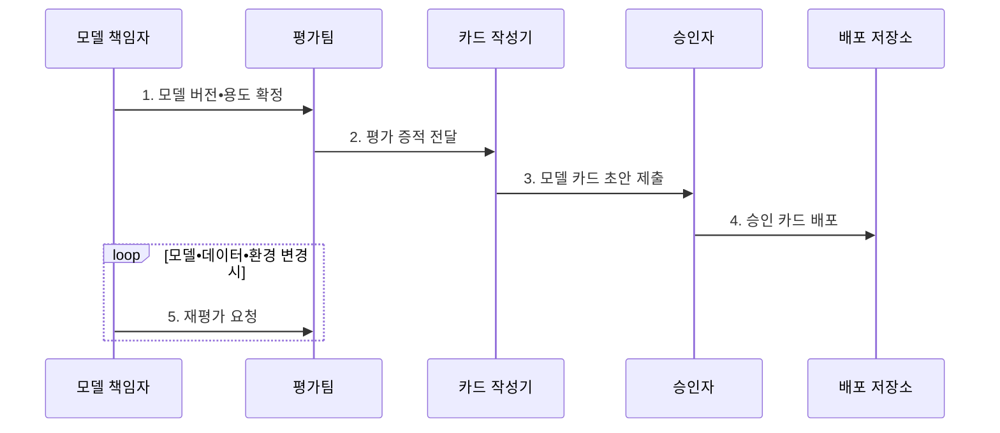

---
sidebar:
  order: 107
  label: "107. 모델 카드 (Model Card)"
  badge:
    text: "미출 • 60%"
    variant: note
title: "모델 카드 (Model Card)"
date: "2026-08-03T08:48:47+09:00"
tags:
  - "notes-latest_tech"
weight: 107
extra:
  question_no: "107"
  source_status: "미출"
  source_history: ""
  priority: 60
  priority_note: "모델 한계•용도 공개가 책임성 기반"
---

## Ⅰ. 개요

핵심 용어

- **모델 카드**: 특정 모델 버전의 권장•금지 용도, 평가 조건, 성능, 한계와 잔여 위험을 구조화한 문서이다.
- **평가 증적**: 모델 카드의 성능•한계 주장을 뒷받침하는 데이터•지표•시험 결과이다.

- 정의/개념: 모델 버전의 용도•평가 증적•성능•한계•잔여 위험을 기록한 **모델 카드 문서**
- 배경/필요성: 모델 파일•단일 성능값만으로는 평가 조건별 **적용 범위•실패 가능성** 전달 곤란

#### 한줄 요약
- 제품 설명서에 쓸 곳과 쓰지 말 곳, 시험 조건과 실패 사례를 같은 모델 버전과 묶어 제공함

## Ⅱ. 특징

핵심 용어

- **적용 경계**: 모델을 사용할 수 있는 사용자•업무•환경과 금지 맥락을 구분한 범위이다.
- **잔여 위험**: 완화 조치를 적용한 뒤에도 모델 사용에 남아 책임자의 판단이 필요한 위험이다.
- **평가 조건**: 성능값을 해석하기 위해 함께 공개해야 하는 데이터•집단•환경•지표의 조건이다.

- 의도한 사용자•용도•금지 맥락의 **적용 경계 명시**
- 데이터•지표•집단별 결과의 **평가 조건 공개**
- 알려진 한계•잔여 위험•관리 책임의 **증적 연결**

#### 한줄 요약
- 높은 점수만 적지 않고 어떤 사람과 환경에서 시험했으며 어디서 실패하는지 함께 적음

## Ⅲ. 구조 및 구성요소

핵심 용어

- **대상 모델 식별**: 카드가 설명하는 모델의 이름•버전•구조를 배포 파일과 연결하는 정보이다.
- **사용자 범위**: 모델을 사용하도록 의도했거나 사용을 금지한 사용자와 역할의 범위이다.
- **문서 수명주기**: 모델 변경•재평가•승인에 따라 카드를 갱신하고 배포하는 관리 과정이다.

| 구성요소 | 책임 |
|:---|:---|
| 모델 세부정보 | 이름•버전•구조의 **대상 모델 식별** |
| 용도•사용자 | 권장•금지 업무와 **사용자 범위 정의** |
| 평가 설계•결과 | 데이터•지표•환경별 **성능 증적 제공** |
| 한계•잔여 위험 | 실패 조건과 완화 후 **남은 위험 공개** |
| 관리•갱신 책임 | 승인•변경•재평가의 **문서 수명주기 관리** |

#### 한줄 요약
- 모델 이름표와 사용 범위, 시험 성적표, 실패 경고, 갱신 책임자를 한 문서에 연결함

## Ⅳ. 흐름도

핵심 용어

- **승인 문서**: 모델 카드의 주장과 증적 일치를 검토해 배포하도록 승인한 버전이다.
- **재평가**: 모델•데이터•환경이 바뀌었을 때 성능과 한계, 잔여 위험을 다시 시험하는 활동이다.

1. **모델 버전•용도 확정**: 카드와 연결할 **모델•사용 경계** 고정
2. **평가 증적 전달**: 데이터•지표•집단별 **검증 결과** 제공
3. **모델 카드 초안 제출**: 성능•한계•잔여 위험의 **판단 정보 구조화**
4. **승인 카드 배포**: 주장과 증적이 일치한 **승인 문서** 게시
5. **재평가 요청**: 변경된 모델•데이터•환경의 **평가 갱신** 지시

#### 한줄 요약
- 모델 버전을 고정해 시험하고 설명서를 승인한 뒤 모델이 바뀌면 성적표와 경고도 다시 발행함

## Ⅴ. 종류 및 비교

핵심 용어

- **데이터 카드**: 데이터셋의 출처•수집•구성•품질과 허용 용도를 기록한 문서이다.
- **시스템 카드**: 모델을 포함한 전체 인공지능(Artificial Intelligence, AI) 서비스의 구조•상호작용•안전 평가•운영 통제를 기록한 문서이다.

| 비교 기준 | 모델 카드 | 데이터 카드 | 시스템 카드 |
|:---|:---|:---|:---|
| 적용 기준 | 모델 사용 적합성 | 데이터 사용 적합성 | 전체 서비스 잔여 위험 |
| 핵심 특징 | 용도•성능•한계의 **모델 증적** | 출처•수집•품질의 **데이터 증적** | 구조•상호작용•통제의 **시스템 증적** |
| 한계 | 서비스 상호작용 미포함 | 모델 동작•운영 미포함 | 작성 범위•검증 비용 증가 |

#### 한줄 요약
- 모델 설명서, 데이터 설명서, 전체 서비스 설명서는 판단 대상의 크기가 다름

## Ⅵ. 실무 고려사항 및 대책

핵심 용어

- **버전 불일치**: 배포된 모델과 모델 카드가 서로 다른 버전을 설명하는 문제이다.
- **집단별 실패 은폐**: 평균 성능값만 제시해 특정 사용자 집단이나 환경의 오류가 드러나지 않는 문제이다.
- **증적 단절**: 카드의 주장과 이를 입증하는 데이터•지표•시험 결과가 연결되지 않는 문제이다.

| 문제 | 대책 | 효과 |
|:---|:---|:---|
| 모델과 카드의 **버전 불일치** | 모델 파일•카드 버전의 동시 배포 차단 | 잘못된 용도 판단 **방지** |
| 단일 평균값의 **집단별 실패 은폐** | 사용 집단•환경별 성능•오류 분해 | 적용 한계의 **가시성 확보** |
| 주장과 **평가 증적의 단절** | 카드 항목별 데이터•지표•시험 링크 연결 | 문서 신뢰성•감사성 **확보** |

#### 한줄 요약
- 모델과 설명서의 번호를 맞추고 평균 점수 뒤에 숨은 집단별 실패를 시험 기록과 연결함

## Ⅶ. 결론

핵심 용어

- **동시 배포**: 모델 파일과 그 버전에 맞는 모델 카드를 하나의 승인 단위로 함께 제공하는 방식이다.
- **재발행**: 모델이나 사용 조건 변경 후 새 평가 결과와 한계를 반영해 모델 카드를 다시 승인•배포하는 절차이다.

- 버전•용도와 **평가 증적** 일치 시 승인하고 변경 시 **모델 카드** 재발행

#### 한줄 요약
- 현재 모델에 맞는 시험 근거와 한계가 있어야 설명서를 승인하고 변경되면 다시 발행함
