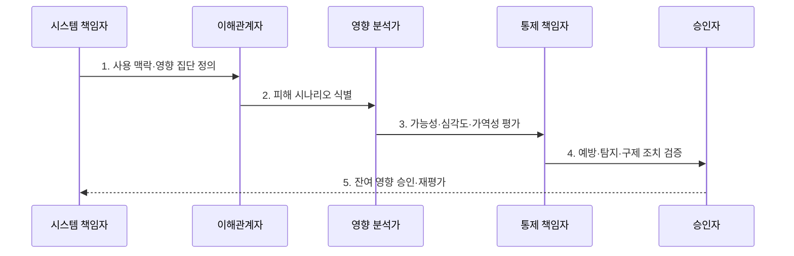

---
sidebar:
  order: 108
  label: "108. AI 영향평가 (AI Impact Assessment)"
  badge:
    text: "미출 · 70%"
    variant: note
title: "AI 영향평가 (AI Impact Assessment)"
date: "2026-07-31T08:49:21+09:00"
tags:
  - "notes-latest_tech"
weight: 108
extra:
  question_no: "108"
  source_status: "미출"
  source_history: ""
  priority: 70
  priority_note: "사전 영향평가가 고위험 AI 통제 핵심"
---

## 미리 알고가기

- **AI 영향평가(AI Impact Assessment)**: AI 도입 전후에 개인·집단의 권리·안전·기회에 미칠 피해와 완화 후 잔여 영향을 평가하는 절차
- **이해관계자(Stakeholder)**: AI의 개발·운영·결정으로 이익이나 피해를 직접·간접적으로 받는 개인·집단
- **피해 시나리오(Harm Scenario)**: AI의 데이터·판정·사용 과정이 특정 대상의 피해로 이어지는 인과 경로
- **가역성(Reversibility)**: 피해가 발생한 뒤 원상 회복하거나 보상할 수 있는 정도
- **잔여 영향(Residual Impact)**: 예방·탐지·구제 조치를 적용한 뒤에도 남아 있는 부정적 영향
- **구제 절차(Redress Mechanism)**: 영향받은 사람이 AI 결정을 설명받고 이의를 제기하며 정정·보상을 요청하는 절차

> **키워드:** AI 영향평가 (AI Impact Assessment)

## Ⅰ. 개요

- 정의/개념: **AI 영향평가**는 AI의 권리·안전·기회 영향을 식별하고 잔여 영향으로 출시 조건을 정하는 절차
- 배경/필요성: 기술 성능만으로는 차별과 **권리 침해·안전 피해**를 출시 전에 식별하기 곤란

### 쉽게 이해하기 (학습용)
- 자동차 성능만 보지 않고 사고가 누구에게 얼마나 큰 피해를 주며 되돌릴 방법이 있는지 출발 전에 확인함

## Ⅱ. 특징

- 직접 사용자·간접 영향자·취약 집단의 **영향 범위 식별**
- 가능성·심각도·가역성 기반 **피해 수준 판정**
- 완화 후 잔여 영향의 **출시 승인·재평가 연결**

### 쉽게 이해하기 (학습용)
- 피해받을 사람과 피해 크기, 되돌릴 수 있는지를 보고 조치 뒤에도 위험하면 출시하지 않음

## Ⅲ. 구조 및 구성요소

| 구성요소 | 책임 |
|:---|:---|
| 시스템 맥락 | 목적·환경·의사결정의 **평가 경계 정의** |
| 영향 집단 | 직접·간접·취약 대상의 **피해 수신자 식별** |
| 피해 시나리오 | 발생 경로·가능성·심각도의 **영향 분석** |
| 완화·구제 조치 | 예방·탐지·정정·보상의 **통제 설계** |
| 잔여 영향 관리 | 조치 후 영향의 **승인·재평가 조건 관리** |

### 쉽게 이해하기 (학습용)
- 사용 장면과 영향받는 사람, 피해 경로, 줄일 방법, 남은 피해를 한 장의 평가서로 연결함

## Ⅳ. 흐름도

1. **사용 맥락·영향 집단 정의**: 시스템 결정 경계와 **직접·간접 영향 대상** 확정
2. **피해 시나리오 식별**: 이해관계자 관점에서 **피해 발생 경로** 도출
3. **가능성·심각도·가역성 평가**: 피해의 빈도·규모·회복 가능성으로 **영향 수준** 판정
4. **예방·탐지·구제 조치 검증**: 피해 전후의 통제와 **실행 책임** 시험
5. **잔여 영향 승인·재평가**: 남은 피해로 출시·중지와 **변경 시 재평가 조건** 결정

### 쉽게 이해하기 (학습용)
- 영향받는 사람과 함께 피해 장면을 찾고 줄이는 장치를 시험한 뒤 남은 피해로 출시 여부를 정함

## Ⅴ. 종류 및 비교

| 비교 기준 | AI 영향평가 | 개인정보 영향평가 | 시스템 위험평가 |
|:---|:---|:---|:---|
| 적용 기준 | 권리·안전의 중대 영향 | 높은 사생활 침해 위험 | 보안·업무 연속성 위험 |
| 핵심 특징 | AI 결정의 **개인·집단 영향** | 정보 처리의 **개인정보 생명주기** | 위협·취약점의 **시스템 통제** |
| 한계 | 영향 범위·가치 판단 복잡 | 비개인정보 피해 미포함 | 권리·기회 영향 미포함 |

### 쉽게 이해하기 (학습용)
- 사람의 권리, 개인정보 처리, 시스템 장애 중 무엇을 중심으로 피해를 보는지가 다름

## Ⅵ. 실무 고려사항 및 대책

| 고려사항 | 대책 | 효과 |
|:---|:---|:---|
| 간접 영향자 누락의 **피해 범위 축소** | 이해관계자 지도·취약 집단 참여 검토 | 영향 대상의 **포괄성 확보** |
| 평균 성능 중심의 **집단 피해 은폐** | 집단별 오류·기회 차이와 피해 경로 분석 | 차별 영향의 **조기 식별** |
| 완화 후 **잔여 영향 과소평가** | 통제 효과 시험·승인 임계값·구제 경로 설정 | 출시·중지 판단의 **근거 확보** |

### 쉽게 이해하기 (학습용)
- 직접 사용자 밖의 피해와 집단별 차이를 찾아 조치 뒤 남은 피해가 기준을 넘으면 출시를 멈춤

## Ⅶ. 결론

- 영향 범위·피해 수준·잔여 영향 수용성을 기준으로 **AI 출시·중지·재평가 조건** 결정

### 쉽게 이해하기 (학습용)
- 누구에게 어떤 피해가 얼마나 남는지를 기준으로 출시할지 다시 설계할지 정함
