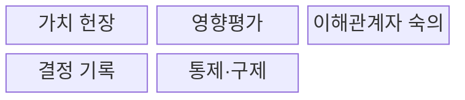
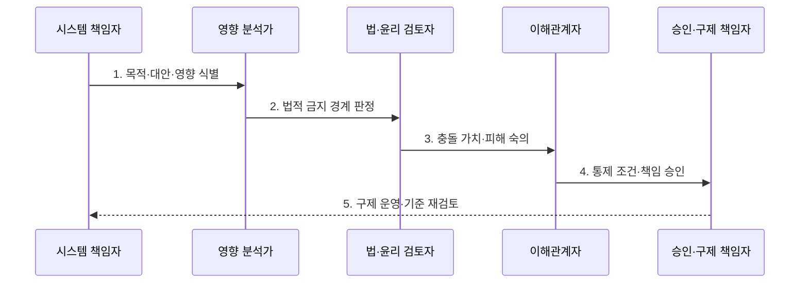

---
sidebar:
  order: 109
  label: "109. AI 윤리 (AI Ethics)"
  badge:
    text: "기출 · 50%"
    variant: note
title: "AI 윤리 (AI Ethics)"
date: "2026-07-30T11:04:43+09:00"
tags:
  - "notes-latest_tech"
weight: 109
extra:
  question_no: "109"
  source_status: "기출"
  source_history: "138회"
  priority: 50
  priority_note: "윤리 원칙은 거버넌스 답안의 기반"
---

## 미리 알고가기

- **AI 윤리(AI Ethics)**: AI의 기술적 가능성보다 인간 권리와 가치에 비추어 허용할 사용·금지할 사용을 판단하는 규범 체계
- **윤리 원칙(Ethical Principle)**: 공정성·투명성·안전성·책임성처럼 AI 판단의 방향을 제시하는 가치 기준
- **가치 충돌(Value Conflict)**: 공정성·프라이버시·설명 가능성 등 여러 윤리 가치가 동시에 최대화되지 않는 상황
- **숙의(Deliberation)**: 이해관계자가 충돌 가치와 피해를 비교하고 선택 근거를 논의하는 과정
- **책임 있는 AI(Responsible AI)**: 윤리 원칙을 제품의 지표·시험·설계·사람 감독으로 구현하는 접근
- **AI 거버넌스(AI Governance)**: AI 의사결정의 권한·책임·승인·감사를 조직적으로 운영하는 체계

## Ⅰ. 개요

- 정의/개념: **AI 윤리**는 AI의 목적·사용·영향을 인간 권리와 가치에 따라 판단하는 규범 체계
- 배경/필요성: 기술 가능성과 법적 최소 요건만으로는 **허용 가능한 사용·가치 충돌** 판단 곤란

### 쉽게 이해하기 (학습용)
- 만들 수 있는 기능인지보다 누구에게 어떤 피해가 생기며 그 사용이 정당한지 먼저 묻는 기준임

## Ⅱ. 특징

- 인간 권리·가치 기반 **허용 범위·금지 경계 제시**
- 법적 의무를 우선한 **공정성·프라이버시 가치 조정**
- 원칙을 제품 통제·책임·구제로 잇는 **실행 지향성**

### 쉽게 이해하기 (학습용)
- 여러 좋은 가치가 충돌하면 법과 피해받는 사람을 먼저 보고 선택 이유와 책임자를 남김

## Ⅲ. 구조 및 구성요소

| 구성요소 | 책임 |
|:---|:---|
| 가치 헌장 | 권리·책임·금지의 **윤리 판단 기준 정의** |
| 영향평가 | 목적·오용·이해관계자 **피해 경로 식별** |
| 이해관계자 숙의 | 충돌 가치와 당사자 관점의 **우선순위 조정** |
| 결정 기록 | 허용 경계·잔여 피해·책임의 **선택 근거 보존** |
| 통제·구제 | 시험·고지·사람 감독·이의제기의 **제품 구현** |

### 쉽게 이해하기 (학습용)
- 가치 기준으로 피해를 찾고 당사자와 선택 이유를 정해 실제 차단 장치와 이의제기 창구로 연결함

## Ⅳ. 흐름도

### 동작 원리

1. **목적·대안·영향 식별**: AI 사용 필요성과 비AI 대안 및 **피해 대상** 확인
2. **법적 금지 경계 판정**: 가치 절충 전에 준수해야 할 **강제 금지선** 적용
3. **충돌 가치·피해 숙의**: 당사자 관점에서 선택별 **권리·효익·피해** 비교
4. **통제 조건·책임 승인**: 허용 범위와 사람 감독·고지의 **실행 책임** 확정
5. **구제 운영·기준 재검토**: 민원·사고·변화로 **윤리 판단 기준** 갱신

### 쉽게 이해하기 (학습용)
- 목적과 피해를 확인해 넘지 말아야 할 선을 긋고 당사자와 선택한 뒤 책임자와 이의제기 길을 만듦

## Ⅴ. 종류 및 비교

| 비교 기준 | AI 윤리 원칙 | 책임 있는 AI | AI 거버넌스 |
|:---|:---|:---|:---|
| 적용 기준 | 허용 가치·금지선 설정 | 제품 통제 구현 | 조직 권한·책임 운영 |
| 핵심 특징 | 가치 판단의 **규범 기준** | 지표·시험·설계의 **기술 구현** | 승인·감사의 **의사결정 체계** |
| 한계 | 추상 선언 위험 | 가치별 지표 충돌 | 형식적 절차 운영 위험 |

### 쉽게 이해하기 (학습용)
- 옳고 그름의 기준, 제품에 넣는 장치, 누가 승인하고 책임지는지를 각각 다룸

## Ⅵ. 실무 고려사항 및 대책

| 고려사항 | 대책 | 효과 |
|:---|:---|:---|
| 추상 원칙의 **제품 통제 미연결** | 원칙별 지표·시험·금지 조건 매핑 | 윤리 기준의 **실행 가능성 확보** |
| 공정성·프라이버시의 **가치 충돌** | 법적 의무·피해 규모·당사자 숙의로 우선순위 기록 | 가치 선택의 **정당성 확보** |
| 책임 주체 없는 **구제 절차 공백** | 결정권자·사람 감독·이의제기 경로 지정 | 피해 대응의 **책임성 확보** |

### 쉽게 이해하기 (학습용)
- 좋은 말만 적지 않고 시험 기준과 선택 이유, 피해를 접수하고 고칠 책임자를 정함

## Ⅶ. 결론

- 법적 경계·가치 충돌·피해 구제 가능성을 기준으로 **AI 허용 범위와 책임 구조** 결정

### 쉽게 이해하기 (학습용)
- 넘지 말아야 할 선과 선택으로 생길 피해를 보고 누가 승인하고 구제할지 정함
