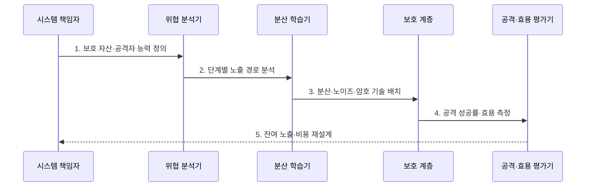

---
sidebar:
  order: 110
  label: "110. 프라이버시 보존 AI (Privacy-Preserving AI)"
  badge:
    text: "미출 · 70%"
    variant: note
title: "프라이버시 보존 AI (Privacy-Preserving AI)"
date: "2026-07-30T11:04:43+09:00"
tags:
  - "notes-latest_tech"
weight: 110
extra:
  question_no: "110"
  source_status: "미출"
  source_history: ""
  priority: 70
  priority_note: "학습·추론 중 개인정보 보호가 핵심"
---

## 미리 알고가기

- **프라이버시 보존 AI(Privacy-Preserving AI)**: 원본 데이터·학습 중간값·모델 출력의 개인정보 노출을 줄이면서 AI를 학습·추론하는 기술군
- **위협 모델(Threat Model)**: 공격자가 볼 수 있는 값·통제할 수 있는 참여자·탈취하려는 자산을 정의한 공격 가정
- **연합학습(Federated Learning)**: 원본 데이터를 각 기관·단말에 둔 채 로컬 학습 결과만 모아 공동 모델을 만드는 방식
- **차등 프라이버시(Differential Privacy)**: 한 사람의 데이터 포함 여부가 결과 확률분포에 미치는 영향을 수학적 예산으로 제한하는 방식
- **동형암호(Homomorphic Encryption)**: 데이터를 복호화하지 않고 암호문 상태에서 연산한 결과를 복호화할 수 있는 암호 기법
- **보안 집계(Secure Aggregation)**: 서버가 각 참여자의 개별 업데이트를 보지 못하고 합계만 얻도록 하는 프로토콜
- **프라이버시 예산(Privacy Budget)**: 차등 프라이버시 보호 수준과 반복 사용에 따른 누적 노출 한도를 나타내는 값

## Ⅰ. 개요

- 정의/개념: **프라이버시 보존 AI**는 데이터·중간값·출력 노출을 위협 모델별 보호 기법으로 줄이는 기술군
- 배경/필요성: 원본 수집·학습·추론은 단계별 **개인정보 노출·재식별 위험** 유발

### 쉽게 이해하기 (학습용)
- 원본을 보내지 않고, 계산값을 가리고, 결과에서 한 사람의 흔적을 줄이는 보호막을 단계마다 다르게 씌움

## Ⅱ. 특징

- 원본·업데이트·추론 결과를 나눈 **단계별 노출 경계**
- 데이터 비이동과 업데이트 보호를 결합한 **다층 방어**
- 프라이버시 예산·정확도·연산 비용의 **보호·효용 절충**

### 쉽게 이해하기 (학습용)
- 원본이 자리를 떠나지 않아도 중간 계산과 최종 결과에서 정보가 샐 수 있어 보호막을 겹쳐야 함

## Ⅲ. 구조 및 구성요소

| 구성요소 | 책임 |
|:---|:---|
| 위협 모델 | 공격자 능력·관측값·**보호 자산 정의** |
| 신뢰 경계 | 데이터·키·결과의 **처리 주체 구분** |
| 분산 학습 계층 | 원본 비이동 기반 **로컬 업데이트 생성** |
| 노이즈·암호 계층 | 업데이트·입력·출력의 **노출 범위 제한** |
| 공격·효용 평가기 | 공격 성공률·정확도·비용의 **보호 효과 검증** |

### 쉽게 이해하기 (학습용)
- 누가 무엇을 볼 수 있는지 먼저 정하고 원본·중간값·결과마다 분산·노이즈·암호 보호를 배치함

## Ⅳ. 흐름도

### 동작 원리

1. **보호 자산·공격자 능력 정의**: 원본·업데이트·출력과 **관측 가능 주체** 설정
2. **단계별 노출 경로 분석**: 학습·집계·추론에서 개인정보가 새는 **공격 표면** 식별
3. **분산·노이즈·암호 기술 배치**: 노출 경로별로 상호 보완적인 **보호 계층** 적용
4. **공격 성공률·효용 측정**: 재식별·추론 공격과 정확도·지연의 **실제 결과** 비교
5. **잔여 노출·비용 재설계**: 보호 목표를 넘는 위험이나 비용의 **기술 조합** 조정

### 쉽게 이해하기 (학습용)
- 공격자가 볼 수 있는 길을 지도에 그리고 길마다 다른 자물쇠를 달아 실제 침입과 성능 손실을 함께 시험함

## Ⅴ. 종류 및 비교

| 비교 기준 | 연합학습 | 차등 프라이버시 | 동형암호·보안 집계 |
|:---|:---|:---|:---|
| 적용 기준 | 원본 데이터 비이동 | 개인 기여도 은닉 | 입력·업데이트 기밀성 |
| 핵심 특징 | 로컬 학습의 **업데이트 집계** | 노이즈 기반 **분포 영향 제한** | 암호 상태의 **연산·합계 공개** |
| 한계 | 업데이트 추론 공격 | 정확도 저하·예산 누적 | 연산·통신 비용·공모 가정 |

### 쉽게 이해하기 (학습용)
- 데이터를 나누어 두는 방법, 한 사람의 흔적을 흐리는 방법, 값을 숨긴 채 계산하는 방법의 차이임

## Ⅵ. 실무 고려사항 및 대책

| 고려사항 | 대책 | 효과 |
|:---|:---|:---|
| 연합 업데이트의 **개인정보 역추론** | 보안 집계·업데이트 크기 제한·차등 프라이버시 적용 | 개별 참여자 정보 **노출 완화** |
| 반복 질의의 **프라이버시 예산 소진** | 예산 회계·질의 상한·노이즈 재조정 | 누적 보호 수준 **통제** |
| 동형암호의 **연산·통신 폭증** | 보호 연산 범위·암호 파라미터·배치 최적화 | 기밀성과 처리 비용 **절충** |

### 쉽게 이해하기 (학습용)
- 분산 학습의 계산값도 모아 볼 수 없게 하고 노이즈 사용량과 암호 계산 범위를 예산 안에서 조절함

## Ⅶ. 결론

- 공격자 관측 범위·보호 예산·효용 손실을 기준으로 **연합·차등 프라이버시·암호 계층** 조합

### 쉽게 이해하기 (학습용)
- 누가 어떤 값을 볼 수 있는지와 감당할 정확도·속도 손실에 맞춰 여러 보호막을 겹침
