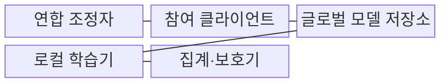
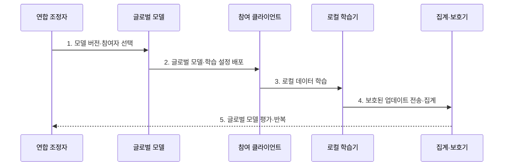

---
sidebar:
  order: 111
  label: "111. 연합학습 (Federated Learning)"
  badge:
    text: "미출 · 70%"
    variant: note
title: "연합학습 (Federated Learning)"
date: "2026-07-25T23:03:00+09:00"
tags:
  - "notes-latest_tech"
weight: 111
extra:
  question_no: "111"
  source_status: "미출"
  source_history: ""
  priority: 70
  priority_note: "분산 학습과 데이터 주권이 주요 쟁점"
---

## 미리 알고가기

- **연합학습(Federated Learning)**: 원본 데이터를 참여자 내부에 둔 채 로컬 모델 변화량만 모아 공동 모델을 학습하는 방식
- **연합 평균(Federated Averaging, FedAvg)**: 참여자의 로컬 모델 변화량을 보유 데이터 수에 비례해 가중 평균하는 집계 알고리즘
- **비독립 동일분포(Non-Independent and Identically Distributed, non-IID)**: 참여자별 데이터의 클래스·특징·표본 수 분포가 서로 다른 상태
- **교차 기기(Cross-Device)**: 접속이 불규칙한 다수 개인 단말이 연합학습에 참여하는 구조
- **교차 사일로(Cross-Silo)**: 안정적인 소수 기관이 데이터 주권을 유지하며 연합학습에 참여하는 구조
- **보안 집계(Secure Aggregation)**: 서버가 개별 참여자의 업데이트를 보지 못하고 합계만 얻는 프로토콜
- **강건 집계(Robust Aggregation)**: 비정상·악성 업데이트의 영향을 제한하여 공동 모델의 중독을 완화하는 집계 방식

## Ⅰ. 개요

- 정의/개념: **연합학습**은 원본 데이터 대신 로컬 업데이트를 집계하여 공동 모델을 학습하는 분산 학습 방식
- 배경/필요성: 개인정보·영업기밀·데이터 주권으로 **다기관 원본 데이터의 중앙 수집** 곤란

### 쉽게 이해하기 (학습용)
- 각 기관이 장부는 보관하고 장부로 계산한 수정 의견만 보내 하나의 공통 모델을 고침

## Ⅱ. 특징

- 원본 비이동과 **로컬 학습·업데이트 집계 분리**
- 참여 데이터량 기반 **FedAvg 가중 집계**
- non-IID·참여 이탈에 따른 **업데이트 편향·수렴 변동**

### 쉽게 이해하기 (학습용)
- 원본은 움직이지 않지만 참여자마다 자료와 접속 시간이 달라 수정 의견이 한 방향으로 모이지 않을 수 있음

## Ⅲ. 구조 및 구성요소

| 구성요소 | 책임 |
|:---|:---|
| 연합 조정자 | 참여자 선택·라운드·학습 설정의 **실행 통제** |
| 참여 클라이언트 | 원본 데이터 보관과 **로컬 학습 실행** |
| 글로벌 모델 저장소 | 라운드별 공통 모델의 **버전 보관·배포** |
| 로컬 학습기 | 참여자 데이터 기반 **모델 업데이트 계산** |
| 집계·보호기 | FedAvg·보안 집계 기반 **공동 모델 갱신** |

### 쉽게 이해하기 (학습용)
- 조정자가 공통 모델을 보내면 각 참여자가 자기 자료로 수정하고 집계기가 수정분만 합침

## Ⅳ. 흐름도

1. **모델 버전·참여자 선택**: 가용성·자원·정책에 맞는 **라운드 참여 집합** 확정
2. **글로벌 모델·학습 설정 배포**: 동일 시작 모델과 반복 횟수·학습률의 **학습 계약** 전달
3. **로컬 데이터 학습**: 원본을 외부로 보내지 않고 **참여자별 변화량** 계산
4. **보호된 업데이트 전송·집계**: 데이터량 가중 평균과 보안 집계로 **새 모델** 생성
5. **글로벌 모델 평가·반복**: 전체·참여자별 품질과 예산으로 **다음 라운드 여부** 결정

### 쉽게 이해하기 (학습용)
- 같은 모델을 나눠 각자 수정한 뒤 자료량에 맞춰 합치고 품질이 부족하면 다음 라운드를 반복함

## Ⅴ. 종류 및 비교

| 비교 기준 | 중앙집중 학습 | 교차 기기 연합학습 | 교차 사일로 연합학습 |
|:---|:---|:---|:---|
| 적용 기준 | 원본 중앙 수집 가능 | 다수 개인 단말 참여 | 소수 기관 데이터 주권 |
| 핵심 특징 | 중앙 데이터의 **일괄 학습** | 불규칙 단말의 **부분 참여** | 인증 기관의 **안정적 협업** |
| 한계 | 원본 집중·주권 제약 | 이탈·통신·자원 편차 | 기관별 non-IID·합의 비용 |

### 쉽게 이해하기 (학습용)
- 한곳에 자료를 모으는 방식, 많은 단말이 들쭉날쭉 참여하는 방식, 소수 기관이 협약하는 방식의 차이임

## Ⅵ. 실무 고려사항 및 대책

| 고려사항 | 대책 | 효과 |
|:---|:---|:---|
| non-IID 데이터의 **업데이트 충돌** | 참여자별 성능 평가·개인화 계층·집계 가중 조정 | 전역·지역 품질 **균형 개선** |
| 교차 기기의 **참여 이탈·지연** | 기한 내 업데이트만 집계·비동기 참여 정책 | 라운드 정체 **완화** |
| 로컬 업데이트의 **정보 누출·중독** | 보안 집계와 강건 집계·이상 업데이트 제한 | 기밀성·모델 무결성 **보완** |

### 쉽게 이해하기 (학습용)
- 서로 다른 수정 의견과 늦게 오는 의견, 악성 의견을 구분해 합치는 규칙이 필요함

## Ⅶ. 결론

- 데이터 주권·non-IID·참여 안정성을 기준으로 **연합 구조와 집계·보호 정책** 결정

### 쉽게 이해하기 (학습용)
- 원본을 지키면서도 참여자 차이와 통신 불안정을 감당할 집계 방식을 선택함
