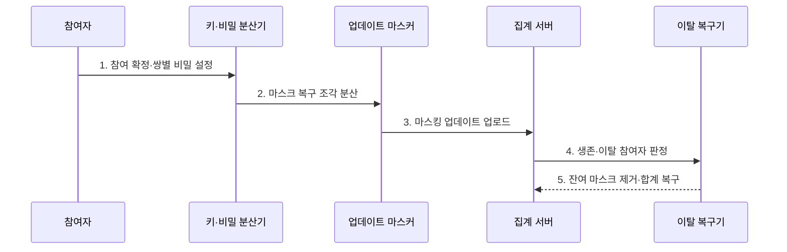

---
sidebar:
  order: 112
  label: "112. 보안 집계 (Secure Aggregation)"
  badge:
    text: "미출 · 60%"
    variant: note
title: "보안 집계 (Secure Aggregation)"
date: "2026-07-25T23:04:00+09:00"
tags:
  - "notes-latest_tech"
weight: 112
extra:
  question_no: "112"
  source_status: "미출"
  source_history: ""
  priority: 60
  priority_note: "개별 갱신 은닉은 연합학습 보안 핵심"
---

## 미리 알고가기

- **보안 집계(Secure Aggregation)**: 서버가 참여자별 학습 업데이트는 알지 못하고 허용된 참여자의 합계만 복구하는 프로토콜
- **쌍별 마스크(Pairwise Mask)**: 두 참여자가 공유하여 한쪽은 더하고 다른 쪽은 빼므로 전체 합에서 상쇄되는 난수값
- **비밀 분산(Secret Sharing)**: 하나의 비밀을 여러 조각으로 나누어 임계 개수 이상을 모을 때만 복구하는 기법
- **참여자 이탈(Dropout)**: 프로토콜 도중 통신 장애·종료로 업데이트나 마스크 해제 자료를 제출하지 못한 상태
- **공모 임계값(Collusion Threshold)**: 서버와 참여자가 결탁해도 개별 업데이트 기밀성을 유지할 수 있는 최대 공모 범위
- **동형암호(Homomorphic Encryption)**: 입력을 복호화하지 않고 암호문 상태에서 합계 등 연산을 수행하는 암호 기법

## Ⅰ. 개요

- 정의/개념: **보안 집계**는 연합학습의 개별 업데이트를 숨기고 참여자 합계만 복구하는 프로토콜
- 배경/필요성: 집계 서버가 개별 업데이트를 보면 **참여자 데이터 특성·민감정보 추론** 가능

### 쉽게 이해하기 (학습용)
- 참여자들이 서로 지워지는 가림막을 값에 씌워 보내면 서버에는 가림막이 사라진 전체 합만 남음

## Ⅱ. 특징

- 생존 참여자의 합에서 상쇄되는 **쌍별 마스크**
- 비밀 분산 기반 **이탈 참여자 마스크 복구**
- 최소 생존자·공모 임계값 기반 **합계 공개 경계**

### 쉽게 이해하기 (학습용)
- 모두가 보낸 가림막은 합에서 지워지고 중간에 빠진 사람의 가림막만 비밀 조각으로 제거함

## Ⅲ. 구조 및 구성요소

| 구성요소 | 책임 |
|:---|:---|
| 참여자 집합 | 로컬 업데이트와 **생존·이탈 상태 제공** |
| 키·비밀 분산기 | 쌍별 마스크와 **복구 조각 생성·배포** |
| 업데이트 마스커 | 로컬 업데이트에 **상쇄 난수 추가** |
| 집계 서버 | 마스킹 업데이트의 **허용 합계 계산** |
| 이탈 복구기 | 생존 임계값 확인과 **잔여 마스크 제거** |

### 쉽게 이해하기 (학습용)
- 참여자가 가림막과 복구 조각을 나누고 서버는 이탈자를 확인한 뒤 합계에 남은 가림막만 제거함

## Ⅳ. 흐름도

1. **참여 확정·쌍별 비밀 설정**: 라운드 참여자 사이에 **상쇄 마스크 재료** 구성
2. **마스크 복구 조각 분산**: 이탈 시 임계 수로 복구할 **비밀 조각** 배포
3. **마스킹 업데이트 업로드**: 로컬 변화량에 쌍별·개인 마스크를 더한 **은닉 값** 전송
4. **생존·이탈 참여자 판정**: 최소 참여 수와 업로드 상태로 **복구 가능성** 확인
5. **잔여 마스크 제거·합계 복구**: 생존자 마스크는 상쇄하고 이탈자 잔여값만 제거해 **집계값 공개**

### 쉽게 이해하기 (학습용)
- 가림막을 나누고 값을 올린 뒤 빠진 참여자의 가림막만 복구 조각으로 걷어 전체 합을 얻음

## Ⅴ. 종류 및 비교

| 비교 기준 | 전송 암호화 | 보안 집계 | 동형암호 |
|:---|:---|:---|:---|
| 적용 기준 | 통신 구간 보호 | 개별값 없이 합계 필요 | 암호문 연산 필요 |
| 핵심 특징 | 서버에서 **개별값 복호화** | 마스크 상쇄 기반 **합계 복구** | 암호문 상태의 **집계 연산** |
| 한계 | 서버 내부 노출 | 이탈·공모 임계 관리 | 높은 연산·통신 비용 |

### 쉽게 이해하기 (학습용)
- 전송 길만 잠그는 방식, 합만 보이게 가리는 방식, 잠긴 값 그대로 계산하는 방식의 차이임

## Ⅵ. 실무 고려사항 및 대책

| 고려사항 | 대책 | 효과 |
|:---|:---|:---|
| 대규모 이탈의 **마스크 복구 실패** | 최소 생존자 임계값·기한·라운드 재시작 규칙 | 합계 가용성 **확보** |
| 서버·참여자 공모의 **개별값 노출** | 위협 모델별 공모 임계값·비밀 분산 수 설정 | 기밀성 경계 **보장** |
| 값 은닉에 가려진 **중독 업데이트** | 집계 전 범위 증명·강건 집계 별도 적용 | 모델 무결성 **보완** |

### 쉽게 이해하기 (학습용)
- 너무 많이 이탈하거나 서로 짜면 가림막이 깨질 수 있고 가린 악성 값은 별도 검사해야 함

## Ⅶ. 결론

- 이탈률·공모 임계·집계 무결성을 기준으로 **보안 집계 복구·검증 정책** 결정

### 쉽게 이해하기 (학습용)
- 합을 복구할 참여자 수와 공모를 견딜 비밀 조각 수, 악성 값 검사 방법을 함께 정함
