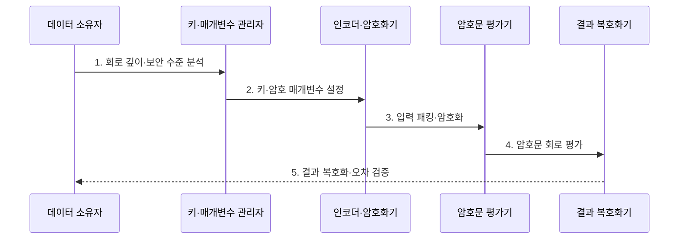

---
sidebar:
  order: 114
  label: "114. 동형암호 (Homomorphic Encryption)"
  badge:
    text: "기출 · 60%"
    variant: note
title: "동형암호 (Homomorphic Encryption)"
date: "2026-07-27T23:59:59+09:00"
tags:
  - "notes-latest_tech"
weight: 114
extra:
  question_no: "114"
  source_status: "기출"
  source_history: "132회"
  priority: 60
  priority_note: "기출 동형암호의 연산 비용·정확도 비교가 유력함"
---

## 미리 알고가기

- **동형암호(Homomorphic Encryption)**: 입력을 복호화하지 않고 암호문 상태에서 계산해 평문 계산과 대응하는 결과 암호문을 얻는 공개키 암호 기법
- **암호문 노이즈(Ciphertext Noise)**: 암호문 보안을 위해 포함되며 곱셈을 반복할수록 커져 복호화 가능 범위를 제한하는 오차 성분
- **곱셈 깊이(Multiplicative Depth)**: 연산 회로에서 순차적으로 이어지는 암호문 곱셈의 최대 횟수
- **패킹(Packing)**: 여러 평문 값을 하나의 암호문 슬롯에 묶어 병렬 연산하는 기법
- **재선형화(Relinearization)**: 암호문 곱셈 뒤 커진 암호문 크기를 평가 키로 줄이는 연산
- **부트스트래핑(Bootstrapping)**: 암호문 자체의 복호화 회로를 동형 연산하여 노이즈와 연산 여유를 새로 고치는 기법
- **CKKS(Cheon-Kim-Kim-Song)**: 실수·복소수 벡터의 근사 연산을 지원하는 동형암호 방식
- **부분 동형암호(Partially Homomorphic Encryption)**: 덧셈 또는 곱셈 한 종류만 반복 지원하는 방식
- **제한 동형암호(Leveled Homomorphic Encryption)**: 미리 정한 곱셈 깊이 안에서 덧셈·곱셈을 지원하는 방식
- **완전 동형암호(Fully Homomorphic Encryption)**: 부트스트래핑으로 연산 여유를 회복하여 임의 깊이 계산을 지원하는 방식
- **모듈러스(Modulus)**: 암호문 계수의 연산 범위와 노이즈 여유를 정하는 나머지 연산 기준값

## Ⅰ. 개요

- 정의/개념: **동형암호**는 암호문 연산 결과가 평문 연산 결과와 대응하도록 하는 공개키 암호 기법
- 배경/필요성: 일반 암호는 외부 연산 전에 복호화하여 **처리 중 평문 노출** 발생

### 쉽게 이해하기 (학습용)
- 잠긴 상자를 열지 않고 계산한 뒤 열쇠를 가진 사람만 결과 상자를 열어 봄

## Ⅱ. 특징

- 비밀키 없이 입력·중간값을 계산하는 **암호문 평가**
- 곱셈 깊이·노이즈에 따른 **매개변수·복호화 한계**
- 부트스트래핑 기반 **암호문 연산 여유 회복**

### 쉽게 이해하기 (학습용)
- 잠긴 값으로 곱셈할수록 잡음이 쌓여 한계 전에 큰 비용을 들여 암호문을 새로 고침

## Ⅲ. 구조 및 구성요소

| 구성요소 | 책임 |
|:---|:---|
| 키·매개변수 관리자 | 보안·깊이별 **암호·평가 키 생성** |
| 인코더·패커 | 평문 값의 **암호문 슬롯 배치** |
| 암호문 평가기 | 덧셈·곱셈·회전의 **평가 회로 실행** |
| 노이즈·스케일 관리자 | 재선형화·부트스트래핑의 **연산 한계 통제** |
| 결과 복호화기 | 비밀키 기반 **결과 평문 복원** |

### 쉽게 이해하기 (학습용)
- 열쇠와 상자 크기를 정하고 값을 묶어 잠근 뒤 외부 계산자는 잠긴 채 계산하고 소유자만 결과를 엶

## Ⅳ. 흐름도

### 동작 원리

1. **회로 깊이·보안 수준 분석**: 함수를 지원 연산으로 바꾸고 **곱셈 깊이** 산정
2. **키·암호 매개변수 설정**: 깊이·정확도에 맞는 모듈러스와 **평가 키** 생성
3. **입력 패킹·암호화**: 평문 벡터를 슬롯에 묶어 **입력 암호문** 생성
4. **암호문 회로 평가**: 노이즈·스케일을 관리하며 덧셈·곱셈과 **부트스트래핑** 실행
5. **결과 복호화·오차 검증**: 비밀키로 결과를 열어 **정확도·복호화 성공** 판정

### 쉽게 이해하기 (학습용)
- 계산 깊이에 맞는 상자와 열쇠를 만들고 값을 잠가 계산한 뒤 결과 오차를 확인함

## Ⅴ. 종류 및 비교

| 비교 기준 | 부분 동형 | 제한 동형 | 완전 동형 |
|:---|:---|:---|:---|
| 적용 기준 | 한 종류 연산 반복 | 사전 정의 깊이 회로 | 임의 깊이 반복 계산 |
| 핵심 특징 | 덧셈 또는 곱셈의 **단일 동형성** | 제한 깊이의 **덧셈·곱셈** | 부트스트래핑 기반 **깊이 연장** |
| 한계 | 지원 연산 제한 | 깊이별 큰 매개변수 | 높은 부트스트래핑 비용 |

### 쉽게 이해하기 (학습용)
- 덧셈이나 곱셈 하나만 할지, 정한 횟수만 할지, 상자를 새로 고치며 계속할지의 차이임

## Ⅵ. 실무 고려사항 및 대책

| 고려사항 | 대책 | 효과 |
|:---|:---|:---|
| 과소 매개변수의 **복호화 실패** | 회로 깊이·노이즈 예산 기반 매개변수 산정 | 결과 복호화 **성공 보장** |
| CKKS의 **근사 오차 누적** | 스케일·재조정 위치별 평문 대비 오차 시험 | 추론 정확도 **검증** |
| 부트스트래핑의 **지연 급증** | 회로 깊이 축소·패킹·실행 횟수 최소화 | 암호문 연산 비용 **절감** |

### 쉽게 이해하기 (학습용)
- 계산 횟수에 맞는 큰 상자를 고르고 근사 오차와 상자 새로 고침 시간을 함께 측정함

## Ⅶ. 결론

- 회로 깊이·정확도·지연 한도를 기준으로 **동형 범위·매개변수·부트스트래핑** 결정

### 쉽게 이해하기 (학습용)
- 필요한 계산 깊이와 허용 오차·시간에 맞춰 암호 방식과 상자 크기, 새로 고칠 시점을 정함
