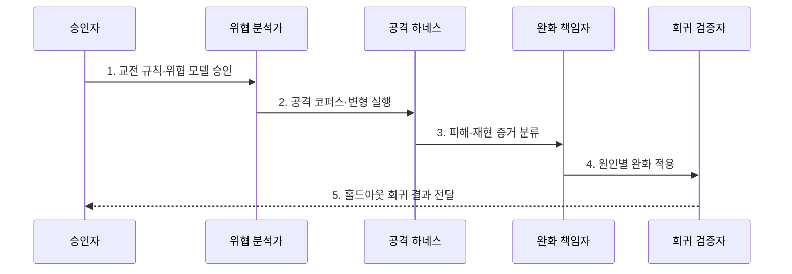

---
sidebar:
  order: 115
  label: "115. AI 레드팀 (AI Red Teaming)"
  badge:
    text: "기출 · 85%"
    variant: note
title: "AI 레드팀 (AI Red Teaming)"
date: "2026-07-31T08:51:44+09:00"
tags:
  - "notes-latest_tech"
weight: 115
extra:
  question_no: "115"
  source_status: "기출"
  source_history: "135회, 137회, 138회"
  priority: 85
  priority_note: "최근 3개 회차에서 AI 공격 검증 설계가 반복됨"
---

## Ⅰ. 개요

핵심 용어

- **인공지능 레드팀(Artificial Intelligence Red Teaming, AI Red Teaming)**: 공격자 관점의 모의 공격으로 인공지능 모델·도구·시스템의 안전·보안·프라이버시 실패를 재현하는 평가 활동이다.
- **복합 실패 경로**: 모델 출력 오류가 권한·도구·정보 흐름과 연쇄되어 실제 피해로 이어지는 과정이다.

- 정의/개념: **인공지능 레드팀(Artificial Intelligence Red Teaming, AI Red Teaming)** 은 공격자 관점으로 인공지능의 안전·보안·프라이버시 피해 경로를 재현하는 평가 활동
- 배경/필요성: 정상 기능 평가는 적대적 우회·권한 악용·정보 유출의 **복합 실패 경로** 탐지에 한계

#### 한줄 요약
- 승인된 훈련장에서 일부러 위험한 질문과 도구 요청을 던져 실제 피해가 어디까지 이어지는지 확인함

## Ⅱ. 특징

핵심 용어

- **위협 모델**: 보호 자산·공격자 능력·공격 경로·예상 피해를 구조화한 공격 가정이다.
- **재현 증거**: 같은 조건에서 실패를 다시 확인할 수 있도록 버전·입출력·권한·환경을 기록한 자료이다.
- **홀드아웃 세트**: 완화 과정에 공개하지 않고 마지막 회귀 시험에 사용하는 봉인 평가 자료이다.

- 자산·공격자·경로·피해를 연결한 **위협 모델 기반 공격**
- 승인된 격리 환경의 **반복 실행·재현 증거 수집**
- 완화 후 홀드아웃 세트를 활용한 **봉인 회귀 검증**

#### 한줄 요약
- 공격 지도를 정해 같은 조건으로 실패를 재현하고 수정팀이 못 본 문제로 다시 시험함

## Ⅲ. 구조 및 구성요소

핵심 용어

- **교전 규칙**: 레드팀의 허용 범위·기법·시간·중단 조건과 증거 처리 방법을 정한 승인 규칙이다.
- **공격 코퍼스**: 위험 유형별 공격 입력과 변형 사례를 모은 평가 자료이다.
- **실행 하네스**: 공격 입력을 격리 환경에서 반복 실행하고 입출력·도구 호출을 기록하는 자동화 장치이다.

| 구성요소 | 책임 |
|:---|:---|
| 승인·교전 규칙 | 범위·기법·중단·증거의 **공격 경계 통제** |
| 위협 모델 | 자산·공격자·경로·피해의 **위험 가설 정의** |
| 공격 코퍼스·하네스 | 격리 환경의 **공격 변형 반복 실행** |
| 증거 저장소 | 버전·입출력·권한·재현 조건의 **발견 증거 보존** |
| 완화·회귀 체계 | 원인별 수정과 홀드아웃 **재발 시험 연결** |

#### 한줄 요약
- 공격 허가서와 위험 지도, 자동 공격 장치, 증거 보관함, 수정 뒤 재시험 세트를 한 체계로 연결함

## Ⅳ. 흐름도

핵심 용어

- **안전 경계**: 모의 공격이 실제 사용자·서비스·데이터에 피해를 주지 않도록 정한 범위와 중단 조건이다.
- **근본 통제**: 실패의 표면 표현이 아니라 모델·권한·도구 경계의 원인을 수정하는 보호조치이다.

1. **교전 규칙·위협 모델 승인**: 공격 범위와 자산·경로·중단 조건의 **안전 경계** 확정
2. **공격 코퍼스·변형 실행**: 격리 환경에서 입력·도구 공격을 반복해 **실패 사례** 탐색
3. **피해·재현 증거 분류**: 공격 성공 조건과 영향·심각도의 **재현 가능한 발견** 기록
4. **원인별 완화 적용**: 모델·프롬프트·권한·도구 경계의 **근본 통제** 수정
5. **홀드아웃 회귀 결과 전달**: 미공개 공격의 재발 여부와 **남은 피해** 제공

#### 한줄 요약
- 허용된 공격을 자동 반복해 실패 증거를 남기고 수정팀이 보지 못한 시험지로 다시 공격함

## Ⅴ. 종류 및 비교

핵심 용어

- **안전 레드팀**: 유해 행동과 사회적 피해를 유도해 모델의 안전 경계를 평가하는 활동이다.
- **보안 레드팀**: 권한·도구·인프라 침해 경로를 공격해 시스템 보안 경계를 평가하는 활동이다.
- **프라이버시 레드팀**: 개인·학습정보의 추출 가능성을 공격해 정보 노출 위험을 평가하는 활동이다.

| 비교 기준 | 안전 레드팀 | 보안 레드팀 | 프라이버시 레드팀 |
|:---|:---|:---|:---|
| 적용 기준 | 유해 행동·사회 피해 | 권한·도구·인프라 침해 | 개인·학습정보 노출 |
| 핵심 특징 | 모델 행동의 **안전 경계 공격** | 시스템의 **보안 경계 공격** | 개인·학습정보의 **추출 공격** |
| 한계 | 피해 판정의 주관성 | 운영 환경 손상 위험 | 민감정보 취급 위험 |

#### 한줄 요약
- 해로운 답을 내는지, 시스템 권한을 뚫는지, 개인 정보를 빼내는지에 따라 공격 목표가 달라짐

## Ⅵ. 실무 고려사항 및 대책

핵심 용어

- **실서비스 피해**: 불명확한 교전 규칙 때문에 평가 공격이 운영 서비스나 사용자에게 손상을 주는 문제이다.
- **거짓 완화**: 공개 공격셋만 암기해 새로운 변형 공격에는 동일 피해가 재발하는 문제이다.
- **도구 권한 우회 누락**: 모델 답변만 시험해 프롬프트 인젝션이 실제 도구 실행으로 이어지는 경로를 놓치는 문제이다.

| 문제 | 대책 | 효과 |
|:---|:---|:---|
| 불명확한 교전 규칙의 **실서비스 피해** | 격리 환경·허용 기법·중단 조건 사전 승인 | 공격 평가의 **안전성 확보** |
| 공개 공격셋 암기의 **거짓 완화** | 변형 생성·홀드아웃 세트 봉인·교차 팀 검증 | 완화 효과의 **일반화 확인** |
| 모델만 시험한 **도구 권한 우회 누락** | 프롬프트 인젝션부터 도구 실행까지 종단 공격 | 복합 피해 경로 **재현** |

#### 한줄 요약
- 실제 서비스를 다치지 않게 훈련장을 만들고 처음 보는 공격으로 모델부터 도구 권한까지 이어서 시험함

## Ⅶ. 결론

핵심 용어

- **잔여 위험**: 완화와 회귀 시험 뒤에도 남아 배포 책임자가 수용·재완화할 위험이다.
- **재완화**: 회귀 시험에서 남은 피해 경로를 다시 분석해 통제를 추가 수정하는 활동이다.

- 재현 증거·회귀 결과로 **잔여 위험** 을 판정해 **인공지능(Artificial Intelligence, AI) 배포·재완화** 결정

#### 한줄 요약
- 공격 성공 횟수보다 같은 피해가 다시 생기는 조건과 수정 뒤 남은 위험으로 배포 여부를 정함
