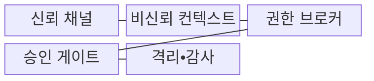
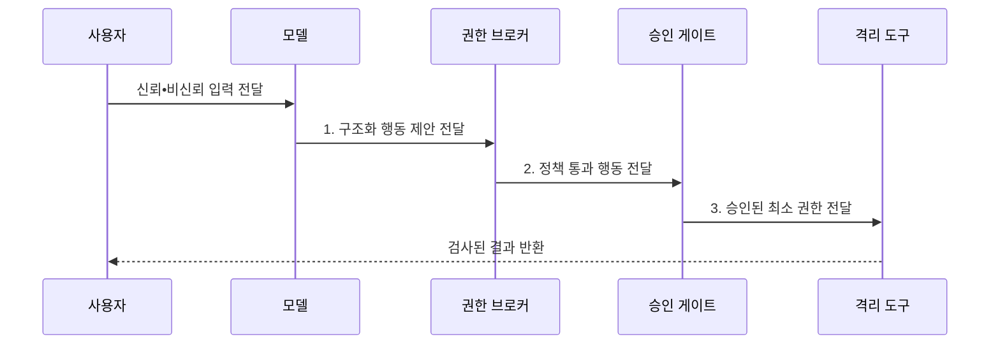

---
sidebar:
  order: 116
  label: "116. 프롬프트 인젝션 (Prompt Injection)"
  badge:
    text: "기출 • 85%"
    variant: note
title: "프롬프트 인젝션 (Prompt Injection)"
date: "2026-08-03T08:48:47+09:00"
tags:
  - "notes-latest_tech"
weight: 116
extra:
  question_no: "116"
  source_status: "기출"
  source_history: "135회, 137회, 138회"
  priority: 85
  priority_note: "최근 3개 회차에서 프롬프트 공격•방어가 반복됨"
---

## Ⅰ. 개요

핵심 용어

- **프롬프트 인젝션**: 비신뢰 입력의 지시가 상위 업무 지침을 교란해 모델 답변이나 도구 행동을 바꾸는 공격이다.
- **비신뢰 입력**: 사용자•문서•웹 등에서 들어와 업무 지시로 실행하도록 승인되지 않은 데이터이다.

- 정의/개념: **프롬프트 인젝션(Prompt Injection)** 은 비신뢰 입력으로 상위 지침•도구 행동을 교란하는 공격
- 배경/필요성: 모델은 자연어의 **신뢰 지시•비신뢰 데이터** 를 완전히 구분하지 못해 권한 오용 가능

#### 한줄 요약
- 인공지능이 참고 자료의 문장을 운영자 명령으로 착각해 답변과 행동이 조종됨

## Ⅱ. 특징

핵심 용어

- **지시 승격**: 비신뢰 데이터 속 문장을 상위 권한의 실행 명령처럼 처리하는 현상이다.
- **최소 권한**: 모델과 도구에 업무 수행에 필요한 최소 범위의 권한만 부여하는 원칙이다.
- **독립 권한 검증**: 모델 판단과 분리된 정책 구성요소가 사용자•도구•대상의 허용 여부를 확인하는 통제이다.

- 비신뢰 데이터의 **실행 지시 승격**
- 직접 입력•외부 콘텐츠의 **다중 유입 경로**
- 독립 권한 검증•최소 권한 기반 **도구 피해 제한**

#### 한줄 요약
- 문장 필터만 믿지 않고 모델이 제안한 행동을 별도 정책으로 다시 확인해야 한다.

## Ⅲ. 구조 및 구성요소

핵심 용어

- **신뢰 채널**: 시스템•업무 지시처럼 승인된 명령만 전달하도록 분리한 입력 경로이다.
- **비신뢰 컨텍스트**: 사용자가 제공하거나 외부에서 검색한 문서•도구 결과처럼 참고 데이터로만 취급해야 하는 입력 영역이다.
- **권한 브로커**: 모델의 도구 호출을 독립 정책으로 검사해 허용된 권한만 부여하는 통제이다.
- **승인 게이트**: 정보 반출•메일 발송 등 고위험 행동을 실행 전에 사람이나 정책이 승인하는 경계이다.
- **격리•감사**: 모델•도구 실행의 파일•망•자원 범위를 제한하고 입력•결정•실행 결과를 추적 가능하게 기록하는 통제이다.

| 구성요소 | 책임 |
| :--- | :--- |
| 신뢰 채널 | 외부 입력의 **지시 승격** 원천 차단 |
| 비신뢰 컨텍스트 | 최소 자료 전달과 **지시•데이터 경계** 유지 |
| 권한 브로커 | 도구별 허용 목록으로 **권한 범위** 제한 |
| 승인 게이트 | 독립 정책 검사 후 **고위험 행동** 승인 |
| 격리•감사 | 샌드박스 실행과 **전체 기록** 추적 |

#### 한줄 요약
- 별도 문지기가 도구 권한과 대상을 확인하고 위험한 행동은 사람이 승인한다.

## Ⅳ. 흐름도

핵심 용어

- **구조화 행동 제안**: 모델이 자유 텍스트와 분리해 도구•대상•인자를 명시한 실행 요청이다.
- **승인 범위**: 사람이나 정책이 특정 도구•대상•행위에 대해 실행을 허용한 한계이다.

1. **구조화 행동 제안 전달**: 자유 텍스트와 **도구 인자** 분리
2. **정책 통과 행동 전달**: 사용자 목적•도구•대상의 **권한** 독립 검증
3. **승인된 최소 권한 전달**: 비가역 행동의 **승인 범위** 제공

#### 한줄 요약
- 모델의 행동 제안을 제한한 뒤 독립 정책 검사와 사람 승인을 거쳐 실행한다.

## Ⅴ. 종류 및 비교

핵심 용어

- **직접 프롬프트 인젝션**: 사용자가 대화 입력에 공격 지시를 직접 제출해 상위 정책을 교란하는 방식이다.
- **간접 프롬프트 인젝션**: 문서•웹•메일 등 외부 콘텐츠의 숨은 지시가 모델 행동을 바꾸는 방식이다.

| 공격 경로 | 직접 프롬프트 인젝션 | 간접 프롬프트 인젝션 |
| :--- | :--- | :--- |
| 적용 기준 | 정책을 덮어쓰는지 **검증할 때 적용** | 콘텐츠 속 지시 수행 여부를 **검증할 때 적용** |
| 핵심 특징 | 대화 입력에 **공격 지시** 제출 | 외부 콘텐츠가 **공격 지시** 전달 |
| 한계 | **표현 변형** 우회 | **지연 발동•출처 확산** |

> 요약: **직접 공격** 은 대화, **간접 공격** 은 외부 콘텐츠로 지시 주입

#### 한줄 요약
- 직접 공격은 대화창에 명령을 넣고 간접 공격은 문서•메일 같은 정보에 명령을 숨긴다.

## Ⅵ. 실무 고려사항 및 대책

핵심 용어

- **상위 지시 승격**: 비신뢰 문장이 시스템이나 운영자의 명령처럼 취급되는 문제이다.
- **도구 권한 직접 행사**: 모델 계획이 별도 정책 검사 없이 실제 응용 프로그래밍 인터페이스•메일•파일 권한을 사용하는 문제이다.

| 문제 | 대책 | 효과 |
|:---|:---|:---|
| 비신뢰 문장이 **상위 지시** 로 승격 | 출처 라벨•지시/데이터 경계 분리 | **지시 우선순위** 보존 |
| 모델 계획이 **응용 프로그래밍 인터페이스(Application Programming Interface, API)•메일•파일 도구 권한** 직접 행사 | 권한 브로커•승인 게이트 적용 | 인젝션의 **행동 피해** 제한 |

#### 한줄 요약

- 메일 속 숨은 명령이 있어도 요약 모델이 직접 발송하지 못하게 도구 권한을 분리한다.

## Ⅶ. 결론

핵심 용어

- **컨텍스트 격리**: 비신뢰 자료를 업무 지시와 분리된 데이터 구역으로 모델에 전달하는 통제이다.
- **행동 피해 제한**: 모델이 공격 지시를 따르더라도 실제 도구•정보에 미치는 영향을 권한 경계로 줄이는 전략이다.

- 입력 신뢰도가 낮으면 **컨텍스트 격리**, 도구 권한이 크면 **승인 게이트** 적용

#### 한줄 요약
- 악성 문장을 모두 찾기보다 AI가 속아도 중요 정보와 도구를 못 쓰게 여러 통제를 둔다.
