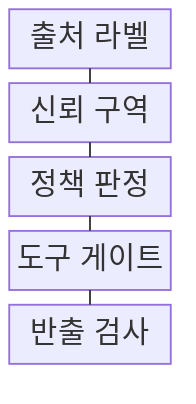
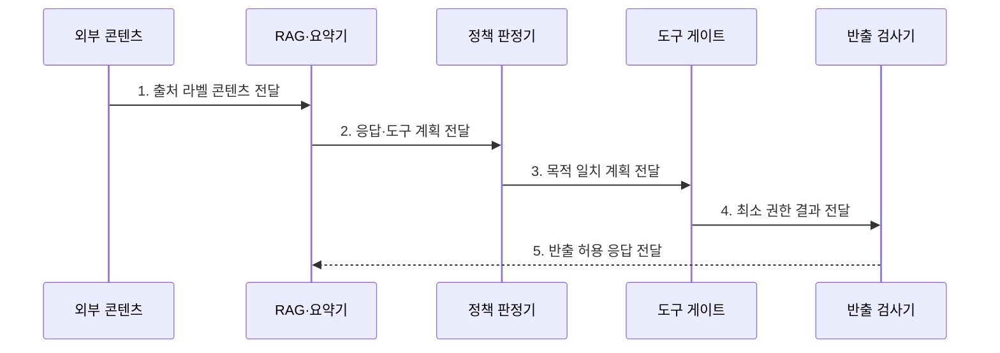

---
sidebar:
  order: 117
  label: "117. 간접 프롬프트 인젝션 (Indirect Prompt Injection)"
  badge:
    text: "기출 · 85%"
    variant: note
title: "간접 프롬프트 인젝션 (Indirect Prompt Injection)"
date: "2026-07-27T23:59:59+09:00"
tags:
  - "notes-latest_tech"
weight: 117
extra:
  question_no: "117"
  source_status: "기출"
  source_history: "137회, 138회"
  priority: 85
  priority_note: "간접 지시 유입과 도구 실행 통제가 연속 출제됨"
---

## 미리 알고가기

- **간접 프롬프트 인젝션(Indirect Prompt Injection)**: 외부 문서·웹·메일에 숨긴 지시가 모델의 행동을 바꾸는 공격
- **거대 언어 모델(Large Language Model, LLM)**: 외부 콘텐츠를 문맥으로 처리하며 데이터와 지시를 혼동할 수 있는 언어 모델
- **검색 증강 생성(Retrieval-Augmented Generation, RAG)**: 검색 문서를 답변 문맥에 결합해 비신뢰 콘텐츠가 유입될 수 있는 구조

## Ⅰ. 개요

- 정의/개념: 외부 콘텐츠의 **숨은 지시**로 모델·도구 행동을 조종하는 공격
- 배경/필요성: 검색·요약 문맥의 **데이터·명령 혼동**으로 비인가 행동 발생

### 쉽게 이해하기 (학습용)
- 메일 본문에 내부 문서 전송 명령을 숨겨 요약 AI가 실행하도록 유도한다.

## Ⅱ. 특징

- 외부 콘텐츠를 매개로 사용자와 무관한 지시를 유입한다
- 검색·요약 자동화와 도구 권한이 공격의 영향 범위를 확대한다
- 출처 분리·독립 권한 검증·반출 통제로 피해를 제한한다

### 쉽게 이해하기 (학습용)
- 자료의 출처와 그 자료가 요구한 행동 권한을 서로 다른 경계에서 검사한다.

## Ⅲ. 구조 및 구성요소

| 구성요소 | 책임 |
|:---|:---|
| 출처 라벨 | 콘텐츠 원천·소유자·검증 여부를 메타데이터로 전달 |
| 신뢰 구역 | 외부 콘텐츠를 지시와 분리하여 데이터 구역으로 조립 |
| 정책 판정 | 모델 계획과 사용자 목적의 일치성 검사 |
| 도구 게이트 | 도구 호출 전 권한 검증 및 고위험 작업 승인 |
| 반출 검사 | 응답·API 호출의 민감 정보 및 목적지 검사 |

> 요약: 출처·문맥·도구·반출 경계에서 외부 지시를 차단한다

### 쉽게 이해하기 (학습용)
- 자료의 출처를 표시하고 데이터 구역으로 분리한 뒤 행동 제안은 권한 문지기를 통과한다.

## Ⅳ. 흐름도

### 동작 원리

- **1. 출처 라벨 콘텐츠 전달**: 외부 문서를 비신뢰 데이터 구역으로 조립
- **2. 응답·도구 계획 전달**: 숨은 지시가 반영된 행동 후보 분리
- **3. 목적 일치 계획 전달**: 원래 사용자 요청과 계획의 독립 대조
- **4. 최소 권한 결과 전달**: 도구·대상·행위별 승인 범위 적용
- **5. 반출 허용 응답 전달**: 민감정보·수신 목적지 검사 후 반환

> 요약: 외부 자료를 분리하고 행동 권한과 반출을 검증한다

### 쉽게 이해하기 (학습용)
- 외부 자료를 읽은 AI의 행동은 원래 요청과 권한을 다시 확인한 뒤 실행된다.

## Ⅴ. 종류 및 비교

| 공격 경로 | 간접 인젝션 | 직접 인젝션 |
|:---|:---|:---|
| 적용 기준 | 외부 콘텐츠 공격 지시 유입 | 사용자의 공격 지시 직접 입력 |
| 핵심 특징 | 검색·요약 과정의 지연 발동 | 현재 대화의 지시 우선순위 교란 |
| 한계 | 외부 자료의 정상 문장과 구별 곤란 | 변형 지시 탐지 곤란 |

> 요약: 직접은 대화, 간접은 외부 자료로 지시를 주입한다

### 쉽게 이해하기 (학습용)
- 직접 공격은 채팅창에 명령을 넣고 간접 공격은 외부 자료에 명령을 숨긴다.

## Ⅵ. 실무 고려사항 및 대책

| 고려사항 | 대책 | 효과 |
|:---|:---|:---|
| 외부 문서 지시의 **지연 발동** | 출처 라벨·비신뢰 데이터 구역 적용 | 외부 콘텐츠의 **지시 승격** 차단 |
| 검색 문서가 **내부 도구 호출** 유도 | 사용자 목적 대조·도구 게이트 적용 | RAG의 **권한 우회** 제한 |

### 쉽게 이해하기 (학습용)

- 검색 문서의 숨은 지시가 내부 자료를 요구해도 업무 정책이 조회 권한을 다시 확인한다.

## Ⅶ. 결론

- **콘텐츠 출처·사용자 목적**으로 간접 인젝션의 도구·반출 권한을 통제

### 쉽게 이해하기 (학습용)

- 공격 문장을 알아맞히기보다 비신뢰 자료가 중요 행동을 직접 결정하지 못하게 설계한다.
