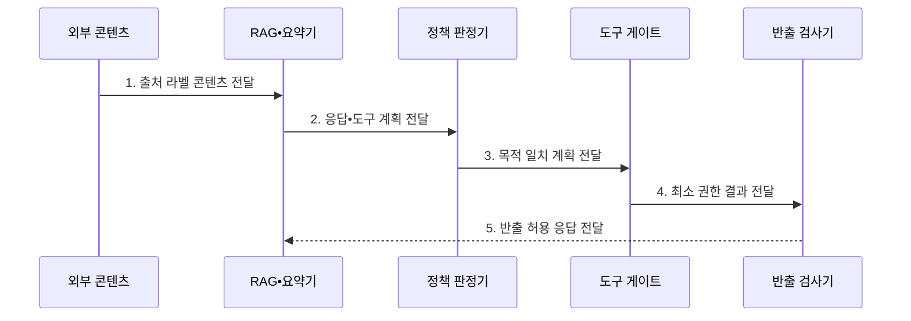

---
sidebar:
  order: 117
  label: "117. 간접 프롬프트 인젝션 (Indirect Prompt Injection)"
  badge:
    text: "기출 • 85%"
    variant: note
title: "간접 프롬프트 인젝션 (Indirect Prompt Injection)"
date: "2026-08-05T01:50:00+09:00"
tags:
  - "notes-latest_tech"
weight: 117
extra:
  question_no: "117"
  source_status: "기출"
  source_history: "137회, 138회"
  priority: 85
  priority_note: "간접 지시 유입과 도구 실행 통제가 연속 출제됨"
---

## Ⅰ. 개요

핵심 용어

- **간접 프롬프트 인젝션(Indirect Prompt Injection)**: 외부 문서•웹•메일에 숨긴 지시가 모델 답변이나 도구 행동을 바꾸는 공격이다.
- **데이터•명령 혼동**: 참고 자료의 문장을 비신뢰 데이터가 아니라 실행할 지시로 해석하는 현상이다.

- 정의/개념: **간접 프롬프트 인젝션**은 외부 콘텐츠의 숨은 지시로 모델•도구 행동을 조종하는 공격
- 배경/필요성: 검색•요약 문맥의 **데이터•명령 혼동** 으로 비인가 행동 발생

#### 한줄 요약
- 메일 본문에 내부 문서 전송 명령을 숨겨 요약 인공지능이 실행하도록 유도함

## Ⅱ. 특징

핵심 용어

- **비신뢰 지시 유입**: 외부 콘텐츠에 포함된 공격 지시가 검색•요약 문맥을 통해 모델로 들어오는 경로이다.
- **피해 범위 확대**: 모델이 도구 권한과 결합되면서 잘못된 응답이 조회•반출•실행 피해로 이어지는 현상이다.
- **반출 통제**: 응답이나 응용 프로그래밍 인터페이스 호출이 민감정보를 허용되지 않은 목적지로 보내지 못하도록 검사하는 통제이다.
- **응용 프로그래밍 인터페이스(Application Programming Interface, API)**: 시스템 간 기능 호출과 데이터 교환을 위한 규격이다.

- 외부 콘텐츠를 매개로 한 **비신뢰 지시 유입**
- 검색•요약 자동화와 도구 권한 결합의 **피해 범위 확대**
- 출처 분리•독립 권한 검증 기반 **행동•반출 통제**

#### 한줄 요약
- 자료의 출처와 그 자료가 요구한 행동 권한을 서로 다른 경계에서 검사한다.

## Ⅲ. 구조 및 구성요소

핵심 용어

- **출처 라벨**: 콘텐츠의 원천•소유자와 검증 여부를 모델과 정책 계층에 전달하는 메타데이터이다.
- **비신뢰 구역**: 외부 콘텐츠를 상위 지시와 분리해 비신뢰 데이터로 조립하는 문맥 영역이다.
- **정책 판정기**: 외부 콘텐츠에서 유래한 행동 제안을 사용자 목적•출처 신뢰도•권한 정책과 대조한다.
- **도구 게이트**: 모델이 제안한 호출의 사용자 목적•권한•대상을 실행 전에 검사하는 경계이다.
- **반출 검사기**: 응답과 도구 인자에 비밀•개인정보•내부 지시가 포함됐는지 외부 전송 전에 검사한다.

| 구성요소 | 책임 |
|:---|:---|
| 출처 라벨 | 콘텐츠 원천•소유자•**검증 여부** 전달 |
| 비신뢰 구역 | 외부 콘텐츠를 지시와 분리한 **데이터 구역** 조립 |
| 정책 판정 | 모델 계획과 **사용자 목적** 의 일치성 검사 |
| 도구 게이트 | 호출 전 **권한 검증•고위험 작업** 승인 |
| 반출 검사 | **응답•API 호출**의 민감정보•목적지 검사 |

#### 한줄 요약
- 자료의 출처를 표시하고 데이터 구역으로 분리한 뒤 행동 제안은 권한 문지기를 통과한다.

## Ⅳ. 흐름도

핵심 용어

- **목적 일치**: 모델의 행동 계획이 원래 사용자가 요청한 업무 범위와 부합하는 성질이다.
- **최소 권한 결과**: 허용된 도구•대상•행위만 실행해 반환한 제한된 결과이다.
- **검색 증강 생성(Retrieval-Augmented Generation, RAG)**: 외부 자료를 검색해 생성 모델의 답변 문맥으로 제공하는 방식이다.

**RAG•요약기**는 외부 콘텐츠를 비신뢰 데이터 구역에 넣고 행동 계획을 별도 정책 계층으로 전달한다.

- **1. 출처 라벨 콘텐츠 전달**: 외부 문서를 비신뢰 데이터 구역으로 조립
- **2. 응답•도구 계획 전달**: 숨은 지시가 반영된 행동 후보 분리
- **3. 목적 일치 계획 전달**: 원래 사용자 요청과 계획의 독립 대조
- **4. 최소 권한 결과 전달**: 도구•대상•행위별 승인 범위 적용
- **5. 반출 허용 응답 전달**: 민감정보•수신 목적지 검사 후 반환

#### 한줄 요약
- 외부 자료를 읽은 인공지능의 행동은 원래 요청과 권한을 다시 확인한 뒤 실행됨

## Ⅴ. 종류 및 비교

핵심 용어

- **지연 발동**: 외부 콘텐츠가 검색•요약된 뒤 특정 도구나 후속 단계에서 공격 지시가 실행되는 특성이다.
- **직접 인젝션**: 사용자가 현재 대화에 공격 지시를 직접 입력해 지시 우선순위를 교란하는 방식이다.

| 공격 경로 | 간접 인젝션 | 직접 인젝션 |
|:---|:---|:---|
| 적용 기준 | 외부 콘텐츠의 **공격 지시 유입** | 사용자의 **공격 지시 직접 입력** |
| 핵심 특징 | 검색•요약 과정의 **지연 발동** | 현재 대화의 **지시 우선순위 교란** |
| 한계 | 정상 문장과 **구별 곤란** | **변형 지시** 탐지 곤란 |

> 요약: **직접 공격** 은 대화, **간접 공격** 은 외부 자료로 지시 주입

#### 한줄 요약
- 직접 공격은 채팅창에 명령을 넣고 간접 공격은 외부 자료에 명령을 숨긴다.

## Ⅵ. 실무 고려사항 및 대책

핵심 용어

- **외부 지시 승격**: 문서 속 숨은 지시가 시스템•사용자 명령처럼 처리되는 문제이다.
- **도구 권한 오용**: 검색 문서의 지시가 내부 응용 프로그래밍 인터페이스나 민감정보 접근 권한을 사용하도록 유도하는 문제이다.

| 문제 | 대책 | 효과 |
|:---|:---|:---|
| 외부 문서 지시의 **지연 발동** | 출처 라벨•비신뢰 데이터 구역 적용 | 외부 콘텐츠의 **지시 승격** 차단 |
| 검색 문서가 **내부 API 호출** 유도 | 사용자 목적 대조•도구 게이트 적용 | **RAG 경유 도구 권한 오용** 제한 |

#### 한줄 요약

- 검색 문서의 숨은 지시가 내부 자료를 요구해도 업무 정책이 조회 권한을 다시 확인한다.

## Ⅶ. 결론

핵심 용어

- **비신뢰 구역 적용**: 외부 자료를 실행 지시와 분리해 데이터로만 취급하는 통제이다.
- **목적 불일치 행동**: 외부 콘텐츠가 유도했지만 원래 사용자 요청의 목표와 무관한 도구 실행이나 정보 반출이다.

- 외부 출처는 **비신뢰 구역** 에 격리하고 목적 불일치 행동은 **도구 게이트** 차단

#### 한줄 요약

- 공격 문장을 알아맞히기보다 비신뢰 자료가 중요 행동을 직접 결정하지 못하게 설계한다.
