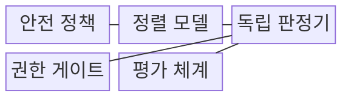
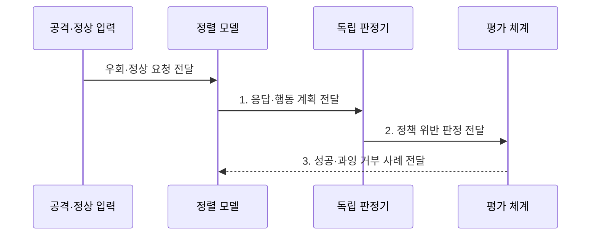

---
sidebar:
  order: 118
  label: "118. 탈옥 공격 (Jailbreak Attack)"
  badge:
    text: "기출 · 70%"
    variant: note
title: "탈옥 공격 (Jailbreak Attack)"
date: "2026-07-31T08:53:25+09:00"
tags:
  - "notes-latest_tech"
weight: 118
extra:
  question_no: "118"
  source_status: "기출"
  source_history: "137회, 138회"
  priority: 70
  priority_note: "탈옥 공격과 정렬 우회 방어가 최근 반복됨"
---

> **키워드:** 탈옥 공격 (Jailbreak Attack)

## Ⅰ. 개요

핵심 용어

- **탈옥 공격**: 변형 지시로 모델의 안전 정책과 거부 규칙을 우회해 금지된 응답이나 행동을 유도하는 공격이다.
- **과잉 거부**: 안전 장치가 허용해야 할 정상 요청까지 차단하는 현상이다.

- 정의/개념: **탈옥 공격**은 변형 지시로 안전 정책·거부 규칙을 우회하는 공격
- 배경/필요성: 정적 필터는 **변형 지시**를 놓치고 **정상 요청**을 과잉 차단

### 쉽게 이해하기 (학습용)
- 질문을 소설 설정이나 암호문으로 바꿔 AI의 거부 정책을 회피한다.

## Ⅱ. 특징

핵심 용어

- **역할극**: 가상 인물·상황을 부여해 금지 요청의 실제 의도를 숨기는 우회 방식이다.
- **적응형 공격**: 방어 체계의 응답을 관찰하면서 다음 입력 표현과 전략을 바꾸는 공격이다.
- **공격 성공률**: 전체 공격 시도 가운데 금지된 응답이나 행동을 유도한 비율이다.

- 역할극·인코딩·다단계 대화 기반 **거부 정책 우회**
- 정책 반응에 맞춰 표현을 바꾸는 **적응형 공격**
- **공격 성공률·과잉 거부율**의 공동 회귀 평가

### 쉽게 이해하기 (학습용)
- 방어 규칙에 맞춰 표현을 바꾸는 공격과 정상 질문의 과잉 거부를 함께 평가해야 한다.

## Ⅲ. 구조 및 구성요소

핵심 용어

- **안전 정책**: 모델이 허용·거부해야 할 내용과 행동, 예외 처리 기준을 정한 규칙이다.
- **독립 판정기**: 정렬 모델과 분리되어 응답·행동의 적대적 의도와 정책 위반을 분류한다.
- **권한 게이트**: 모델의 도구 계획이 실제 실행되기 전에 허용 여부를 결정적으로 검사한다.

| 구성요소 | 책임 |
|:---|:---|
| 안전 정책 | 금지·허용 범위와 **예외 처리 기준** |
| 정렬 모델 | 정책에 맞는 **응답·거부** 생성 |
| 독립 판정기 | 적대적 의도와 **정책 위반** 독립 분류 |
| 권한 게이트 | 호출 전 행위의 **결정적 승인·거부** |
| 평가 체계 | 공격·정상 요청의 **결과 축적·평가** |

### 쉽게 이해하기 (학습용)
- 모델의 거절 습관에만 의존하지 않고 독립 검사와 도구 권한 확인을 수행한다.

## Ⅳ. 흐름도

핵심 용어

- **회귀 사례**: 수정 이후 공격 차단과 정상 요청 통과가 유지되는지 반복 확인하는 평가 입력이다.
- **정상 통과율**: 허용해야 할 정상 요청 가운데 모델이 올바르게 응답한 비율이다.

1. **응답·행동 계획 전달**: 정렬 모델의 답변·거부와 **도구 계획** 제공
2. **정책 위반 판정 전달**: 의도·내용·권한의 **위반 여부** 제공
3. **성공·과잉 거부 사례 전달**: 공격 성공률·정상 통과율 기반 **회귀 사례** 제공

### 쉽게 이해하기 (학습용)
- 새 우회 질문과 정상 질문을 함께 검증해 공격 성공과 과잉 거부를 회귀 세트에 반영한다.

## Ⅴ. 종류 및 비교

핵심 용어

- **정렬 우회**: 모델이 학습한 안전 행동과 거부 정책을 변형 입력으로 무력화하는 공격 목적이다.
- **업무 흐름 탈취**: 프롬프트 인젝션으로 상위 지시를 바꾸고 도구 실행 흐름을 공격자가 통제하는 목적이다.

| 공격 유형 | 탈옥 공격 | 프롬프트 인젝션 |
|:---|:---|:---|
| 적용 기준 | **안전 정책의 거부 우회** 목적 | **지시 계층·업무 흐름 탈취** 목적 |
| 핵심 특징 | 금지된 **응답·행동 생성** 유도 | 상위 지시 무시와 **도구 오용** 유도 |
| 한계 | 변형 공격과 **정상 요청 구별** 곤란 | 비신뢰 데이터와 **지시 구별** 곤란 |

> 요약: **탈옥 공격**은 정책, **프롬프트 인젝션**은 업무 지시 변경

### 쉽게 이해하기 (학습용)
- 탈옥은 금지된 답변을 유도하고 인젝션은 업무 지시와 실행 흐름을 바꾼다.

## Ⅵ. 실무 고려사항 및 대책

핵심 용어

- **탈옥 성공**: 변형·다단계 입력이 안전 통제를 넘어 금지된 응답이나 행동을 생성하는 문제이다.
- **정상 요청 차단**: 강한 거부 정책 때문에 방어·교육 등 허용된 요청까지 거절하는 문제이다.

| 문제 | 대책 | 효과 |
|:---|:---|:---|
| 변형·다단계 입력의 **탈옥 성공** | 적응형 공격 세트·독립 판정 적용 | **공격 성공률** 감소 |
| 강한 거부 정책의 **정상 요청 차단** | 정상 경계 사례와 과잉 거부율 공동 평가 | 안전성 내 **유용성 보존** |

### 쉽게 이해하기 (학습용)

- 같은 보안 용어라도 공격 코드 제작과 방어 분석은 목적이 다르므로 답변과 실행 권한을 나눠 판단한다.

## Ⅶ. 결론

핵심 용어

- **안전 통제**: 금지된 응답·행동을 탐지하고 차단하도록 모델·정책·권한 계층에 적용한 조치이다.
- **예외 기준**: 표현이 비슷해도 정당한 방어·교육 목적의 정상 요청을 허용하도록 정한 조건이다.

- 공격 성공률이 높으면 **안전 통제** 강화, 과잉 거부율이 높으면 **예외 기준** 조정

### 쉽게 이해하기 (학습용)

- 모든 우회 문장을 미리 막기보다 정상 질문과 함께 검증해 안전성과 사용성을 유지한다.
