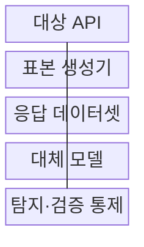
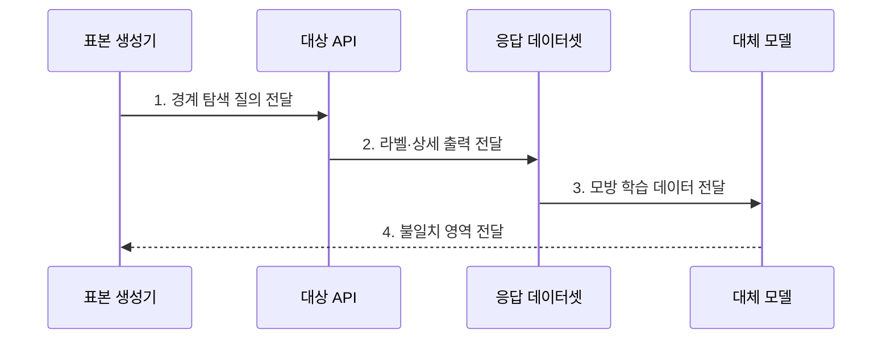

---
sidebar:
  order: 119
  label: "119. 모델 추출 (Model Extraction)"
  badge:
    text: "기출 · 50%"
    variant: note
title: "모델 추출 (Model Extraction)"
date: "2026-07-27T23:59:59+09:00"
tags:
  - "notes-latest_tech"
weight: 119
extra:
  question_no: "119"
  source_status: "기출"
  source_history: "137회"
  priority: 50
  priority_note: "모델 추출의 질의 제한·워터마킹 설계가 유력함"
---

## 미리 알고가기

- **모델 추출(Model Extraction)**: 공개 API의 입출력을 수집해 원본의 기능을 모방하는 대체 모델을 만드는 공격
- **응용 프로그래밍 인터페이스(Application Programming Interface, API)**: 공격자가 원본 모델에 반복 질의하고 출력을 수집하는 서비스 접점
- **대체 모델(Surrogate Model)**: 수집한 응답으로 학습한 모방 모델이며 원본 가중치의 정확한 복원을 의미하지 않음

## Ⅰ. 개요

- 정의/개념: 반복 API 응답으로 **원본 결정 경계·기능**을 모방하는 공격
- 배경/필요성: 상세 출력·무제한 질의의 **대체 모델 학습** 악용 통제 필요

### 쉽게 이해하기 (학습용)
- AI 답변을 모아 학습하면 원본 파일 없이도 비슷한 답을 내는 모방 AI를 만들 수 있다.

## Ⅱ. 특징

- API 입출력 쌍을 교사 데이터로 사용해 대체 모델을 학습한다
- 점수·로짓과 적응형 질의는 판단 경계 모방 효율을 높인다
- 출력 최소화·질의 예산·행위 탐지로 추출 비용을 높인다

### 쉽게 이해하기 (학습용)
- 상세 점수까지 받으면 적은 질문으로 원본의 판단 경계를 자세히 배울 수 있다.

## Ⅲ. 구조 및 구성요소

| 구성요소 | 책임 |
|:---|:---|
| 대상 API | 입력에 대한 라벨·로짓 등을 반환하는 원본 서비스 |
| 표본 생성기 | 결정 경계 정보 확보를 위한 입력 선택 |
| 응답 데이터셋 | 입력과 API 반환 결과를 축적한 학습 자료 |
| 대체 모델 | 수집 데이터 기반 원본 기능 모방 학습 |
| 탐지·검증 통제 | 계정별 예산 감시와 워터마크 검증 |

> 요약: 질의 응답을 모아 대체 모델을 학습·검증한다

### 쉽게 이해하기 (학습용)
- 공격자는 응답으로 모방 모델을 학습하고 운영자는 질문 패턴과 워터마크 흔적을 찾는다.

## Ⅳ. 흐름도

### 동작 원리

- **1. 경계 탐색 질의 전달**: 불확실 영역 중심의 적응형 입력 선택
- **2. 라벨·상세 출력 전달**: 점수·로짓의 결정 경계 정보 수집
- **3. 모방 학습 데이터 전달**: API 입출력쌍 기반 대체 모델 학습
- **4. 불일치 영역 전달**: 원본·대체 모델 차이 기반 추가 질의 선택

> 요약: 불일치 영역을 다시 질의해 모방 정확도를 높인다

### 쉽게 이해하기 (학습용)
- 모방 AI가 틀린 영역을 골라 다시 묻기 때문에 여러 계정에 나뉜 질의 패턴도 살펴야 한다.

## Ⅴ. 종류 및 비교

| 추출 방식 | 라벨 전용 추출 | 점수·로짓 기반 추출 |
|:---|:---|:---|
| 적용 기준 | 최종 라벨만 제공하는 API | 점수·로짓을 제공하는 API |
| 핵심 특징 | 많은 질의로 결정 경계 추정 | 상세 출력으로 질의 효율 향상 |
| 한계 | 많은 질의와 표본 선택 비용 필요 | 상세 출력 제한 시 공격 효율 저하 |

> 요약: 출력 정보가 상세할수록 추출 질의가 줄어든다

### 쉽게 이해하기 (학습용)
- 최종 답만 줄 때보다 상세 점수까지 주면 적은 시도로 판단 규칙을 추리하기 쉽다.

## Ⅵ. 실무 고려사항 및 대책

| 고려사항 | 대책 | 효과 |
|:---|:---|:---|
| 상세 점수·로짓으로 **경계 모방** 가속 | 최소 라벨 출력·정밀도 제한 | 질의당 **추출 정보량** 감소 |
| 분산 반복 질의로 **질의 예산** 우회 | 계정·조직·입력 분포 연계 탐지 | 적응형 **경계 탐색** 비용 증가 |

### 쉽게 이해하기 (학습용)

- 공개 API는 계정·조직별 예산과 입력 다양성을 함께 살펴 분산된 경계 탐색을 찾는다.

## Ⅶ. 결론

- **출력 상세도·질의 예산**으로 모델 추출의 경계 모방 비용을 높이는 통제

### 쉽게 이해하기 (학습용)

- 모방 가능성을 완전히 없애기 어려우므로 출력 정보를 줄이고 복제 추적 증거를 남긴다.
