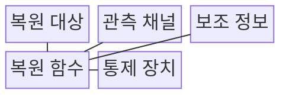
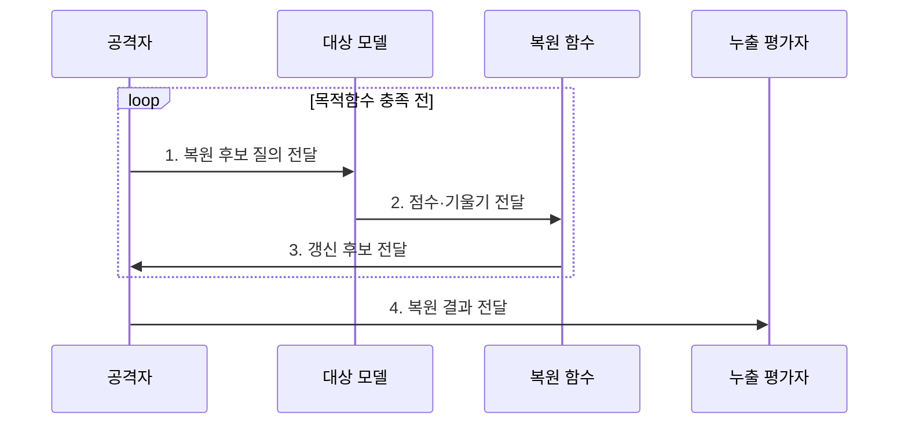

---
sidebar:
  order: 120
  label: "120. 모델 역전 (Model Inversion)"
  badge:
    text: "기출 · 50%"
    variant: note
title: "모델 역전 (Model Inversion)"
date: "2026-07-31T08:54:19+09:00"
tags:
  - "notes-latest_tech"
weight: 120
extra:
  question_no: "120"
  source_status: "기출"
  source_history: "137회"
  priority: 50
  priority_note: "모델 역전의 정보 노출·완화 비교가 유력함"
---

## Ⅰ. 개요

핵심 용어

- **모델 역전**: 모델 출력이나 내부 신호를 이용해 학습 데이터의 대표 특징·민감 속성을 역추정하는 공격이다.
- **학습정보 노출**: 모델의 응답·점수·기울기에서 훈련 데이터의 특징이나 개인 정보를 알아내는 위험이다.

- 정의/개념: **모델 역전**은 모델 출력·내부 신호로 학습 특징·민감 속성을 복원하는 공격
- 배경/필요성: 상세 점수·기울기·과적합은 **학습정보 노출**을 키워 민감 속성 추정 가능

#### 한줄 요약
- AI 답변과 점수를 단서로 삼아 AI가 배운 집단의 숨은 특징을 추리한다.

## Ⅱ. 특징

핵심 용어

- **복원 후보**: 모델 관측 신호가 목표 출력에 가까워지도록 반복 수정하는 추정 입력이다.
- **보조 정보**: 후보 공간을 줄이기 위해 공격자가 결합하는 외부 지식이나 대상 속성이다.
- **개인 식별성**: 복원 결과가 특정 개인과 연결될 수 있는 정도이다.

- 상세 점수·기울기 기반 **복원 후보 반복 최적화**
- 보조 정보 결합에 따른 **후보 공간·재식별 범위 축소**
- **원본 일치도·개인 식별성** 분리 기반 누출 판정

#### 한줄 요약
- 복원 결과가 원본 복사본이 아니어도 닮은 정도와 개인 식별 가능성을 함께 판단해야 한다.

## Ⅲ. 구조 및 구성요소

핵심 용어

- **관측 채널**: 공격자가 후보를 평가하도록 응답·점수·기울기·파라미터 정보를 얻는 경로이다.
- **기울기**: 손실이 입력에 따라 변하는 방향으로 복원 후보를 갱신하는 단서이다.
- **복원 함수**: 후보 입력의 모델 반응을 목표 출력과 가깝게 만드는 목적함수이다.

| 구성요소 | 책임 |
|:---|:---|
| 복원 대상 | 추론할 **민감 속성·대표 입력 특징** |
| 관측 채널 | 후보를 평가하는 **응답·파라미터 정보** |
| 보조 정보 | 후보 공간을 좁히는 **외부 지식** |
| 복원 함수 | 후보 응답을 목표와 유사하게 만드는 **목적함수** |
| 통제 장치 | 출력 축소·프라이버시 예산 기반 **노출 제한** |

#### 한줄 요약

- 공격자는 복원 대상·모델 단서·보조 정보·채점 기준을 조합하고 운영자는 같은 경로로 누출을 검증한다.

## Ⅳ. 흐름도

핵심 용어

- **목적함수**: 복원 후보와 목표 출력의 차이를 수치화해 갱신 방향을 정하는 함수이다.
- **재식별 가능성**: 복원된 특징을 다른 정보와 결합해 실제 개인을 알아낼 수 있는 정도이다.

- **1. 복원 후보 질의 전달**: 보조 정보 기반 초기 특징·민감 속성 구성
- **2. 점수·기울기 전달**: 후보와 목표 출력의 차이를 계산할 관측 신호 수집
- **3. 갱신 후보 전달**: 목적함수 개선 방향의 입력 특징 반복 수정
- **4. 복원 결과 전달**: 원본 유사도·민감 속성·재식별 가능성 판정

#### 한줄 요약

- 흐릿한 그림을 AI에 반복 입력하고 목표 점수가 높아지는 방향으로 고쳐 충분히 닮으면 멈춘다.

## Ⅴ. 종류 및 비교

핵심 용어

- **멤버십 추론**: 특정 표본이 모델 훈련 데이터에 포함됐는지를 판정하는 공격이다.
- **모델 추출**: 대량의 API 입출력으로 원본 모델의 기능을 모방하는 대체 모델을 만드는 공격이다.

| 공격 유형 | 모델 역전 | 멤버십 추론 | 모델 추출 |
|:---|:---|:---|:---|
| 적용 기준 | **학습 특징 복원** 목적 | **훈련 포함 판정** 목적 | **모델 기능 모방** 목적 |
| 핵심 특징 | 출력·기울기로 **후보 최적화** | 표본별 **손실·신뢰도 차이** 활용 | 대량 입출력으로 **대체 모델 학습** |
| 한계 | 복원물과 **실제 원본의 차이** | 낮은 과적합 시 **구별 곤란** | 많은 **질의·학습 비용** 필요 |

> 요약: **모델 역전**은 특징, **멤버십 추론**은 포함, 모델 추출은 기능 공격

#### 한줄 요약

- 모델 역전은 학습 특징, 멤버십 추론은 훈련 포함 여부, 모델 추출은 판단 기능을 노린다.

## Ⅵ. 실무 고려사항 및 대책

핵심 용어

- **관측 정보량**: 출력 점수·정밀도·기울기 등 질의 한 번에서 공격자가 얻을 수 있는 모델 정보의 양이다.
- **민감 특징 재현**: 과적합 모델이 훈련 표본의 개인적 속성을 출력이나 복원 결과에 드러내는 문제이다.

| 문제 | 대책 | 효과 |
|:---|:---|:---|
| 상세 점수·기울기로 **복원 후보** 최적화 | 출력 정밀도·내부 신호 접근 제한 | 공격의 **관측 정보량** 감소 |
| 과적합 모델의 **민감 특징 재현** | 정규화·프라이버시 학습·복원 시험 | 학습 표본 **재식별 위험** 감소 |

#### 한줄 요약

- 얼굴 인식의 세밀한 점수를 줄인 뒤 실제 복원 공격으로 정보 노출이 감소했는지 확인한다.

## Ⅶ. 결론

핵심 용어

- **관측 채널 제한**: 출력 정밀도와 내부 신호 접근을 줄여 복원 공격의 단서를 제한하는 통제이다.
- **프라이버시 학습**: 개인 표본의 영향이 모델에 과도하게 남지 않도록 학습 과정에 보호 기법을 적용하는 방식이다.

- 출력 정보량이 많으면 **관측 채널** 제한, 재식별 성공률이 높으면 **프라이버시 학습** 적용

#### 한줄 요약

- AI가 주는 단서를 줄이고 개인별 프라이버시 한도를 두되 실제 복원 성공률도 확인한다.
