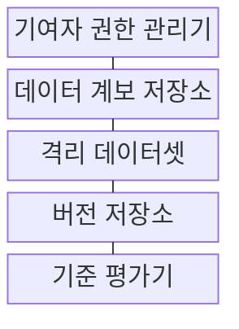
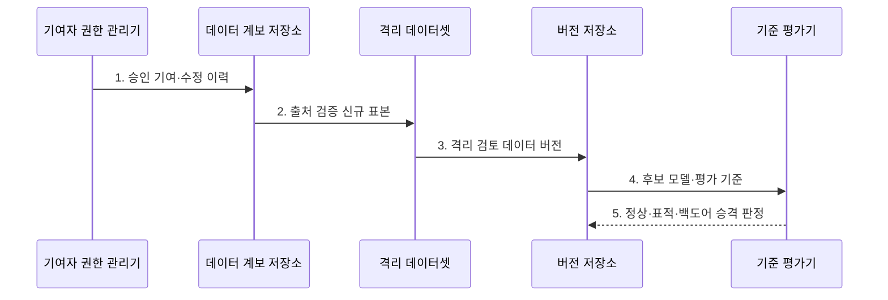

---
sidebar:
  order: 121
  label: "121. 데이터 오염 (Data Poisoning)"
  badge:
    text: "기출 · 70%"
    variant: note
title: "데이터 오염 (Data Poisoning)"
date: "2026-07-27T23:59:59+09:00"
tags:
  - "notes-latest_tech"
weight: 121
extra:
  question_no: "121"
  source_status: "기출"
  source_history: "137회"
  priority: 70
  priority_note: "학습 데이터 오염과 검증 설계가 최근 출제됨"
---

## 미리 알고가기

- **데이터 오염(Data Poisoning)**: 학습·재학습 데이터의 샘플·라벨·비중을 조작해 학습 결과를 왜곡하는 공격
- **적대적 예제**: 데이터 오염과 달리 배포된 모델의 입력을 교란하는 추론 시점 공격
- **오픈 데이터**: 외부 학습·검색 수집 경로가 넓어 공격자가 오염시킬 수 있는 공개 자료

## Ⅰ. 개요

- 정의/개념: 학습 데이터의 표본·라벨·분포를 조작해 **모델의 가용성·무결성·표적 행동을 훼손**
- 배경/필요성: 입력 검증만으로 찾기 어려운 **학습 결과 내재화·지속 오판** 방지 필요

### 쉽게 이해하기 (학습용)

- 문제집 일부의 문제나 정답을 몰래 바꾸면 학생의 성적이 떨어지거나 특정 문제만 틀리게 되는 것과 같다.

## Ⅱ. 특징

- **가용성·표적·백도어 목적**에 따라 전체 성능·특정 입력·트리거 행동을 노린다.
- **라벨 변조·클린 라벨 특징 조작·표본 비중 조작**으로 학습 경계를 바꾼다.
- **출처·계보·기여 권한·격리 학습·행동 평가**로 데이터와 모델 승격을 통제한다.

### 쉽게 이해하기 (학습용)

- 오염 샘플은 눈에 띄는 오답일 수도 있지만 정답은 그대로 둔 채 특징만 바꿔 판단 기준을 틀어 놓을 수도 있다.

## Ⅲ. 구조 및 구성요소

| 구성요소 | 책임 |
|:---|:---|
| 기여자 권한 관리기 | 샘플·라벨 수정 주체와 범위 통제 |
| 데이터 계보 저장소 | 샘플 출처·시점·변환 이력 보관 |
| 격리 데이터셋 | 신규·의심 샘플과 승인 자료 분리 |
| 버전 저장소 | 승인 데이터셋·모델 버전 관리 |
| 기준 평가기 | 정상·표적·백도어 행동 대조 |

> 요약: 권한·계보·격리·평가로 모델 승격을 통제한다

### 쉽게 이해하기 (학습용)

- 누가 어떤 재료를 언제 넣었는지 기록하고 새 재료는 격리해 검사한 뒤 검증된 데이터와 모델 버전을 함께 보관한다.

## Ⅳ. 흐름도

### 동작 원리

1. **승인 기여·수정 이력**: 데이터 변경 주체와 허용 범위 연결
2. **출처 검증 신규 표본**: 계보·시점·변환 정책 일치 판정
3. **격리 검토 데이터 버전**: 의심 표본을 승인 자료와 분리
4. **후보 모델·평가 기준**: 고정 데이터 버전으로 후보 학습
5. **정상·표적·백도어 승격 판정**: 행동 시험 통과 버전만 배포

> 요약: 기여 권한·계보와 모델 행동을 검증해 승격한다

### 쉽게 이해하기 (학습용)

- 새 자료의 출처와 이동 기록을 확인하고 후보 모델의 정상·표적 행동이 모두 통과할 때만 배포한다.

## Ⅴ. 종류 및 비교

| 데이터 오염 공격 목적 | 가용성 오염 | 표적 무결성 오염 | 백도어 오염 |
|:---|:---|:---|:---|
| 적용 기준 | 정상 평가셋 성능 검사 | 표적 조각 오류 검사 | 트리거 성공률 검사 |
| 핵심 특징 | 전체 예측 성능 저하 | 특정 입력·집단 오판 | 트리거에서 지정 행동 |
| 한계 | 서비스 품질 붕괴 | 평균 지표에 오류 은닉 | 정상 성능으로 탐지 회피 |

> 요약: 전체·표적·트리거 오판을 서로 다른 시험으로 찾는다

### 쉽게 이해하기 (학습용)

- 가용성 오염은 전체 성능을 낮추고 표적 오염은 일부만 틀리게 하며 백도어는 트리거에서만 오답을 낸다.

## Ⅵ. 실무 고려사항 및 대책

| 고려사항 | 대책 | 효과 |
|:---|:---|:---|
| 특정 기여자의 표본 비중 급증 | 기여자별 **표본 비중·쓰기 권한** 제한 | 분포 조작 영향 축소 |
| 라벨·특징의 은닉 변조 | 계보 기반 **격리 전후 모델 비교** | 클린 라벨 오염 탐지 |
| 평균 성능에 표적 오류 은닉 | 정상·표적·트리거 **행동 평가셋** 분리 | 국소 오판 식별 |

### 쉽게 이해하기 (학습용)

- 신고 출처와 계보를 확인하고 의심 데이터를 뺀 모델과 비교해 오염 영향을 판정한다

## Ⅶ. 결론

- **데이터 계보·기여량·격리 전후 행동 변화**로 오염을 판정하고 검증 데이터로 재학습

### 쉽게 이해하기 (학습용)

- 학습 자료의 변경 권한과 기록을 관리하고 새 모델이 이상하면 검증된 데이터와 모델로 되돌려야 한다.
