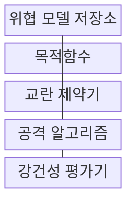
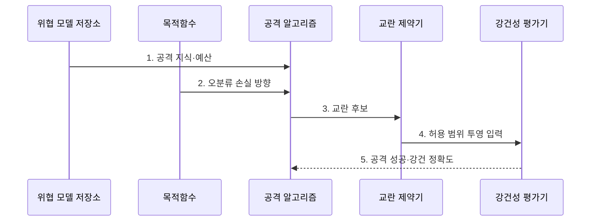

---
sidebar:
  order: 123
  label: "123. 적대적 예제 (Adversarial Example)"
  badge:
    text: "기출 · 50%"
    variant: note
title: "적대적 예제 (Adversarial Example)"
date: "2026-07-27T23:59:59+09:00"
tags:
  - "notes-latest_tech"
weight: 123
extra:
  question_no: "123"
  source_status: "기출"
  source_history: "131회"
  priority: 50
  priority_note: "적대적 예제의 교란·강건성 비교 가치가 유지됨"
---

## 미리 알고가기

- **적대적 예제(Adversarial Example)**: 추론 입력을 위협 모델의 허용 범위 안에서 조작해 모델 오판을 유도하는 표본
- **모델 민감성**: 사람이 보기엔 거의 같은 입력이어도 모델은 경계 근처에서 크게 흔들릴 수 있음
- **강건성 평가**: 정상 정확도와 정한 공격 범위의 적대적 정확도를 함께 측정하는 평가
- **교란 예산($\epsilon$)**: $\epsilon$은 '엡실론'으로 읽는 그리스 문자이며 위협 모델이 허용하는 최대 입력 변화량을 표시
- **빠른 기울기 부호법(Fast Gradient Sign Method, FGSM)**: 손실 기울기의 부호를 이용해 한 번에 교란을 생성하는 공격
- **투영 기울기 하강법(Projected Gradient Descent, PGD)**: 교란을 반복 갱신하고 매 단계 허용 범위에 투영하는 공격
- **칼리니-와그너(Carlini-Wagner, C&W)**: 작은 교란으로 오분류를 유도하도록 목적함수를 최적화하는 공격

## Ⅰ. 개요

- 정의/개념: 추론 시 입력을 제한 범위에서 조작해 **모델의 오분류·표적 출력을 유도하는 공격 표본**
- 배경/필요성: 무작위 잡음 평가의 **최악 방향 입력 교란** 탐지 한계

### 쉽게 이해하기 (학습용)

- 사진이 사람에게는 그대로 보여도 모델이 중요하게 보는 수치를 계산해 조금 바꾸면 판정이 뒤집힐 수 있음

## Ⅱ. 특징

> 파란 정상 표본 $x$가 점선 $\epsilon$ 범위 안에서 붉은 $x'$로 이동해 검은 결정 경계를 넘으면 오분류되며, 공격 성공률 실측값이 아닌 입력 공간의 개념 좌표다.

- **공격 지식·목표·질의·교란·계산 예산**이 위협 모델과 주장 범위를 정한다.
- **손실 방향 탐색·전이성**으로 제한된 입력 변화에서 오판을 찾는다.
- **정상·적대적 정확도와 공격 설정 공개**로 방어 성능 과장을 막는다.

### 쉽게 이해하기 (학습용)

- 아무 곳이나 흔드는 잡음이 아니라 모델이 가장 헷갈리는 방향을 골라 제한된 크기만큼 입력을 움직이는 공격임

## Ⅲ. 구조 및 구성요소

| 구성요소 | 책임 |
|:---|:---|
| 위협 모델 저장소 | 공격 지식·범위·계산 예산 보관 |
| 목적함수 | 오분류를 유도하는 손실 |
| 교란 제약기 | 입력 변화의 거리·허용 범위 판정 |
| 공격 알고리즘 | 교란 후보 탐색 계산 |
| 강건성 평가기 | 위협 범위 안의 방어 성능 측정 |

> 요약: 위협 모델과 교란 제약 안에서 강건성을 평가한다

### 쉽게 이해하기 (학습용)

- 공격자가 무엇을 알고 얼마나 바꿀 수 있는지 경계선을 먼저 그은 뒤, 그 안에서 오판을 찾고 남은 정답 비율을 재는 구조임

## Ⅳ. 흐름도

### 동작 원리

1. **공격 지식·예산**: 공격자의 접근 범위와 계산 한계 고정
2. **오분류 손실 방향**: 비표적·표적 공격의 최적화 목표 결정
3. **교란 후보**: 손실 기울기로 입력 변화 탐색
4. **허용 범위 투영 입력**: 교란 예산 밖 후보를 제약 집합으로 복귀
5. **공격 성공·강건 정확도**: 위협 모델 범위의 방어 성능 판정

> 요약: 제약 안에서 교란을 탐색해 공격 성공을 판정한다

### 쉽게 이해하기 (학습용)

- 정상 입력 하나를 고르고 공격 규칙을 정한 뒤, 허용선 밖의 후보는 되돌리면서 오판이 생기거나 계산 예산이 끝날 때까지 반복함

## Ⅴ. 종류 및 비교

| 적대적 예제 생성 방식 | FGSM | PGD | C&W |
|:---|:---|:---|:---|
| 적용 기준 | 빠른 회귀 점검 | 반복 공격 평가 | 작은 교란 정밀 탐색 |
| 핵심 특징 | 기울기 부호로 1회 이동 | 이동·제약 투영 반복 | 거리·오분류 공동 최적화 |
| 한계 | 약한 공격으로 과대평가 | 반복 계산 비용 증가 | 설정별 결과 편차 |

> 요약: FGSM은 1회, PGD는 반복, C&W는 정밀 탐색이다

### 쉽게 이해하기 (학습용)

- FGSM은 한 걸음에 교란을 만들고, PGD는 허용선 안에서 여러 걸음 찾으며, C&W는 오판을 만드는 작은 변화를 최적화함

## Ⅵ. 실무 고려사항 및 대책

| 고려사항 | 대책 | 효과 |
|:---|:---|:---|
| 약한 공격으로 방어 과대평가 | FGSM·PGD·C&W의 **공격 강도** 비교 | 기울기 은폐 오판 완화 |
| 교란 예산의 의미 불일치 | 입력 도메인별 **거리 규범·ε** 명시 | 강건성 주장 범위 고정 |
| 공격 설정 비공개 | 반복 수·초기값·성공 조건과 **강건 정확도** 공개 | 방어 재현성 확보 |

### 쉽게 이해하기 (학습용)

- 제한된 교란에서 정상 정확도와 공격 후 정확도를 함께 비교한다

## Ⅶ. 결론

- **공격 지식·교란 예산·계산 강도**를 명시하고 해당 위협 모델의 **강건 정확도**로만 판정

### 쉽게 이해하기 (학습용)

- 자물쇠가 한 도구를 견뎠다고 모든 침입에 안전한 것은 아니므로, 공격자의 지식과 도구 범위를 적은 뒤 그 범위에서만 강하다고 말해야 함
