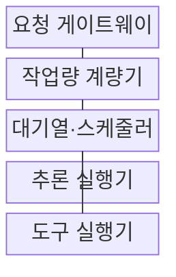
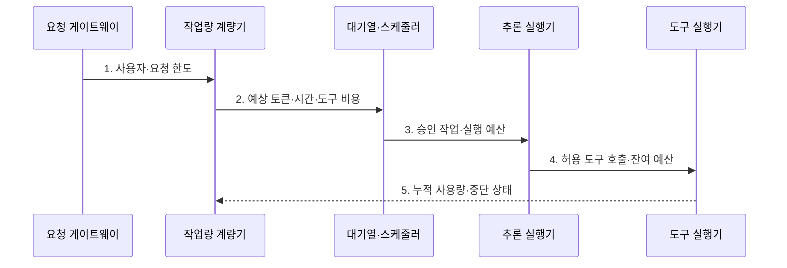

---
sidebar:
  order: 124
  label: "124. 모델 서비스 거부 (Model Denial of Service)"
  badge:
    text: "기출 · 50%"
    variant: note
title: "모델 서비스 거부 (Model Denial of Service)"
date: "2026-07-27T23:59:59+09:00"
tags:
  - "notes-latest_tech"
weight: 124
extra:
  question_no: "124"
  source_status: "기출"
  source_history: "138회"
  priority: 50
  priority_note: "자원 고갈형 모델 서비스 거부가 최근 출제됨"
---

## 미리 알고가기

- **모델 서비스 거부(Model Denial of Service, Model DoS)**: 고비용 모델 작업을 반복해 정상 요청의 가용성을 훼손하는 공격
- **대규모 언어 모델(Large Language Model, LLM)**: 긴 입출력과 반복 생성에 많은 가속기 자원을 사용하는 언어 모델
- **분당 요청 수(Requests Per Minute, RPM)**: 사용자·키별 1분 요청 건수 한도
- **분당 토큰 수(Tokens Per Minute, TPM)**: 사용자·키별 1분 입출력 토큰 수 한도
- **그래픽 처리장치(Graphics Processing Unit, GPU)**: 모델의 행렬 연산을 병렬 처리하는 가속 장치

## Ⅰ. 개요

- 정의/개념: 공격자가 고비용 입력·출력·반복 실행으로 **모델 자원을 고갈시켜 정상 서비스 가용성을 훼손**
- 배경/필요성: 요청 건수 제한의 **토큰·시간·도구 비용** 미반영 보완

### 쉽게 이해하기 (학습용)

- 짧은 주문 한 장으로도 조리가 오래 걸리는 일을 계속 시켜 다른 손님의 주문을 밀리게 만드는 공격과 같음

## Ⅱ. 특징

- **긴 입력·출력·에이전트 반복**은 적은 요청으로 큰 계산·메모리를 소모한다.
- 공격 결과는 **대기열 지연·오류·가용성 저하**이며 비용 증가는 동반 피해다.
- **주체별 토큰·시간·동시성·도구 예산과 실행 풀 격리**로 자원 독점을 제한한다.

### 쉽게 이해하기 (학습용)

- 손님 수가 적어도 한 명이 긴 주문과 추가 주문을 계속 내면 조리대와 비용을 모두 독점할 수 있음

## Ⅲ. 구조 및 구성요소

| 구성요소 | 책임 |
|:---|:---|
| 요청 게이트웨이 | 주체 식별과 한도 적용 |
| 작업량 계량기 | 토큰·시간·도구 호출 누적 |
| 대기열·스케줄러 | 테넌트별 실행 풀 격리 |
| 추론 실행기 | 모델 연산과 캐시 처리 |
| 도구 실행기 | 도구 권한·시간 제한 |

> 요약: 주체별 작업량을 계량하고 실행 자원을 격리한다

### 쉽게 이해하기 (학습용)

- 입구에서 손님을 구분하고 계산대가 사용량을 세며, 조리 순서를 나누고 정해진 예산을 넘으면 주방이나 외부 주문을 멈추는 구조임

## Ⅳ. 흐름도

### 동작 원리

1. **사용자·요청 한도**: 주체별 RPM·TPM·동시성 정책 적용
2. **예상 토큰·시간·도구 비용**: 요청 건수 밖의 작업량 추정
3. **승인 작업·실행 예산**: 테넌트 용량과 대기열로 입장 판정
4. **허용 도구 호출·잔여 예산**: 연쇄 실행의 외부 비용 제한
5. **누적 사용량·중단 상태**: 실행 중 한도 초과 작업 취소

> 요약: 예상·누적 작업량으로 입장과 중단을 결정한다

### 쉽게 이해하기 (학습용)

- 입장권만 세지 않고 예상 주문량을 확인해 줄을 나누며, 실제 조리 중에도 사용량을 재다가 한도를 넘으면 작업을 취소함

## Ⅴ. 종류 및 비교

| 모델 DoS 자원 소모 경로 | 입력 길이 증폭 | 출력 길이 증폭 | 도구·에이전트 반복 |
|:---|:---|:---|:---|
| 적용 기준 | 긴 문맥 처리 고갈 | 장시간 순차 생성 고갈 | 재귀·연쇄 실행 고갈 |
| 핵심 특징 | 입력 연산·캐시 소모 | 생성 슬롯·시간 소모 | 모델·도구 반복 호출 |
| 한계 | 입력 상한만으로 출력 미통제 | 출력 상한만으로 입력 미통제 | 외부 서비스까지 피해 전파 |

> 요약: 입력·출력·도구별로 다른 자원 한도를 적용한다

### 쉽게 이해하기 (학습용)

- 긴 질문은 읽는 자원, 긴 답은 쓰는 시간, 도구 반복은 다른 시스템까지 호출하는 횟수를 소모하므로 각각 다른 한도가 필요함

## Ⅵ. 실무 고려사항 및 대책

| 고려사항 | 대책 | 효과 |
|:---|:---|:---|
| 적은 요청의 긴 토큰 점유 | 사용자별 **RPM·TPM** 동시 제한 | 입력·출력 자원 독점 차단 |
| 에이전트·도구 무한 반복 | 단계·시간·**도구 호출 예산** 설정 | 연쇄 비용 고갈 방지 |
| 고비용 요청의 대기열 독점 | 테넌트별 **실행 풀·동시성** 격리 | 정상 요청 가용성 보존 |

### 쉽게 이해하기 (학습용)

- 한 사용자의 긴 요청이 전체 추론 자원을 고갈시키지 않게 한도를 둔다

## Ⅶ. 결론

- **토큰·시간·동시성·도구 비용**을 주체별로 계량하고 예산 초과 작업을 격리·중단

### 쉽게 이해하기 (학습용)

- 사람 수만 세는 출입 통제로는 부족하므로 각 사람이 쓰는 조리 시간과 추가 주문을 함께 세고 서로 다른 작업 줄에 나눠야 함
