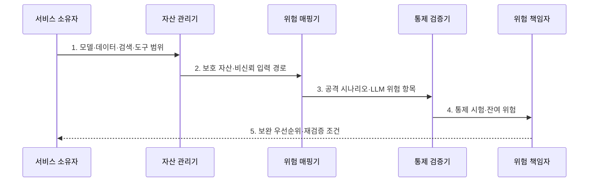

---
sidebar:
  order: 125
  label: "125. OWASP LLM Top 10 (OWASP LLM Top 10)"
  badge:
    text: "기출 · 85%"
    variant: note
title: "OWASP LLM Top 10 (OWASP LLM Top 10)"
date: "2026-07-31T08:46:58+09:00"
tags:
  - "notes-latest_tech"
weight: 125
extra:
  question_no: "125"
  source_status: "기출"
  source_history: "137회, 138회"
  priority: 85
  priority_note: "LLM 위협 분류와 계층별 통제가 연속 출제됨"
---

## 미리 알고가기

- **오픈 월드와이드 애플리케이션 보안 프로젝트(Open Worldwide Application Security Project, OWASP)**: 공개 애플리케이션 보안 지침과 위험 목록을 제공하는 비영리 재단
- **대규모 언어 모델(Large Language Model, LLM)**: 대규모 말뭉치에서 언어 생성·처리 능력을 학습한 모델
- **검색 증강 생성(Retrieval-Augmented Generation, RAG)**: 외부 지식에서 검색한 근거를 생성 문맥에 결합하는 방식
- **OWASP LLM Top 10 2025**: LLM 응용의 주요 위험 열 가지를 2025판 번호·이름으로 분류한 지침
- **LLM01 번호 표기**: LLM 위험군과 두 자리 순번을 붙여 같은 판본의 항목을 식별

## Ⅰ. 개요

- 정의/개념: LLM 응용의 **10대 위험·공격 예·완화책**을 정리한 보안 지침
- 배경/필요성: 기존 웹 목록만으로는 **프롬프트·RAG·도구·자원 위험** 분류 곤란

### 쉽게 이해하기 (학습용)

- 챗봇 모델과 연결된 문서함·검색창·실행 도구의 사고 지점을 같은 번호로 표시하는 지도다.

## Ⅱ. 특징

- **입력·출력·데이터·모델·도구·자원**의 연쇄 위험 분류
- 이전 판과 항목 혼용을 막는 **2025판 번호·항목명**
- 우선순위·통제 공백을 찾는 **위협 모델·실제 공격 검증**

### 쉽게 이해하기 (학습용)

- 한 번의 악성 지시가 정보 노출과 도구 오용을 함께 만들 수 있어 관련 위험 항목을 연결해 본다.

## Ⅲ. 구조 및 구성요소

| 구성요소 | 책임 |
|:---|:---|
| **입력·출력 경계** | **LLM01 인젝션·LLM05 출력 처리** |
| **정보·지시 경계** | **LLM02 정보 노출·LLM07 지시 유출** |
| **공급·학습 경계** | **LLM03 공급망·LLM04 오염** |
| **검색·행동 경계** | **LLM06 대리권·LLM08 벡터 약점** |
| **판단·자원 경계** | **LLM09 허위정보·LLM10 소비** |

### 쉽게 이해하기 (학습용)

- 열 가지 위험을 입력·학습·검색·출력·도구·사용량 경계에 붙이면 담당 통제가 보인다.

## Ⅳ. 흐름도

1. **모델·데이터·검색·도구 범위**: LLM 응용의 평가 경계 확정
2. **보호 자산·비신뢰 입력 경로**: 위험이 전파될 접점 식별
3. **공격 시나리오·LLM 위험 항목**: 2025판 번호·명칭으로 분류
4. **통제 시험·잔여 위험**: 실제 공격으로 예방·탐지·복구 검증
5. **보완 우선순위·재검증 조건**: 통제 공백과 변경 영향을 갱신

### 쉽게 이해하기 (학습용)

- 시스템 경계에 위험 번호와 담당자를 붙이고 통제를 공격으로 검증한 뒤 실패한 경계를 보완한다.

## Ⅴ. 종류 및 비교

| OWASP LLM Top 10 판본 | 2023/24판 | 2025판 |
|:---|:---|:---|
| **적용 기준** | 기존 평가의 **식별자 해석** | 현재 서비스의 **통제 매핑** |
| **핵심 특징** | 초기 **LLM 위험 분류** | 앱·운영 위험의 **재분류** |
| **한계** | 최신 위험·**명칭 누락** | 이전 번호와 **혼용 위험** |

### 쉽게 이해하기 (학습용)

- 구판은 서비스 거부를 중심으로 봤고 2025판은 예상 밖 비용과 프롬프트·검색 벡터 위험까지 넓혔다.

## Ⅵ. 실무 고려사항 및 대책

| 고려사항 | 대책 | 효과 |
|:---|:---|:---|
| 판본의 **번호·명칭 혼용** | **2025판 식별자·항목명** 함께 기록 | 위험 **추적 오류 방지** |
| 단일 위험 중심의 **연쇄 누락** | 데이터 흐름별 **복수 항목 매핑** | 공격 **전파 경로 식별** |
| 목록 점검으로 **통제 검증 대체** | 실제 공격 기반 **통제 시험** 수행 | **형식적 준수 방지** |

### 쉽게 이해하기 (학습용)

- 실제 데이터 흐름과 권한에서 발생 가능한 위험을 분류표에 연결한다

## Ⅶ. 결론

- **서비스 데이터 흐름·위협 모델**에 2025판 항목을 매핑하고 **실제 통제 시험**으로 우선순위 결정

### 쉽게 이해하기 (학습용)

- 최신 위험 번호를 실제 시스템 경계에 붙여 통제 책임자와 재검증 조건을 정해야 한다.
