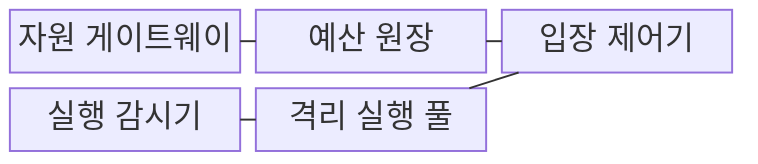
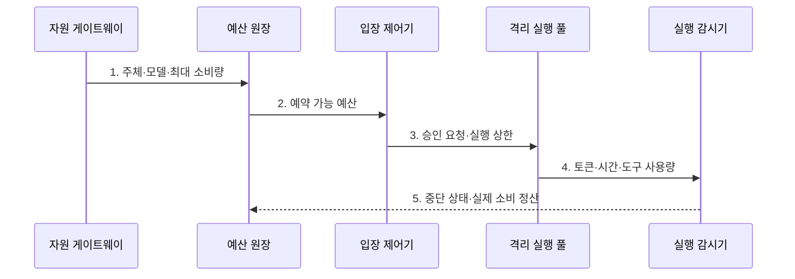

---
sidebar:
  order: 126
  label: "126. LLM10 Unbounded Consumption (LLM10 Unbounded Consumption)"
  badge:
    text: "기출 · 50%"
    variant: note
title: "LLM10 Unbounded Consumption (LLM10 Unbounded Consumption)"
date: "2026-07-31T08:47:25+09:00"
tags:
  - "notes-latest_tech"
weight: 126
extra:
  question_no: "126"
  source_status: "기출"
  source_history: "138회"
  priority: 50
  priority_note: "무제한 소비의 비용·요율 제한 설계가 최근 출제됨"
---

> **키워드:** LLM10 Unbounded Consumption (LLM10 Unbounded Consumption)

## Ⅰ. 개요

핵심 용어

- **LLM10 무제한 소비**: 제한 없는 모델·도구 사용으로 자원·비용·서비스 용량을 소진하는 OWASP LLM Top 10 2025의 열 번째 위험이다.
- **토큰**: 언어 모델이 입력과 출력을 처리하고 사용량을 계량하는 문자열 단위이다.

- 정의/개념: 무제한 모델·도구 사용으로 **자원·비용·용량**을 소진하는 위험
- 배경/필요성: 요청 건수만으로는 **토큰·시간·도구 비용 편차** 포착 불가

### 쉽게 이해하기 (학습용)

- 식당의 손님 수뿐 아니라 주문량과 조리 시간을 함께 제한해야 주방 독점을 막을 수 있다.

## Ⅱ. 특징

핵심 용어

- **경제적 손실**: 과도한 모델·도구 호출이 사용료와 인프라 비용을 비정상적으로 증가시키는 피해이다.
- **복합 자원 계량**: 토큰·시간·동시성·도구 비용을 주체별로 함께 측정하는 통제이다.
- **격리 실행 풀**: 한 주체의 소비가 다른 사용자의 용량을 잠식하지 않도록 큐와 동시성을 분리한 자원 영역이다.

- 무제한 소비에 따른 **서비스 거부·경제적 손실·모델 탈취**
- 주체별 **토큰·시간·동시성·도구 비용 계량**
- 연쇄 소비를 통제하는 **예약·상한·격리·중단·정산**

### 쉽게 이해하기 (학습용)

- 짧은 질문과 긴 문서 분석·도구 반복은 같은 한 건이어도 서버 시간과 비용이 크게 다르다.

## Ⅲ. 구조 및 구성요소

핵심 용어

- **예산 원장**: 사용자별 토큰·시간·도구·비용의 한도와 실제 소비를 기록하는 장부이다.
- **입장 제어기**: 남은 예산과 실행 용량을 확인해 요청의 시작 여부를 결정한다.
- **실행 감시기**: 작업 중 실제 자원 소비를 누적하고 상한을 넘으면 실행을 중단한다.

| 구성요소 | 책임 |
|:---|:---|
| **자원 게이트웨이** | 주체·모델·입출력 한도 식별 |
| **예산 원장** | 토큰·시간·도구·비용 기록 |
| **입장 제어기** | 예산·용량으로 실행 여부 결정 |
| **실행 감시기** | 사용량 계량과 초과 중단 |
| **격리 실행 풀** | 주체별 큐·동시성·용량 분리 |

### 쉽게 이해하기 (학습용)

- 실행 전에 예산과 자리를 예약하고 실행 중 사용량이 한도를 넘으면 멈춰 다른 사용자의 자원을 보호한다.

## Ⅳ. 흐름도

핵심 용어

- **예산 예약**: 실행 전에 예상 최대 소비량을 원장에서 확보해 과도한 요청의 입장을 차단하는 처리이다.
- **소비 정산**: 실행 후 실제 사용량을 반영하고 사용하지 않은 예약 예산을 반환하는 처리이다.

1. **주체·모델·최대 소비량**: 사용자별 비용 상한 산정
2. **예약 가능 예산**: 원장의 잔여 할당량으로 입장 가능성 확인
3. **승인 요청·실행 상한**: 예약 성공 요청만 격리 큐에 배치
4. **토큰·시간·도구 사용량**: 실행 중 복합 자원 소비 누적
5. **중단 상태·실제 소비 정산**: 초과 작업 취소와 잔여 예산 반환

### 쉽게 이해하기 (학습용)

- 최대 소비량을 먼저 예약하고 실제 사용량을 재며 초과 시 중단한 뒤 남은 예산을 반환한다.

## Ⅴ. 종류 및 비교

핵심 용어

- **요청 건수 한도**: 사용자별 호출 횟수를 제한해 폭주를 통제하는 방식이다.
- **토큰·시간 예산**: 입출력 크기와 실행 시간을 제한해 요청별 비용 편차를 통제하는 방식이다.
- **도구·단계 예산**: 에이전트의 반복 단계와 외부 서비스 호출 비용을 제한하는 방식이다.

| 무제한 소비 통제 단위 | 요청 건수 한도 | 토큰·시간 예산 | 도구 호출·단계 예산 |
|:---|:---|:---|:---|
| **적용 기준** | 호출 **폭주 통제** | 추론 **비용 편차 통제** | 에이전트 **반복 통제** |
| **핵심 특징** | 사용자별 **요청 횟수** | 입출력 토큰·**실행 시간** | 반복·**외부 서비스 비용** |
| **한계** | 고비용 **단일 요청 누락** | 외부 **도구 소비 누락** | 호출별 **모델 비용 누락** |

### 쉽게 이해하기 (학습용)

- 요청 수와 토큰·시간 및 도구 호출은 서로 다른 비용이므로 하나의 제한만으로 과소비를 잡을 수 없다.

## Ⅵ. 실무 고려사항 및 대책

핵심 용어

- **고비용 단일 요청**: 호출 횟수는 적지만 매우 긴 입출력이나 실행 시간을 소비해 건수 한도를 우회하는 문제이다.
- **연쇄 소비**: 모델 계획이 도구·에이전트 호출을 반복해 외부 비용까지 계속 확산하는 문제이다.
- **실행 풀 독점**: 한 주체가 공유 큐와 동시성 슬롯을 점유해 정상 사용자의 용량을 줄이는 문제이다.

| 문제 | 대책 | 효과 |
|:---|:---|:---|
| **고비용 단일 요청** | **토큰·시간 예산** 사전 예약 | 요청 한도의 **우회 방지** |
| 도구·에이전트의 **연쇄 소비** | **단계·도구 비용 상한** 적용 | 외부 **비용 확산 차단** |
| 한 주체의 **실행 풀 독점** | 테넌트별 **큐·동시성 격리** | 정상 사용자 **용량 보존** |

### 쉽게 이해하기 (학습용)

- 요청이 과도한 토큰과 실행시간을 쓰면 중단하고 고객 단위로 계량한다

## Ⅶ. 결론

핵심 용어

- **도구 상한**: 요청 하나나 사용자별로 허용하는 외부 도구 호출 횟수·비용의 한도이다.
- **동시성 상한**: 한 주체가 동시에 실행할 수 있는 모델·도구 작업 수의 제한이다.

- 주체별 **토큰·시간 예산**과 **도구·동시성 상한**을 두고 초과 작업 중단

### 쉽게 이해하기 (학습용)

- 요청 수뿐 아니라 토큰·시간·도구 호출을 제한하고 실행 풀도 나눠야 한 사용자의 독점을 막을 수 있다.
