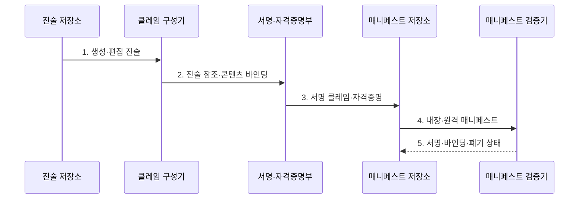

---
sidebar:
  order: 127
  label: "127. C2PA 콘텐츠 출처 표준 (Coalition for Content Provenance and Authenticity)"
  badge:
    text: "미출 · 50%"
    variant: note
title: "C2PA 콘텐츠 출처 표준 (Coalition for Content Provenance and Authenticity)"
date: "2026-07-31T08:47:57+09:00"
tags:
  - "notes-latest_tech"
weight: 127
extra:
  question_no: "127"
  source_status: "미출"
  source_history: ""
  priority: 50
  priority_note: "C2PA 서명 출처·검증 한계의 독립 가치가 높음"
---

## 미리 알고가기

- **C2PA**: 콘텐츠 출처와 편집 이력을 서명된 매니페스트로 교환·검증하는 개방형 표준
- **매니페스트(Manifest)**: 출처 진술·클레임·서명과 콘텐츠 연결 정보를 담는 구조
- **바인딩(Binding)**: 매니페스트를 콘텐츠와 연결해 변경이나 분리를 확인하는 방식
- **C2PA 2.4**: crJSON과 자산 형식·진술·검증 기능을 확대한 2026년 4월 현행 규격

> **키워드:** C2PA 콘텐츠 출처 표준 (Coalition for Content Provenance and Authenticity)

## Ⅰ. 개요

- 정의/개념: 출처 진술을 **서명 매니페스트**로 교환·검증하는 표준
- 배경/필요성: 일반 메타데이터의 **편집 이력·변조 검증** 한계

### 쉽게 이해하기 (학습용)

- 카메라·편집기·플랫폼이 같은 형식의 봉인된 작업 장부를 이어 쓰게 한 공통 규칙이다.

## Ⅱ. 특징

- **상호운용 출처성**: 공통 형식으로 도구 간 출처 이력 단절을 줄이고 발행 경로를 검증
- **이중 바인딩성**: 하드 바인딩으로 변경을 탐지하고 소프트 바인딩으로 제거된 매니페스트의 재발견 지원
- **진위 한계성**: 유효 서명은 발행 경로만 보장하므로 워터마크·합성 탐지로 출처 이력 공백 보완

### 쉽게 이해하기 (학습용)

- 장부의 봉인과 발행자는 확인할 수 있지만 기록한 내용이 사실인지는 별도로 검증해야 한다.

## Ⅲ. 구조 및 구성요소

| 구성요소 | 책임 |
|:---|:---|
| **진술 저장소** | 생성·편집 이력 진술 보관 |
| **클레임 구성기** | 진술 참조·콘텐츠 바인딩 결합 |
| **서명·자격증명부** | 클레임 무결성·신뢰 경로 입증 |
| **매니페스트 저장소** | 매니페스트·참조 관계 보관 |
| **매니페스트 검증기** | 구조·서명·폐기 상태 판정 |

### 쉽게 이해하기 (학습용)

- 작업 기록과 원본 지문을 함께 봉인하고 검증기가 봉인·발행 경로·유효 기간을 확인한다.

## Ⅳ. 흐름도

1. **생성·편집 진술**: 출처 이력과 구성 자산 기록
2. **진술 참조·콘텐츠 바인딩**: 클레임과 자산 변경 상태 연결
3. **서명 클레임·자격증명**: 발행 주체와 무결성 증명
4. **내장·원격 매니페스트**: 자산 배포와 이력 탐색 경로 제공
5. **서명·바인딩·폐기 상태**: 유효성과 내용 사실성을 분리 판정

### 쉽게 이해하기 (학습용)

- 작업 내역과 원본 지문을 봉인해 배포하고 수신자는 매니페스트의 봉인·지문·발행 경로를 확인한다.

## Ⅴ. 종류 및 비교

| 판단 기준 | C2PA | 일반 메타데이터 | 파일 해시 공증 |
|:---|:---|:---|:---|
| **기록 대상** | 출처·편집 진술과 **구성 자산** | 장비·시간 등 **속성값** | 파일 해시와 **등록 시점** |
| **검증 근거** | 바인딩·서명·**신뢰 경로** | 서명 없이는 **수정 가능** | 외부 기록과 **해시 일치** |
| **적용 기준** | 도구 간 **출처 이력 연결** | 비보안 **속성 교환** | 파일의 **존재 시점** 증명 |

### 쉽게 이해하기 (학습용)

- C2PA는 편집 이력을 잇고 일반 메타데이터는 속성을 붙이며 해시 공증은 파일의 존재 시점을 남긴다.

## Ⅵ. 실무 고려사항 및 대책

| 고려사항 | 대책 | 효과 |
|:---|:---|:---|
| **매니페스트 제거** | **소프트 바인딩·외부 저장소** 병행 | 출처 이력의 **재발견** |
| 서명 키·자격증명의 **폐기** | 신뢰 목록과 **폐기 상태** 검증 | 무효 **발행자 차단** |
| 유효 서명의 **사실성 오인** | 서명 상태와 **내용 검증** 분리 표시 | 출처·진실성의 **혼동 방지** |
| 버전별 **형식·자산 지원 차이** | **C2PA 2.4** 프로파일·상호운용 시험 | 버전 간 **검증 실패 방지** |

### 쉽게 이해하기 (학습용)

- 뉴스 사진은 촬영부터 편집까지 매니페스트를 이어 기사 뷰어에 검증 상태를 표시하고, 파일에서 빠진 매니페스트는 외부 보관소에서 복구한다.

## Ⅶ. 결론

- 출처 이력은 **C2PA 2.4**로 연결하고 서명 검증과 **내용 사실성**은 분리 판정

### 쉽게 이해하기 (학습용)

- C2PA는 누가 기록을 봉인했는지 보여 주므로 서명 키·발행자와 매니페스트 복구 경로를 관리해야 한다.
