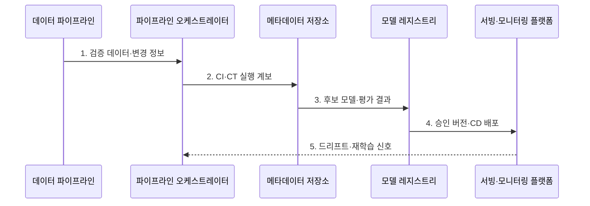

---
sidebar:
  order: 128
  label: "128. MLOps (Machine Learning Operations)"
  badge:
    text: "기출 · 85%"
    variant: note
title: "MLOps (Machine Learning Operations)"
date: "2026-07-31T12:02:14+09:00"
tags:
  - "notes-latest-tech"
weight: 128
extra:
  question_no: "128"
  source_status: "기출"
  source_history: "135회, 137회"
  priority: 85
  priority_note: "MLOps 수명주기·배포 통제가 반복 출제됨"
---

## Ⅰ. 개요

핵심 용어

- **MLOps**: 데이터·코드·모델의 학습·배포·운영을 재현 가능한 자동화 수명주기로 연결하는 체계이다.
- **모델 계보**: 모델을 만든 코드·데이터·특징·실행 환경과 평가·배포 이력을 추적하는 기록이다.

- 정의/개념: **MLOps**는 ML의 데이터·코드·학습·모델·배포·관측을 재현 가능한 자동화 수명주기로 연결하는 운영 체계
- 배경/필요성: DevOps의 **데이터·모델 계보·재학습** 관리 한계

### 쉽게 이해하기 (학습용)

- 코드·데이터·모델을 같은 이력과 자동화 공정으로 연결해 검증된 모델만 운영한다.

## Ⅱ. 특징

핵심 용어

- **CI**: 코드·데이터·파이프라인 변경을 자동으로 통합하고 검증하는 과정이다.
- **CT**: 데이터와 성능 변화에 따라 후보 모델을 자동으로 재학습하는 과정이다.
- **CD**: 검증·승인된 모델을 단계적으로 배포 가능한 상태로 전달하는 과정이다.

- 학습 결과를 재현·복구하는 **코드·데이터·모델 계보**
- 검증된 모델만 배포하는 **CI·CT·CD·승격 게이트**
- 재학습·롤백을 정하는 **드리프트·서비스 성능 관측**

### 쉽게 이해하기 (학습용)

- 코드·데이터·모델 버전을 한 계보에 묶고 검사·배포·재학습을 자동으로 이어가는 방식이다.

## Ⅲ. 구조 및 구성요소

핵심 용어

- **파이프라인 오케스트레이터**: 학습 작업의 순서·의존 관계·재시도와 실행 상태를 관리한다.
- **메타데이터 저장소**: 코드·데이터·특징·실행 환경과 결과의 계보를 기록한다.
- **모델 레지스트리**: 모델 버전·평가 결과·승인과 승격 상태를 보관한다.

| 구성요소 | 책임 |
|:---|:---|
| **데이터 파이프라인** | 검증·변환된 피처 공급 |
| **파이프라인 오케스트레이터** | 작업·의존 관계 관리 |
| **메타데이터 저장소** | 코드·데이터·실행 계보 기록 |
| **모델 레지스트리** | 모델 버전·평가·승격 상태 보관 |
| **서빙·모니터링 플랫폼** | 서빙·데이터·품질 변화 추적 |

### 쉽게 이해하기 (학습용)

- 데이터 파이프라인·오케스트레이터·계보·레지스트리·모니터링을 연결해 모델 생성 과정을 추적한다.

## Ⅳ. 흐름도

핵심 용어

- **승격 게이트**: 평가 기준을 통과한 후보 모델만 다음 배포 단계로 이동시키는 승인 경계이다.
- **드리프트 신호**: 운영 데이터나 개념·성능 분포가 기준에서 달라졌음을 나타내는 지표이다.

1. **검증 데이터·변경 정보**: 코드·스키마·특징 변경 입력
2. **CI·CT 실행 계보**: 파이프라인 검증과 후보 학습 재현
3. **후보 모델·평가 결과**: 모델 버전과 승격 근거 연결
4. **승인 버전·CD 배포**: 검증 통과 모델만 단계 배포
5. **드리프트·재학습 신호**: 운영 품질 변화로 CT 재실행 판정

### 쉽게 이해하기 (학습용)

- 새 코드·데이터를 검사해 후보를 만들고 검증된 모델만 배포하며 운영 품질이 떨어지면 다시 학습한다.

## Ⅴ. 종류 및 비교

핵심 용어

- **DevOps**: 애플리케이션 코드와 인프라의 빌드·시험·배포를 자동화하는 운영체계이다.
- **LLMOps**: 프롬프트·검색·모델·도구의 생성 응답을 품질·안전·비용 기준으로 운영하는 체계이다.

| AI 운영 수명주기 | MLOps | DevOps | LLMOps |
|:---|:---|:---|:---|
| **적용 기준** | 예측 ML·**드리프트 관리** | 앱 **빌드·배포 자동화** | LLM **품질·안전·비용** 관리 |
| **핵심 특징** | 데이터·모델 **재학습** | 코드·인프라 **배포** | 프롬프트·검색·**응답 평가** |
| **한계** | 계보·**드리프트 누락** | 모델·데이터 **변화 미관리** | 생성 평가의 **변동성·비용** |

### 쉽게 이해하기 (학습용)

- DevOps는 코드 배포, MLOps는 데이터 기반 재학습, LLMOps는 프롬프트·검색·생성 평가까지 관리한다.

## Ⅵ. 실무 고려사항 및 대책

핵심 용어

- **재현 불가**: 코드·데이터·특징·환경 버전이 연결되지 않아 같은 모델을 다시 만들지 못하는 문제이다.
- **미검증 모델 승격**: 평가와 승인 상태를 거치지 않은 후보가 운영 환경에 배포되는 문제이다.
- **불필요한 자동 재학습**: 실제 드리프트 원인과 품질 영향을 확인하지 않고 CT를 실행해 회귀를 만드는 문제이다.

| 문제 | 대책 | 효과 |
|:---|:---|:---|
| 학습 결과의 **재현 불가** | 코드·데이터·특징·실행의 **계보 연결** | 모델 **재생성·복구** |
| **미검증 모델 승격** | 평가 게이트·**레지스트리 상태** 적용 | **배포 품질 보존** |
| 드리프트 확인 없는 **자동 재학습** | 데이터·개념 드리프트의 **CT 조건** 설정 | 불필요한 **학습·회귀 방지** |

### 쉽게 이해하기 (학습용)

- 데이터와 모델 기준을 통과한 버전만 일부 트래픽에서 기존 모델과 비교한다

## Ⅶ. 결론

핵심 용어

- **드리프트 임계치**: 데이터·개념·성능 변화가 재평가나 재학습을 시작할 수준인지 판정하는 기준이다.
- **단계 배포**: 승인 모델을 일부 트래픽부터 순차 확대하며 기존 모델과 성능을 비교하는 방식이다.

- 예측 모델은 **MLOps**로 계보·승격을 통제하고 **드리프트 임계치** 충족 시만 재학습

### 쉽게 이해하기 (학습용)

- 모델 생성 계보를 기록하고 검증된 모델만 배포하며 품질이 떨어질 때 재학습하는 체계가 핵심이다.
