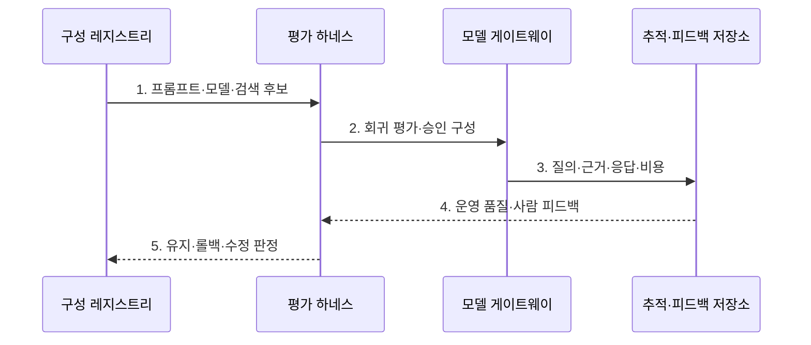

---
sidebar:
  order: 129
  label: "129. LLMOps (Large Language Model Operations)"
  badge:
    text: "기출 · 70%"
    variant: note
title: "LLMOps (Large Language Model Operations)"
date: "2026-07-31T08:49:21+09:00"
tags:
  - "notes-latest-tech"
weight: 129
extra:
  question_no: "129"
  source_status: "기출"
  source_history: "138회"
  priority: 70
  priority_note: "LLMOps 평가·운영 통제가 138회 출제됨"
---

## 미리 알고가기

- **대규모 언어 모델 운영(Large Language Model Operations, LLMOps)**: 프롬프트·검색·모델·평가·배포를 통합 관리하는 운영체계
- **머신러닝 운영(Machine Learning Operations, MLOps)**: 데이터 기반 모델의 학습·배포·재학습을 자동화하는 운영체계
- **검색 증강 생성(Retrieval-Augmented Generation, RAG)**: 외부 지식에서 검색한 근거를 모델 입력에 결합하는 생성 방식
- **평가 하네스(Evaluation Harness)**: 평가 자료·기준·실행·결과를 반복 관리하는 시험 장치

## Ⅰ. 개요

- 정의/개념: 프롬프트·RAG·모델·도구·평가·배포를 **버전과 실행 추적으로 연결하는 운영체계**
- 배경/필요성: MLOps의 **프롬프트·검색·생성 평가** 관리 한계

### 쉽게 이해하기 (학습용)

- 질문·참고 문서·모델·채점표를 한 묶음으로 검증해 승인된 조합만 배포한다.

## Ⅱ. 특징

- 실행 구성을 재현하는 **프롬프트·모델·검색·도구 버전 결합**
- 실패 원인을 나누는 **질의·근거·응답·비용 추적**
- 품질·안전·지연·비용을 검증하는 **자동·사람 평가·단계 배포**

### 쉽게 이해하기 (학습용)

- 답이 나빠지면 질문·검색 자료·모델의 실행 기록으로 원인을 찾고 사람 평가로 자동 채점의 오판을 바로잡는다.

## Ⅲ. 구조 및 구성요소

| 구성요소 | 책임 |
|:---|:---|
| **구성 레지스트리** | 프롬프트·모델·검색 결합본 보관 |
| **RAG 파이프라인** | 문서 인덱싱·검색 근거 결합 |
| **평가 하네스** | 데이터·기준·자동·사람 평가 |
| **모델 게이트웨이** | 라우팅·자격·토큰 정책 집행 |
| **추적·피드백 저장소** | 질의·응답·근거·의견 연결 |

### 쉽게 이해하기 (학습용)

- 구성 레지스트리·검색·모델·평가·피드백을 연결해 조합별 답과 비용을 확인한다.

## Ⅳ. 흐름도

1. **프롬프트·모델·검색 후보**: 실행 구성 전체를 버전 결합
2. **회귀 평가·승인 구성**: 품질·안전·지연·비용 기준 검증
3. **질의·근거·응답·비용**: 운영 실패 원인의 실행 추적
4. **운영 품질·사람 피드백**: 자동 평가의 변동·오판 보완
5. **유지·롤백·수정 판정**: 승인선에 따른 구성 상태 갱신

### 쉽게 이해하기 (학습용)

- 새 프롬프트·검색 구성을 먼저 검증하고 전문가 승인 뒤 단계 배포하며 사용자 의견을 다음 평가에 반영한다.

## Ⅴ. 종류 및 비교

| AI 모델 운영체계 | LLMOps | MLOps |
|:---|:---|:---|
| **적용 기준** | LLM **품질·안전·비용** 통제 | 예측 모델 **학습·배포 자동화** |
| **핵심 특징** | 프롬프트·근거·**응답 평가** | 데이터·모델 **재학습** |
| **한계** | 평가 변동성·**근거·비용 누락** | 계보·**드리프트 누락** |

### 쉽게 이해하기 (학습용)

- MLOps는 데이터로 예측 모델을 재학습하고 LLMOps는 프롬프트·검색·모델 조합의 응답을 평가한다.

## Ⅵ. 실무 고려사항 및 대책

| 고려사항 | 대책 | 효과 |
|:---|:---|:---|
| 구성 일부만 **버전 관리** | 프롬프트·모델·RAG·도구 **결합 버전** 등록 | 응답 구성의 **재현** |
| **자동 평가 변동성** | 고위험 표본의 **사람 평가** 병행 | 품질 승격의 **오판 감소** |
| 근거·비용의 **회귀 누락** | 질의·근거·도구·토큰 **실행 추적** | **실패 원인 분리** |

### 쉽게 이해하기 (학습용)

- 모델·프롬프트·검색 구성을 묶어 근거성·안전성·비용을 회귀 시험한다

## Ⅶ. 결론

- 생성형 응답은 **LLMOps**로 구성·실행을 추적하고 **다축 평가** 통과 조합만 승격

### 쉽게 이해하기 (학습용)

- 자동 채점과 대화 기록 및 사람 의견을 함께 보고 품질·안전·비용을 통과한 구성만 운영해야 한다.
