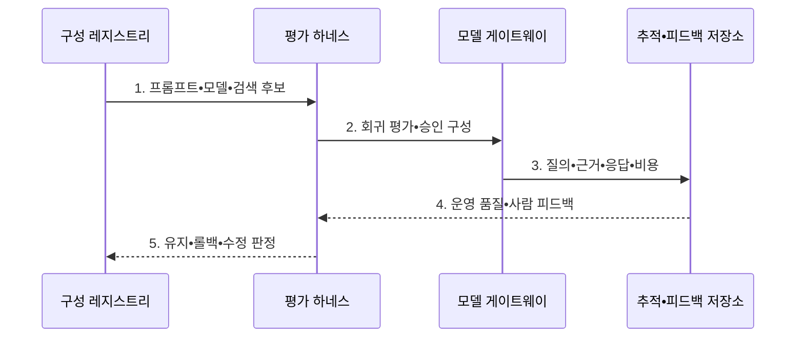

---
sidebar:
  order: 129
  label: "129. LLMOps (Large Language Model Operations)"
  badge:
    text: "기출 • 70%"
    variant: note
title: "LLMOps (Large Language Model Operations)"
date: "2026-08-05T02:56:00+09:00"
tags:
  - "notes-latest-tech"
weight: 129
extra:
  question_no: "129"
  source_status: "기출"
  source_history: "138회"
  priority: 70
  priority_note: "LLMOps 평가•운영 통제가 138회 출제됨"
---

## Ⅰ. 개요

핵심 용어

- **거대 언어 모델 운영(Large Language Model Operations, LLMOps)**: 프롬프트•검색 증강 생성•모델•도구•평가•배포를 버전과 실행 추적으로 연결하는 운영체계이다.
- **실행 구성**: 한 응답을 만드는 프롬프트•모델•검색 색인•도구와 매개변수의 결합이다.
- **검색 증강 생성(Retrieval-Augmented Generation, RAG)**: 외부 자료를 검색해 생성 응답의 근거 문맥으로 제공하는 방식이다.
- **인공지능(Artificial Intelligence, AI)**: 입력을 바탕으로 예측•생성•의사결정을 수행하는 시스템이다.

- 정의/개념: 프롬프트•RAG•모델•도구•평가•배포를 연결하는 **LLMOps 체계**
- 배경/필요성: MLOps의 **프롬프트•검색•생성 평가 관리 한계**

#### 한줄 요약

- 질문•참고 문서•모델•채점표를 한 묶음으로 검증해 승인된 조합만 배포한다.

## Ⅱ. 특징

핵심 용어

- **구성 버전**: 프롬프트•모델•검색•도구 조합을 하나의 재현 가능한 단위로 식별한 버전이다.
- **실행 추적**: 질의•검색 근거•응답•도구 호출•토큰•비용을 한 요청 단위로 연결한 기록이다.
- **다축 평가**: 생성 응답을 품질•안전•충실성•지연•비용 등 여러 기준으로 함께 검증하는 방식이다.

- 실행 구성을 재현하는 **프롬프트•모델•검색•도구 버전 결합**
- 실패 원인을 나누는 **질의•근거•응답•비용 추적**
- 품질•안전•지연•비용을 검증하는 **자동•사람 평가•단계 배포**

#### 한줄 요약

- 답이 나빠지면 질문•검색 자료•모델의 실행 기록으로 원인을 찾고 사람 평가로 자동 채점의 오판을 바로잡는다.

## Ⅲ. 구조 및 구성요소

핵심 용어

- **구성 레지스트리**: 승인할 프롬프트•모델•검색•도구 조합과 상태를 보관한다.
- **평가 하네스**: 평가 자료•기준•실행과 자동•사람 결과를 반복 관리하는 시험 장치이다.
- **모델 게이트웨이**: 모델 라우팅•자격증명•토큰 정책과 제공자별 호출을 통제한다.

RAG 파이프라인의 실행 추적 연결 요소: **구성 레지스트리•평가 하네스•모델 게이트웨이**

| 구성요소 | 책임 |
|:---|:---|
| **구성 레지스트리** | 프롬프트•모델•검색 결합본 보관 |
| **RAG 파이프라인** | 문서 인덱싱•검색 근거 결합 |
| **평가 하네스** | 데이터•기준•자동•사람 평가 |
| **모델 게이트웨이** | 라우팅•자격•토큰 정책 집행 |
| **추적•피드백 저장소** | 질의•응답•근거•의견 연결 |

#### 한줄 요약

- 구성 레지스트리•검색•모델•평가•피드백을 연결해 조합별 답과 비용을 확인한다.

## Ⅳ. 흐름도

핵심 용어

- **회귀 평가**: 구성 변경 후 기존 품질•안전•근거•비용 기준이 유지되는지 반복 시험하는 과정이다.
- **롤백 판정**: 운영 품질이 승인선 아래로 내려갔을 때 이전 구성으로 되돌릴지 결정하는 과정이다.

1. **프롬프트•모델•검색 후보**: 실행 구성 전체를 버전 결합
2. **회귀 평가•승인 구성**: 품질•안전•지연•비용 기준 검증
3. **질의•근거•응답•비용**: 운영 실패 원인의 실행 추적
4. **운영 품질•사람 피드백**: 자동 평가의 변동•오판 보완
5. **유지•롤백•수정 판정**: 승인선에 따른 구성 상태 갱신

#### 한줄 요약

- 새 프롬프트•검색 구성을 먼저 검증하고 전문가 승인 뒤 단계 배포하며 사용자 의견을 다음 평가에 반영한다.

## Ⅴ. 종류 및 비교

핵심 용어

- **기계학습 운영(Machine Learning Operations, MLOps)**: 데이터 기반 예측 모델의 학습•평가•배포•재학습을 자동화하는 운영체계이다.
- **생성 평가**: 정답 일치만이 아니라 근거성•안전성•유용성과 표현 변동을 평가하는 활동이다.

AI 운영에서 LLMOps는 생성 응답 구성을, MLOps는 예측 모델의 학습•배포를 관리한다.

| AI 모델 운영체계 | LLMOps | MLOps |
|:---|:---|:---|
| **적용 기준** | LLM **품질•안전•비용** 통제 | 예측 모델 **학습•배포 자동화** |
| **핵심 특징** | 프롬프트•근거•**응답 평가** | 데이터•모델 **재학습** |
| **한계** | 평가 변동성•**근거•비용 누락** | 계보•**드리프트 누락** |

#### 한줄 요약

- MLOps는 데이터로 예측 모델을 재학습하고 LLMOps는 프롬프트•검색•모델 조합의 응답을 평가한다.

## Ⅵ. 실무 고려사항 및 대책

핵심 용어

- **부분 버전 관리**: 모델만 기록하고 프롬프트•RAG•도구 조합을 남기지 않아 응답을 재현하지 못하는 문제이다.
- **자동 평가 변동성**: 평가 모델•프롬프트•샘플링에 따라 같은 응답의 채점이 달라지는 문제이다.
- **회귀 누락**: 구성 변경 평가에서 검색 근거•도구 호출•토큰•비용 변화를 확인하지 않는 문제이다.

| 문제 | 대책 | 효과 |
|:---|:---|:---|
| 구성 일부만 **버전 관리** | 프롬프트•모델•RAG•도구 **결합 버전 등록** | 응답 구성의 **재현** |
| **자동 평가 변동성** | 고위험 표본의 **사람 평가** 병행 | 품질 승격의 **오판 감소** |
| 근거•비용의 **회귀 누락** | 질의•근거•도구•토큰 **실행 추적** | **실패 원인 분리** |

#### 한줄 요약

- 모델•프롬프트•검색 구성을 묶어 근거성•안전성•비용을 회귀 시험한다

## Ⅶ. 결론

핵심 용어

- **구성 승격**: 다축 평가와 승인 기준을 통과한 실행 조합을 운영 상태로 전환하는 과정이다.
- **사람 평가**: 전문가나 실제 사용자가 자동 채점의 한계를 보완해 응답 품질•위험을 판정하는 평가이다.

- 생성형 응답 운영: **LLMOps의 구성•실행 추적**, 승격 조건: **다축 평가 통과**

#### 한줄 요약

- 자동 채점과 대화 기록 및 사람 의견을 함께 보고 품질•안전•비용을 통과한 구성만 운영해야 한다.
