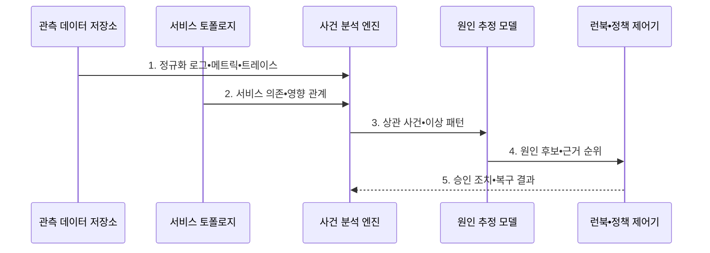

---
sidebar:
  order: 130
  label: "130. AIOps (Artificial Intelligence for IT Operations)"
  badge:
    text: "기출 • 50%"
    variant: note
title: "AIOps (Artificial Intelligence for IT Operations)"
date: "2026-08-05T03:02:00+09:00"
tags:
  - "notes-latest-tech"
weight: 130
extra:
  question_no: "130"
  source_status: "기출"
  source_history: "137회"
  priority: 50
  priority_note: "AIOps 탐지•원인 분석•자동화 설계가 유력함"
---

## Ⅰ. 개요

핵심 용어

- **인공지능 기반 정보기술 운영(Artificial Intelligence for Information Technology Operations, AIOps)**: 로그•메트릭•트레이스 같은 운영 신호를 인공지능으로 분석해 사건•원인•조치 판단을 지원하는 정보기술 운영 체계이다.
- **인공지능(Artificial Intelligence, AI)**: 입력을 바탕으로 예측•생성•의사결정을 수행하는 시스템이다.
- **경보 상관관계**: 여러 경보가 같은 장애 원인과 서비스 영향으로 연결되는 관계이다.

- 정의/개념: **AIOps**는 로그•지표•추적•이벤트를 AI로 상관 분석해 사건•원인•조치 후보를 도출하는 운영 체계
- 배경/필요성: 개별 경보만으로는 **경보 폭주•장애 상관관계 누락**

#### 한줄 요약

- 흩어진 사고 경보를 하나의 사건으로 묶고 의심 원인과 허용된 대응을 알려 주는 운영 보조원이다.

## Ⅱ. 특징

핵심 용어

- **경보 상관분석**: 시간•서비스 의존 관계를 이용해 중복 신호를 하나의 사건으로 묶는 처리이다.
- **동적 정상 기준**: 시간•계절•서비스 상태 변화에 맞춰 정상 범위를 갱신하는 이상 탐지 기준이다.
- **런북**: 장애 유형별 진단•복구 절차와 실행 조건을 정한 운영 지침이다.

규칙 기반 운영과 **AIOps**는 정상 기준과 경보 상관분석 방식이 다르다.

- 다중 신호•토폴로지 기반 **경보 상관분석**
- 동적 정상 기준 기반 **이상 탐지**
- 원인 후보•런북•승인 기반 **대응 우선순위**

#### 한줄 요약

- 평소와 다른 신호를 찾아 관련 경보를 한 사건으로 묶고 원인 후보와 허용된 복구 수단을 함께 제시한다.

## Ⅲ. 구조 및 구성요소

핵심 용어

- **서비스 토폴로지**: 서비스 구성요소와 호출•의존 관계를 나타낸 연결 지도이다.
- **사건 분석 엔진**: 경보를 군집하고 이상 패턴을 탐지해 운영 사건을 구성한다.
- **원인 추정 모델**: 토폴로지와 관측 증거를 바탕으로 장애 원인 후보를 순위화한다.

| 구성요소 | 책임 |
|:---|:---|
| **관측 데이터 저장소** | 로그•메트릭•트레이스•이력 |
| **서비스 토폴로지** | 의존 관계•사건 영향 범위 |
| **사건 분석 엔진** | 경보 군집•이상 패턴 탐지 |
| **원인 추정 모델** | 원인 후보•근거 순위화 |
| **런북•정책 제어기** | 조치•위험•승인•이력 관리 |

#### 한줄 요약

- 관측 수집•토폴로지•사건 분석•원인 추정•정책 제어가 역할을 나눠 장애 대응을 지원한다.

## Ⅳ. 흐름도

핵심 용어

- **영향 범위**: 장애가 의존 관계를 따라 영향을 미치는 서비스와 사용자 영역이다.
- **원인 후보 신뢰도**: 각 원인 가설이 관측 증거와 일치하는 정도를 나타낸 점수이다.

1. **정규화 로그•메트릭•트레이스**: 시간•서비스 식별자로 신호 정렬
2. **서비스 의존•영향 관계**: 토폴로지 기반 장애 전파 범위 제공
3. **상관 사건•이상 패턴**: 중복 경보를 하나의 사건으로 군집
4. **원인 후보•근거 순위**: 후보별 증거와 영향도를 함께 제시
5. **승인 조치•복구 결과**: 위험별 런북 실행과 결과 피드백

#### 한줄 요약

- 경보를 사건으로 묶고 원인 후보를 좁힌 뒤 저위험 조치는 자동화하고 큰 조치는 운영자 승인을 받는다.

## Ⅴ. 종류 및 비교

핵심 용어

- **규칙 기반 운영**: 고정 임계값과 사전 정의 조건으로 개별 경보를 발생시키는 방식이다.
- **경보 군집**: 관련된 여러 경보를 하나의 사건으로 묶어 중복을 줄이는 처리이다.

| 구분 | 규칙 기반 운영 | AIOps |
|:---|:---|:---|
| 적용 기준 | 단순•안정 **운영 환경** | 분산•고변경 **운영 환경** |
| 핵심 특징 | **고정 임계값**•개별 경보 | **동적 기준**•경보 군집 |
| 한계 | **경보 폭주**•상관 누락 | **오탐**•원인 후보 과신 |

#### 한줄 요약

- 규칙 기반은 경보별 고정 기준을 보고 AIOps는 여러 신호의 시간•서비스 관계를 하나의 사건으로 해석한다.

## Ⅵ. 실무 고려사항 및 대책

핵심 용어

- **경보 폭주**: 하나의 장애가 다수 구성요소에서 중복 경보를 발생시켜 운영 판단을 방해하는 문제이다.
- **원인 후보 과신**: 상관관계 기반 추정 결과를 확정 원인으로 오인해 잘못된 조치를 실행하는 문제이다.
- **고위험 자동 실행**: 영향과 가역성이 검증되지 않은 복구 런북을 사람 승인 없이 수행하는 문제이다.

| 문제 | 대책 | 효과 |
|:---|:---|:---|
| 동일 장애의 **경보 폭주** | 토폴로지•시간 기반 **사건 군집** | **중복 경보 감소** |
| **원인 후보 과신** | 근거•영향 범위와 **후보 신뢰도** 제시 | **오진 조치 감소** |
| 고위험 **런북 자동 실행** | 가역성•영향도 기반 **사람 승인** 적용 | **자동 복구 피해 방지** |

#### 한줄 요약

- 같은 장애의 여러 경보를 연결해 영향 서비스와 공통 원인을 좁힌다

## Ⅶ. 결론

핵심 용어

- **조치 가역성**: 복구 조치가 실패했을 때 원래 상태로 안전하게 되돌릴 수 있는 정도이다.
- **사람 승인**: 고위험 런북 실행 전에 운영자가 근거•영향 범위•복구 가능성을 확인하는 통제이다.

- **원인 신뢰도** 나 **조치 가역성** 이 낮으면 사람 승인, 모두 높으면 저위험 런북 자동 실행

#### 한줄 요약

- 인공지능이 원인 후보를 빨리 좁혀도 확정으로 믿지 말고 위험한 복구 조치는 사람이 최종 결정해야 함
