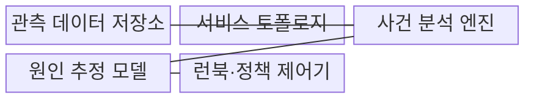
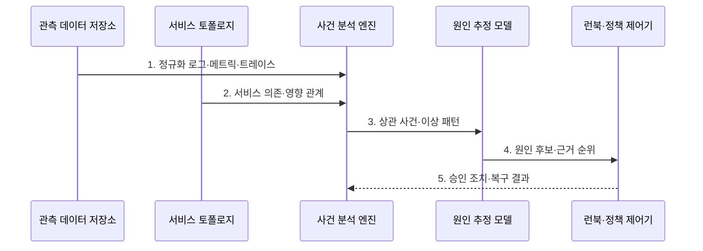

---
sidebar:
  order: 130
  label: "130. AIOps (Artificial Intelligence for IT Operations)"
  badge:
    text: "기출 · 50%"
    variant: note
title: "AIOps (Artificial Intelligence for IT Operations)"
date: "2026-07-31T12:02:40+09:00"
tags:
  - "notes-latest-tech"
weight: 130
extra:
  question_no: "130"
  source_status: "기출"
  source_history: "137회"
  priority: 50
  priority_note: "AIOps 탐지·원인 분석·자동화 설계가 유력함"
---

## 미리 알고가기

- **인공지능 기반 IT 운영(Artificial Intelligence for IT Operations, AIOps)**: 영문 핵심 글자를 조합한 표기로 “에이아이옵스”로 읽으며, 운영 신호를 분석해 사건·원인·조치를 지원하는 체계
- **서비스 토폴로지(Service Topology)**: 서비스 구성요소와 호출·의존 관계를 나타낸 연결 지도
- **런북(Runbook)**: 장애 유형별 진단·복구 절차와 실행 조건을 정한 운영 지침

## Ⅰ. 개요

- 정의/개념: AI로 운영 신호의 사건·원인·조치를 분석하는 **AIOps**
- 배경/필요성: 개별 경보만으로는 **경보 폭주·장애 상관관계 누락**

### 쉽게 이해하기 (학습용)

- 흩어진 사고 경보를 하나의 사건으로 묶고 의심 원인과 허용된 대응을 알려 주는 운영 보조원이다.

## Ⅱ. 특징

- 다중 신호·토폴로지 기반 **경보 상관분석**
- 동적 정상 기준 기반 **이상 탐지**
- 원인 후보·런북·승인 기반 **대응 우선순위**

### 쉽게 이해하기 (학습용)

- 평소와 다른 신호를 찾아 관련 경보를 한 사건으로 묶고 원인 후보와 허용된 복구 수단을 함께 제시한다.

## Ⅲ. 구조 및 구성요소

| 구성요소 | 책임 |
|:---|:---|
| **관측 데이터 저장소** | 로그·메트릭·트레이스·이력 |
| **서비스 토폴로지** | 의존 관계·사건 영향 범위 |
| **사건 분석 엔진** | 경보 군집·이상 패턴 탐지 |
| **원인 추정 모델** | 원인 후보·근거 순위화 |
| **런북·정책 제어기** | 조치·위험·승인·이력 관리 |

### 쉽게 이해하기 (학습용)

- 관측 수집·토폴로지·사건 분석·원인 추정·정책 제어가 역할을 나눠 장애 대응을 지원한다.

## Ⅳ. 흐름도

1. **정규화 로그·메트릭·트레이스**: 시간·서비스 식별자로 신호 정렬
2. **서비스 의존·영향 관계**: 토폴로지 기반 장애 전파 범위 제공
3. **상관 사건·이상 패턴**: 중복 경보를 하나의 사건으로 군집
4. **원인 후보·근거 순위**: 후보별 증거와 영향도를 함께 제시
5. **승인 조치·복구 결과**: 위험별 런북 실행과 결과 피드백

### 쉽게 이해하기 (학습용)

- 경보를 사건으로 묶고 원인 후보를 좁힌 뒤 저위험 조치는 자동화하고 큰 조치는 운영자 승인을 받는다.

## Ⅴ. 종류 및 비교

| 구분 | 규칙 기반 운영 | AIOps |
|:---|:---|:---|
| 적용 기준 | 단순·안정 **운영 환경** | 분산·고변경 **운영 환경** |
| 핵심 특징 | **고정 임계값**·개별 경보 | **동적 기준**·경보 군집 |
| 한계 | **경보 폭주**·상관 누락 | **오탐**·원인 후보 과신 |

### 쉽게 이해하기 (학습용)

- 규칙 기반은 경보별 고정 기준을 보고 AIOps는 여러 신호의 시간·서비스 관계를 하나의 사건으로 해석한다.

## Ⅵ. 실무 고려사항 및 대책

| 고려사항 | 대책 | 효과 |
|:---|:---|:---|
| 동일 장애의 **경보 폭주** | 토폴로지·시간 기반 **사건 군집** | **중복 경보 감소** |
| **원인 후보 과신** | 근거·영향 범위와 **후보 신뢰도** 제시 | **오진 조치 감소** |
| 고위험 **런북 자동 실행** | 가역성·영향도 기반 **사람 승인** 적용 | **자동 복구 피해 방지** |

### 쉽게 이해하기 (학습용)

- 같은 장애의 여러 경보를 연결해 영향 서비스와 공통 원인을 좁힌다

## Ⅶ. 결론

- **원인 신뢰도**나 **조치 가역성**이 낮으면 사람 승인, 모두 높으면 저위험 런북 자동 실행

### 쉽게 이해하기 (학습용)

- AI가 원인 후보를 빨리 좁혀도 확정으로 믿지 말고 위험한 복구 조치는 사람이 최종 결정해야 한다.
