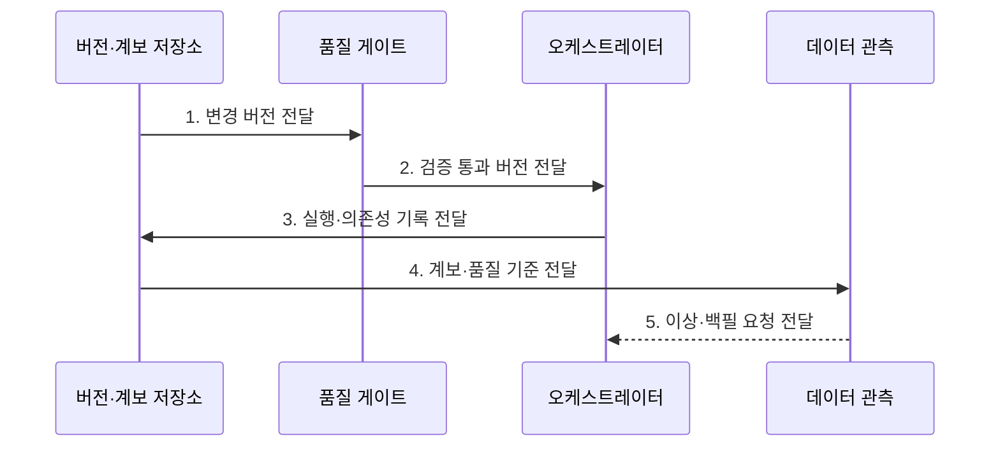

---
sidebar:
  order: 131
  label: "131. 데이터 운영 (DataOps)"
  badge:
    text: "미출 · 50%"
    variant: note
title: "데이터 운영 (DataOps)"
date: "2026-07-31T12:02:56+09:00"
tags:
  - "notes-latest-tech"
weight: 131
extra:
  question_no: "131"
  source_status: "미출"
  source_history: ""
  priority: 50
  priority_note: "DataOps 품질·계보·계약 운영 비교가 유효함"
---

## Ⅰ. 개요

핵심 용어

- **데이터 운영(Data Operations, DataOps)**: 데이터 파이프라인의 변경을 버전화·검증·배포하고 품질과 계보를 관측하는 운영 체계이다.
- **데이터 파이프라인**: 원천 데이터를 수집·변환·검증해 하류 시스템에 제공하는 작업 흐름이다.

- 정의/개념: **데이터 운영(Data Operations, DataOps)** 은 데이터 파이프라인의 개발·검증·배포·품질·계보 관측을 자동화하여 신뢰할 수 있는 데이터 제공을 지속하는 운영 체계
- 배경/필요성: 수동 변경은 **스키마 오류 전파·영향 추적 불가**

#### 한줄 요약

- 데이터 생산 공정을 버전별로 검증·배포하고 불량이 생기면 계보로 원인을 추적한다.

## Ⅱ. 특징

핵심 용어

- **변경 재현성**: 코드·스키마·품질 규칙의 특정 버전을 같은 조건으로 다시 실행할 수 있는 성질이다.
- **품질 게이트**: 데이터 계약과 무결성 검사를 통과한 변경만 운영에 배포하는 승인 경계이다.
- **백필**: 누락되거나 변경된 과거 구간의 데이터를 파이프라인으로 다시 계산하는 처리이다.

- 코드·스키마·품질 규칙의 **변경 재현성**
- 자동 시험·품질 게이트 기반 **불량 데이터 배포 차단**
- 의존성·백필·계보 기반 **누락 복구·영향 추적**

#### 한줄 요약

- 데이터 설계와 검사 기준을 버전으로 관리하고 운영 이상을 계보와 품질 지표로 추적한다.

## Ⅲ. 구조 및 구성요소

핵심 용어

- **데이터 계보**: 원천·변환·산출 데이터의 의존 관계와 변경 영향 경로를 기록한 정보이다.
- **오케스트레이터**: 데이터 작업의 순서·의존성·재시도와 실행 상태를 관리한다.
- **데이터 관측**: 신선도·완전성·분포·스키마 변화를 수집해 데이터 이상을 탐지하는 활동이다.

| 구성요소 | 책임 |
|:---|:---|
| **버전 저장소** | 코드, 스키마, 규칙 변경 이력 보관 |
| **품질 게이트** | 무결성 검증으로 배포 판정 |
| **오케스트레이터** | 의존성 및 재시도 작업 관리 |
| **메타데이터 계보** | 데이터 연결 및 소유권 기록 |
| **데이터 관측** | 신선도 및 분포 변화 수집 |

#### 한줄 요약

- 버전 저장소와 검사대, 작업 제어기, 계보 장부, 관측 체계가 데이터 생산을 함께 관리한다.

## Ⅳ. 흐름도

핵심 용어

- **데이터 계약**: 생산자와 소비자가 합의한 스키마·의미·품질·갱신 조건이다.
- **복구 정합성**: 백필이나 이전 버전 복구 후 데이터의 중복·누락과 하류 결과가 올바른 상태이다.

- **1. 변경 버전 전달**: 코드·스키마·품질 규칙의 단일 변경 묶음 구성
- **2. 검증 통과 버전 전달**: 변환·계약·무결성 실패 시 배포 차단
- **3. 실행·의존성 기록 전달**: 작업 순서·입출력·재시도 상태 기록
- **4. 계보·품질 기준 전달**: 이상 원인과 하류 영향 범위 연결
- **5. 이상·백필 요청 전달**: 실패 구간 재처리와 이전 버전 복구

#### 한줄 요약

- 검증된 버전만 운영에 투입하고 불량이 발생하면 원인을 찾아 재처리하거나 이전 버전으로 복구한다.

## Ⅴ. 종류 및 비교

핵심 용어

- **개발·운영(Development and Operations, DevOps)**: 서비스 코드와 인프라의 빌드·시험·배포를 자동화하는 운영 체계이다.
- **기계학습 운영(Machine Learning Operations, MLOps)**: 데이터 기반 모델의 학습·평가·배포·재학습 수명주기를 운영하는 체계이다.

**데이터 운영(Data Operations, DataOps)**, **개발·운영(Development and Operations, DevOps)**, **기계학습 운영(Machine Learning Operations, MLOps)** 은 각각 데이터 공정, 서비스 코드, 모델 수명주기를 중심으로 관리한다.

| 운영 체계 | DataOps | DevOps | MLOps |
|:---|:---|:---|:---|
| 적용 기준 | **데이터 품질**·연쇄 전파 | **서비스 코드**·릴리스 | **모델 수명주기** |
| 핵심 특징 | **스키마·계보**·품질 자동화 | **빌드·시험·배포** 자동화 | **모델 재현성**·성능 감시 |
| 한계 | **하류 영향**·소유권 복잡성 | 데이터 **의미 품질** 미관리 | **데이터 공정** 의존 |

#### 한줄 요약

- DevOps는 프로그램, MLOps는 모델, DataOps는 두 체계가 쓰는 데이터 공정과 품질을 관리한다.

## Ⅵ. 실무 고려사항 및 대책

핵심 용어

- **하류 오류 전파**: 스키마나 의미 변경이 연결된 소비 데이터와 서비스에 연쇄 장애를 일으키는 문제이다.
- **중복·누락 데이터**: 재시도·백필 작업이 멱등하지 않아 같은 레코드가 반복되거나 구간이 빠지는 문제이다.

| 문제 | 대책 | 효과 |
|:---|:---|:---|
| 스키마 변경의 **하류 오류 전파** | **데이터 계약 시험·계보 영향 분석** | 불량 변경 **배포 차단** |
| 재처리 시 **중복·누락 데이터** 발생 | **멱등 작업·구간별 백필 검증** | 과거 데이터 **복구 정합성** 확보 |

#### 한줄 요약

- 데이터 형식 변경을 먼저 검증하고 배포 뒤 오류가 생기면 계보로 영향 경로를 추적한다.

## Ⅶ. 결론

핵심 용어

- **멱등 작업**: 같은 입력 구간을 여러 번 실행해도 최종 데이터 결과가 변하지 않는 작업이다.
- **영향 추적**: 계보를 따라 변경이나 오류가 영향을 주는 하류 데이터와 소유자를 찾는 활동이다.

- **데이터 계약·계보** 검증 통과 변경만 배포하고 **백필 정합성** 실패 시 복구

#### 한줄 요약

- 검증된 데이터 버전만 배포하고 문제가 생기면 실행·계보 기록으로 원인과 영향 범위를 찾아 해결한다.
