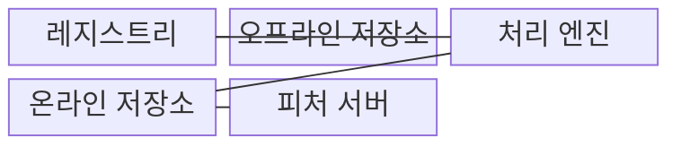
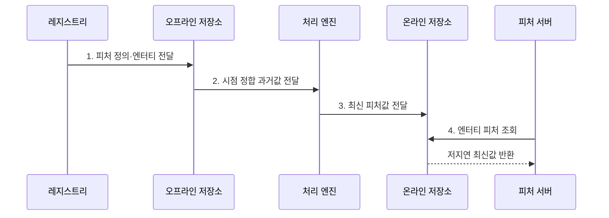

---
sidebar:
  order: 132
  label: "132. 피처 스토어 (Feature Store)"
  badge:
    text: "기출 · 50%"
    variant: note
title: "피처 스토어 (Feature Store)"
date: "2026-07-31T12:03:11+09:00"
tags:
  - "notes-latest-tech"
weight: 132
extra:
  question_no: "132"
  source_status: "기출"
  source_history: "135회"
  priority: 50
  priority_note: "특징 저장소의 시점 정합성 설계가 기출됨"
---

## Ⅰ. 개요

핵심 용어

- **피처 저장소**: 학습과 추론에 동일한 피처 정의와 시점 기준을 재사용하도록 저장·제공하는 데이터 인프라이다.
- **학습-서빙 편향**: 학습과 실시간 추론의 피처 계산·시점 차이로 같은 엔터티의 값이 달라지는 현상이다.

- 정의/개념: **피처 스토어**는 학습과 추론에서 사용할 피처의 정의·변환·시점·저장·제공을 일관되게 관리하는 ML 데이터 플랫폼
- 배경/필요성: 학습·추론 분리 계산은 **미래 정보 누출·학습-서빙 편향**

#### 한줄 요약
- 학습에는 당시의 과거 값을, 추론에는 최신 값을 같은 정의로 제공하는 피처 창고다.

## Ⅱ. 특징

핵심 용어

- **피처 계보**: 피처 정의·엔터티·원천·변환·버전과 사용 모델의 연결 기록이다.
- **오프라인 저장소**: 시계열 과거 피처를 보관해 학습셋과 배치 추론에 제공하는 저장소이다.
- **온라인 저장소**: 최신 피처를 엔터티 키로 저지연 조회하도록 제공하는 저장소이다.

- 정의·엔터티·원천 버전 기반 **피처 계보**
- 오프라인 저장소의 **시점 정합 학습셋**
- 온라인 저장소의 **저지연 제공·동기화**

#### 한줄 요약

- 학습 시점에 알 수 있었던 값만 쓰고 같은 계산 규칙의 최신 값을 실시간 추론에 제공한다.

## Ⅲ. 구조 및 구성요소

핵심 용어

- **피처 레지스트리**: 피처의 이름·정의·엔터티·원천과 버전을 관리한다.
- **처리 엔진**: 공통 정의로 과거·최신 피처를 계산하고 온라인 저장소에 동기화한다.
- **피처 서버**: 추론 대상 엔터티의 최신 피처값을 온라인 저장소에서 반환한다.

| 구성요소 | 책임 |
|:---|:---|
| **레지스트리** | 정의 및 버전 정보 관리 |
| **오프라인 저장소** | 시계열 과거 데이터 저장 |
| **처리 엔진** | 최신 데이터 동기화 |
| **온라인 저장소** | 저지연 최신 데이터 저장 |
| **피처 서버** | 엔터티 기반 추론값 반환 |

#### 한줄 요약

- 레지스트리가 계산 규칙을 정하고 과거 창고와 최신 창구 및 피처 서버가 같은 정의를 사용한다.

## Ⅳ. 흐름도

핵심 용어

- **시점 정합 조인**: 각 학습 사례의 예측 시각 이전에 존재한 피처값만 연결하는 결합이다.
- **이벤트 시각**: 실제 사건이나 피처값이 발생해 알 수 있게 된 시간이다.

- **1. 피처 정의·엔터티 전달**: 학습·추론이 공유할 변환 로직 고정
- **2. 시점 정합 과거값 전달**: 예측 시각 이후 정보의 학습셋 누출 차단
- **3. 최신 피처값 전달**: 동일 정의의 계산 결과 온라인 동기화
- **4. 엔터티 피처 조회**: 추론 대상 키 기반 온라인 값 요청

#### 한줄 요약

- 학습셋은 예측 당시 알 수 있던 값만 조인하고 실시간 추론은 동기화된 최신 값을 조회한다.

## Ⅴ. 종류 및 비교

핵심 용어

- **시점 기반 피처 조회**: 특정 예측 시각에 알 수 있었던 과거 피처값을 찾는 조회 방식이다.
- **저지연 키 조회**: 실시간 추론에서 엔터티 식별자로 최신 피처를 빠르게 읽는 방식이다.

| 피처 저장소 | 오프라인 저장소 | 온라인 저장소 |
|:---|:---|:---|
| 적용 기준 | **학습셋**·배치 추론 | **실시간 추론** |
| 핵심 특징 | 대용량 **시점 기반 피처** 조회 | 최신 피처 **저지연 키 조회** |
| 한계 | **갱신 지연**·시점 조인 비용 | **저장 비용**·일관성 관리 |

#### 한줄 요약

- 오프라인 저장소는 과거 기록으로 학습셋을 만들고 온라인 저장소는 현재 값을 빠르게 제공한다.

## Ⅵ. 실무 고려사항 및 대책

핵심 용어

- **학습 데이터 누출**: 예측 시점 이후에 생성된 미래 피처값이 학습 사례에 포함되는 문제이다.
- **서빙 편향**: 온라인 동기화 지연이나 정의 차이 때문에 학습과 추론의 피처값이 어긋나는 문제이다.

| 문제 | 대책 | 효과 |
|:---|:---|:---|
| 미래값 조인으로 **학습 데이터 누출** | **시점 정합 조인·이벤트 시각 검증** | 오프라인 **학습 유효성** 확보 |
| 온라인 동기화 지연으로 **서빙 편향** | **피처 신선도 한도·동일 정의 검증** | 학습·추론 **피처 일치** 확보 |

#### 한줄 요약

- 결제 이전 값으로 학습해 미래 정보 누수를 막고 추론에는 같은 정의의 최신 값을 제공한다.

## Ⅶ. 결론

핵심 용어

- **온라인 신선도**: 최신 피처가 생성된 뒤 온라인 저장소에서 조회 가능해질 때까지의 지연 수준이다.
- **피처 일치**: 학습과 추론이 같은 정의·시점 규칙으로 계산된 값을 사용하는 성질이다.

- 학습은 **시점 정합 조인**, 실시간 추론은 **온라인 신선도** 충족 피처만 제공

#### 한줄 요약

- 학습과 추론의 피처 정의·시점·동기화 지연을 함께 관리해야 같은 의미의 값을 제공할 수 있다.
