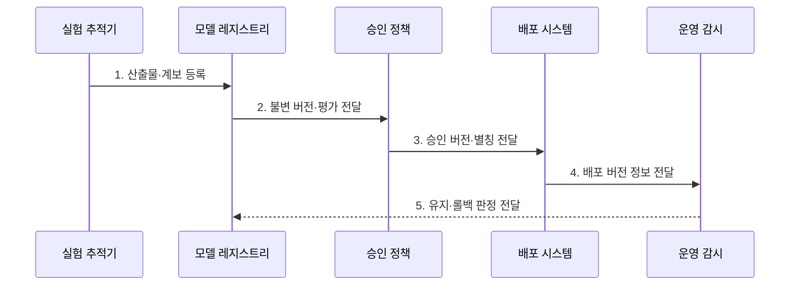

---
sidebar:
  order: 133
  label: "133. 모델 레지스트리 (Model Registry)"
  badge:
    text: "기출 · 50%"
    variant: note
title: "모델 레지스트리 (Model Registry)"
date: "2026-07-27T23:59:59+09:00"
tags:
  - "notes-latest-tech"
weight: 133
extra:
  question_no: "133"
  source_status: "기출"
  source_history: "135회"
  priority: 50
  priority_note: "모델 등록소의 승인·버전 수명주기가 기출됨"
---

## 미리 알고가기

- **모델 레지스트리(Model Registry)**: 모델 산출물과 버전·계보·평가·승인·배포 상태를 연결해 관리하는 저장소
- **불변 모델 버전(Immutable Model Version)**: 등록 뒤 내용이 바뀌지 않아 계보·평가·배포 결과를 같은 산출물에 연결하는 단위
- **배포 별칭(Deployment Alias)**: 운영·검증 같은 논리 이름을 승인된 특정 모델 버전에 연결하는 참조

## Ⅰ. 개요

- 정의/개념: 모델 **불변 버전·계보·승인·배포 상태**를 연결하는 저장소
- 배경/필요성: 파일 저장만으로 **학습 출처·평가 증적·롤백 근거** 추적 곤란

### 쉽게 이해하기 (학습용)

- 모델 파일의 출처와 검사 결과를 기록하고 승인된 버전만 운영 이름표에 연결한다.

## Ⅱ. 특징

- 불변 모델 버전과 **데이터·코드 계보**
- 검증 상태·승인 기록 기반 **배포 게이트**
- 배포 별칭 전환 기반 **승격·롤백**

### 쉽게 이해하기 (학습용)

- 버전별 모델에 계보와 검사 상태를 남기고 운영 별칭은 승인된 버전에만 붙인다.

## Ⅲ. 구조 및 구성요소

| 구성요소 | 책임 |
|:---|:---|
| 모델 이름 | 버전 묶음용 고유 이름 공간 |
| 불변 버전 | 배포 가능한 가중치 및 규격 단위 |
| 계보 정보 | 원본 실행 및 데이터 연결 정보 |
| 상태·별칭 | 검증 상태 및 배포 대상 관리 |
| 승인 정책 | 전환 조건 및 주체 관리 |

### 쉽게 이해하기 (학습용)

- 모델의 제품 번호와 출처, 검사 상태, 운영 이름표를 나눠 기록해 배포 대상을 분명히 한다.

## Ⅳ. 흐름도

- **1. 산출물·계보 등록**: 모델 해시와 데이터·코드·실험 실행 연결
- **2. 불변 버전·평가 전달**: 동일 산출물의 품질·안전 증적 심사
- **3. 승인 버전·별칭 전달**: 검증된 버전에만 운영 참조 연결
- **4. 배포 버전 정보 전달**: 실제 서비스 모델과 레지스트리 상태 동기화
- **5. 유지·롤백 판정 전달**: 운영 이상 시 이전 승인 버전으로 별칭 복원

### 쉽게 이해하기 (학습용)

- 검증에 합격하면 운영 별칭을 새 버전으로 옮기고 문제가 생기면 이전 버전으로 되돌린다.

## Ⅴ. 종류 및 비교

| 관리 체계 | 모델 레지스트리 | 산출물 저장소 | 실험 추적 |
|:---|:---|:---|:---|
| 적용 기준 | 모델 배포·롤백 | 범용 파일·패키지 저장 | 후보 실험 비교 |
| 핵심 특징 | 모델 계보·승인·상태 관리 | 파일·패키지 버전 저장 | 실행 조건·지표 비교 |
| 한계 | 실제 파일 저장소 연계 필요 | 모델 승인 의미 부족 | 배포 상태 관리 부족 |

> 요약: 레지스트리는 배포, 저장소는 파일, 추적은 실험을 다룬다

### 쉽게 이해하기 (학습용)

- 실험 추적은 후보 개발 기록이고 모델 레지스트리는 승인된 운영 모델의 출고 대장이다.

## Ⅵ. 실무 고려사항 및 대책

| 고려사항 | 대책 | 효과 |
|:---|:---|:---|
| 산출물 변경으로 **평가·배포 버전** 불일치 | 불변 해시·계보·평가 증적 결합 | 모델 승인 **재현성 확보** |
| 별칭 전환 오류로 **미승인 모델 배포** | 승인 정책 기반 원자적 별칭 전환 | 운영 모델 **승격 통제** |

### 쉽게 이해하기 (학습용)

- 산출물·계보·평가 결과가 일치하는 불변 버전에만 운영 별칭을 옮긴다.

## Ⅶ. 결론
- **불변 버전·승인 증적·배포 별칭**으로 모델 승격·롤백을 통제

### 쉽게 이해하기 (학습용)

- 모델을 만든 재료와 승인자를 기록하고 운영 별칭을 검증된 버전에만 안전하게 연결한다.
