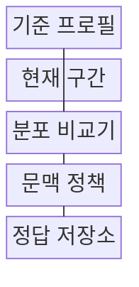
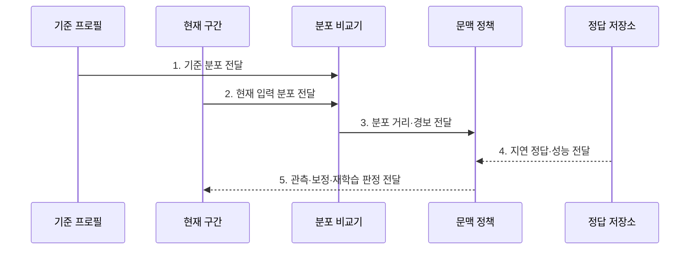

---
sidebar:
  order: 134
  label: "134. 데이터 드리프트 (Data Drift)"
  badge:
    text: "기출 · 50%"
    variant: note
title: "데이터 드리프트 (Data Drift)"
date: "2026-07-27T23:59:59+09:00"
tags:
  - "notes-latest-tech"
weight: 134
extra:
  question_no: "134"
  source_status: "기출"
  source_history: "135회"
  priority: 50
  priority_note: "데이터 분포 변화 탐지·대응이 기출됨"
---

## 미리 알고가기

- **데이터 드리프트(Data Drift)**: 학습 기준 시점과 운영 시점 사이에서 입력 분포 $P(X)$가 달라지는 현상
- **모집단 안정성 지수(Population Stability Index, PSI)**: 기준·현재 구간의 구간별 비율 차이를 로그 비율로 합산한 분포 변화 지표
- **콜모고로프-스미르노프 검정(Kolmogorov-Smirnov Test, KS Test)**: 두 연속형 표본의 누적분포 차이 최댓값으로 분포 변화를 검정하는 방법
- **입력 분포 $P(X)$**: 입력 변수 $X$가 각 값이나 구간에 나타날 확률 구조

## Ⅰ. 개요

- 정의/개념: 학습 기준과 운영 시점의 **입력 분포 $P(X)$ 변화**
- 배경/필요성: 지연 라벨 환경의 **성능 저하 전 입력 이상** 조기 탐지 필요

### 쉽게 이해하기 (학습용)

- 학습 당시 입력 분포와 운영 데이터를 먼저 비교하고 정답이 도착하면 실제 성능 영향도 확인한다.

## Ⅱ. 특징

- 정답 없이 $P(X)$를 비교하는 **조기 경보**
- 계절·캠페인을 구분하는 **분포 기준선**
- 성능 확정 전 지연 정답을 결합하는 **영향 검증**

### 쉽게 이해하기 (학습용)

- 입력 분포 변화는 먼저 감지하되 정답이 늦으면 성능 저하 확정은 유보한다.

## Ⅲ. 구조 및 구성요소

| 구성요소 | 책임 |
|:---|:---|
| 기준 프로필 | 정상 구간의 분포 및 품질 정보 |
| 현재 구간 | 최신 관측 입력 표본 |
| 분포 비교기 | 통계 검정 및 거리 계산 |
| 문맥 정책 | 환경별 경고 및 임계치 관리 |
| 정답 저장소 | 예측과 실제 정답 결합 참조 |

> 요약: 분포 차이를 경보하고 지연 정답으로 영향을 확인한다

### 쉽게 이해하기 (학습용)

- 기준 입력 분포와 현재 구간을 비교하고 나중에 도착한 정답을 예측과 결합한다.

## Ⅳ. 흐름도

### 동작 원리

- **1. 기준 분포 전달**: 계절·캠페인 등 정상 비교 구간 고정
- **2. 현재 입력 분포 전달**: 오류·결측을 분리한 피처별 프로필 생성
- **3. 분포 거리·경보 전달**: PSI·KS 등 문맥 임계값 기반 조기 경보
- **4. 지연 정답·성능 전달**: 입력 변화의 실제 예측 품질 영향 확인
- **5. 관측·보정·재학습 판정 전달**: 변화 원인·성능 저하별 대응 선택

> 요약: 분포 차이를 경보하고 실제 품질 뒤 대응한다

### 쉽게 이해하기 (학습용)

- 입력 분포 변화를 먼저 경보하고 정답으로 성능 영향을 확인한 뒤 모델을 조정한다.

## Ⅴ. 종류 및 비교

| 분포 변화 | 데이터 드리프트 | 라벨 드리프트 | 개념 드리프트 |
|:---|:---|:---|:---|
| 적용 기준 | 입력 분포 감시 | 정답 비율 감시 | 입력·정답 관계 감시 |
| 핵심 특징 | $P(X)$ 변화 | $P(Y)$ 변화 | $P(Y\mid X)$ 변화 |
| 한계 | 성능 저하 직접 증명 불가 | 라벨 지연·정책 영향 | 정답 피드백 필요 |

> 요약: 입력·정답·관계 변화별로 대응을 구분한다

### 쉽게 이해하기 (학습용)

- 입력 구성은 데이터, 정답 비율은 라벨, 입력과 정답의 관계는 개념 드리프트다.

## Ⅵ. 실무 고려사항 및 대책

| 고려사항 | 대책 | 효과 |
|:---|:---|:---|
| 계절 변화로 **분포 경보 오탐** | 문맥별 기준선·피처별 임계값 적용 | 정상 변동과 **드리프트 구분** |
| $P(X)$ 변화만으로 **성능 저하 오판** | 지연 정답·과업 성능 공동 검증 | 재학습 **불필요 실행 방지** |

### 쉽게 이해하기 (학습용)

- 이상거래는 거래 정보 변화를 먼저 찾고 확정된 사기 정답과 결합해 재학습을 결정한다.

## Ⅶ. 결론
- **문맥별 분포 거리·지연 성능**으로 데이터 드리프트의 재학습 여부를 결정

### 쉽게 이해하기 (학습용)

- 입력 분포 차이만으로 곧바로 재학습하지 않고 지연된 정답으로 실제 성능 저하를 확인한다.
