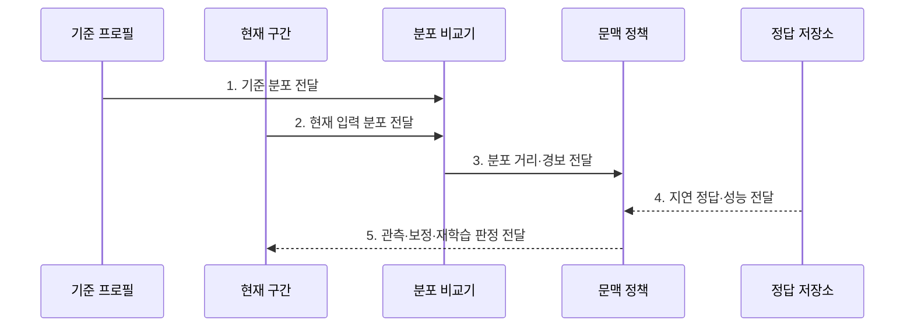

---
sidebar:
  order: 134
  label: "134. 데이터 드리프트 (Data Drift)"
  badge:
    text: "기출 · 50%"
    variant: note
title: "데이터 드리프트 (Data Drift)"
date: "2026-07-31T12:03:42+09:00"
tags:
  - "notes-latest-tech"
weight: 134
extra:
  question_no: "134"
  source_status: "기출"
  source_history: "135회"
  priority: 50
  priority_note: "데이터 분포 변화 탐지·대응이 기출됨"
---

## Ⅰ. 개요

핵심 용어

- **데이터 드리프트**: 학습 기준 시점과 운영 시점 사이에서 입력 분포 $P(X)$가 달라지는 현상이다.
- **지연 라벨**: 예측 시점보다 실제 정답이 늦게 확정돼 성능 평가에 즉시 사용할 수 없는 라벨이다.

- 정의/개념: **데이터 드리프트**는 학습 기준 시점과 운영 시점 사이에서 모델 입력의 확률분포 $P(X)$가 변하는 현상
- 배경/필요성: 지연 라벨 환경은 정답 도착 전 **성능 저하 판정 불가**

#### 한줄 요약

- 학습 당시 입력 분포와 운영 데이터를 먼저 비교하고 정답이 도착하면 실제 성능 영향도 확인한다.

## Ⅱ. 특징

핵심 용어

- **조기 경보**: 정답이 도착하기 전에 입력 분포 변화를 감지해 조사 필요성을 알리는 신호이다.
- **분포 기준선**: 계절·캠페인·업무 환경을 고려해 정상으로 인정한 비교 분포이다.
- **영향 검증**: 지연 정답과 과업 성능을 결합해 입력 변화가 실제 예측 품질을 낮췄는지 확인하는 과정이다.

- 정답 없이 $P(X)$를 비교하는 **조기 경보**
- 계절·캠페인을 구분하는 **분포 기준선**
- 성능 확정 전 지연 정답을 결합하는 **영향 검증**

#### 한줄 요약

- 입력 분포 변화는 먼저 감지하되 정답이 늦으면 성능 저하 확정은 유보한다.

## Ⅲ. 구조 및 구성요소

핵심 용어

- **기준 프로필**: 정상 구간의 피처별 분포·결측·품질 정보를 요약한 자료이다.
- **분포 비교기**: 기준과 현재 입력에 통계 검정과 거리 지표를 적용한다.
- **정답 저장소**: 운영 예측을 나중에 도착한 실제 정답과 연결해 보관한다.

| 구성요소 | 책임 |
|:---|:---|
| **기준 프로필** | 정상 구간의 분포 및 품질 정보 |
| **현재 구간** | 최신 관측 입력 표본 |
| **분포 비교기** | 통계 검정 및 거리 계산 |
| **문맥 정책** | 환경별 경고 및 임계치 관리 |
| **정답 저장소** | 예측과 실제 정답 결합 참조 |

#### 한줄 요약

- 기준 입력 분포와 현재 구간을 비교하고 나중에 도착한 정답을 예측과 결합한다.

## Ⅳ. 흐름도

핵심 용어

- **PSI**: 기준·현재 구간의 구간별 비율 차이를 로그 비율로 합산한 분포 변화 지표이다.
- **KS 검정**: 두 연속형 표본의 누적분포 차이 최댓값으로 분포 변화를 검정하는 방법이다.

- **1. 기준 분포 전달**: 계절·캠페인 등 정상 비교 구간 고정
- **2. 현재 입력 분포 전달**: 오류·결측을 분리한 피처별 프로필 생성
- **3. 분포 거리·경보 전달**: PSI·KS 등 문맥 임계값 기반 조기 경보
- **4. 지연 정답·성능 전달**: 입력 변화의 실제 예측 품질 영향 확인
- **5. 관측·보정·재학습 판정 전달**: 변화 원인·성능 저하별 대응 선택

#### 한줄 요약

- 입력 분포 변화를 먼저 경보하고 정답으로 성능 영향을 확인한 뒤 모델을 조정한다.

## Ⅴ. 종류 및 비교

핵심 용어

- **라벨 드리프트**: 운영 시점에서 정답 비율 $P(Y)$가 학습 기준과 달라지는 현상이다.
- **개념 드리프트**: 입력과 정답의 조건부 관계 $P(Y\mid X)$가 시간에 따라 달라지는 현상이다.

| 분포 변화 | 데이터 드리프트 | 라벨 드리프트 | 개념 드리프트 |
|:---|:---|:---|:---|
| 적용 기준 | **입력 분포** 감시 | **정답 비율** 감시 | **입력·정답 관계** 감시 |
| 핵심 특징 | **$P(X)$** 변화 | **$P(Y)$** 변화 | **$P(Y\mid X)$** 변화 |
| 한계 | **성능 저하** 직접 증명 불가 | **라벨 지연**·정책 영향 | **정답 피드백** 필요 |

#### 한줄 요약

- 입력 구성은 데이터, 정답 비율은 라벨, 입력과 정답의 관계는 개념 드리프트다.

## Ⅵ. 실무 고려사항 및 대책

핵심 용어

- **분포 경보 오탐**: 계절·캠페인 같은 정상 변화가 드리프트 이상으로 잘못 경보되는 문제이다.
- **성능 저하 오판**: $P(X)$ 변화만으로 모델 성능이 나빠졌다고 확정해 불필요한 재학습을 실행하는 문제이다.

| 문제 | 대책 | 효과 |
|:---|:---|:---|
| 계절 변화로 **분포 경보 오탐** | **문맥별 기준선·피처별 임계값** 적용 | 정상 변동과 **드리프트 구분** |
| $P(X)$ 변화만으로 **성능 저하 오판** | **지연 정답·과업 성능** 공동 검증 | 재학습 **불필요 실행 방지** |

#### 한줄 요약

- 이상거래는 거래 정보 변화를 먼저 찾고 확정된 사기 정답과 결합해 재학습을 결정한다.

## Ⅶ. 결론

핵심 용어

- **분포 거리**: 기준과 현재 입력 분포가 얼마나 다른지를 나타내는 통계적 값이다.
- **재학습 판정**: 드리프트 원인과 지연 성능 저하를 확인해 모델을 다시 학습할지 결정하는 과정이다.

- **분포 거리**만 증가하면 관측하고 **지연 성능**도 저하하면 재학습

#### 한줄 요약

- 입력 분포 차이만으로 곧바로 재학습하지 않고 지연된 정답으로 실제 성능 저하를 확인한다.
